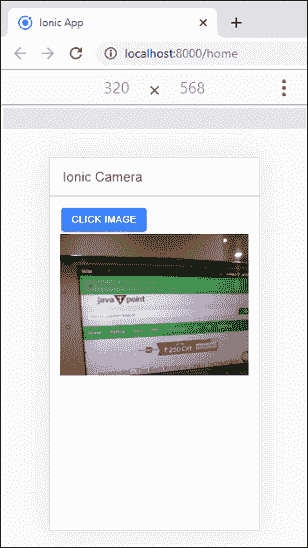

# Ionic照相机

> 原文：<https://www.javatpoint.com/ionic-camera>

在本节中，我们将看到一个基于 Angular 访问本机设备摄像头的示例。

要访问或集成本机设备功能，您需要一个Cordova插件。Ionic Native 充当 Cordova 插件的包装器，该插件提供了与 Angular 和 TypeScript 的集成。

Ionic原生相机插件允许我们使用设备相机拍照。让我们一步一步来看看，了解你如何在Ionic使用相机拍照。

**步骤 1:** 创建新项目。你可以从[这里](ionic-installation)学习如何在Ionic 4 中创建一个项目。如果您已经有了一个Ionic项目，您可以跳过这一步。

**步骤 2:** 接下来，导航到项目，并使用下面的命令安装以下相机插件。

```

$ cd myApp
$ ionic cordova plugin add cordova-plugin-camera
$ npm install @ionic-native/camera

```

**第三步:**导入 **app.module.ts** 文件中的相机插件，并将该插件包含在如下提供程序中。

**App.module.ts**

```

import { NgModule } from '@angular/core';
import { BrowserModule } from '@angular/platform-browser';
import { RouteReuseStrategy } from '@angular/router';

import { IonicModule, IonicRouteStrategy } from '@ionic/angular';
import { SplashScreen } from '@ionic-native/splash-screen/ngx';
import { StatusBar } from '@ionic-native/status-bar/ngx';

import { AppComponent } from './app.component';
import { AppRoutingModule } from './app-routing.module';
import { Camera } from '@ionic-native/camera/ngx';
import { WebView } from '@ionic-native/ionic-webview/ngx';

@NgModule({
  declarations: [AppComponent],
  entryComponents: [],
  imports: [BrowserModule, IonicModule.forRoot(), AppRoutingModule],
  providers: [
    StatusBar,
    SplashScreen,
    Camera,
    WebView,
    { provide: RouteReuseStrategy, useClass: IonicRouteStrategy }
  ],
  bootstrap: [AppComponent]
})
export class AppModule {}

```

**第四步:**打开 **home.page.ts** 文件，导入相机插件，然后使用构造函数创建一个对象引用。现在，创建一个捕捉照片的功能。下面的代码片段为您提供了详细的解释。

**主页**

```

import { Component } from '@angular/core';
import { Camera, CameraOptions } from '@ionic-native/camera/ngx';

@Component({
  selector: 'app-home',
  templateUrl: 'home.page.html',
  styleUrls: ['home.page.scss'],
})
export class HomePage {

  capturedSnapURL: string;

  cameraOptions: CameraOptions = {
    quality: 20,
    destinationType: this.camera.DestinationType.DATA_URL,
    encodingType: this.camera.EncodingType.JPEG,
    mediaType: this.camera.MediaType.PICTURE
  };

  constructor(private camera: Camera) {}

  takeSnap() {
    this.camera.getPicture(this.cameraOptions).then((imageData) => {
      // this.camera.DestinationType.FILE_URI gives file URI saved in local
      // this.camera.DestinationType.DATA_URL gives base64 URI

      const base64Image = 'data:image/jpeg;base64,' + imageData;
      this.capturedSnapURL = base64Image;
    }, (err) => {

      console.log(err);
      // Handle error
    });
  }
}

```

**第五步:**创建功能后，打开**home.page.html**文件。在这个文件中，你需要创建一个**按钮**和**点击事件**来使用**主页. ts** 文件中定义的功能。

**Home.page.html**

```

<ion-header>
  <ion-toolbar>
    <ion-title>Ionic Camera</ion-title>
  </ion-toolbar>
</ion-header>

<ion-content>
  <div class="ion-padding">
    <ion-button (click)="takeSnap()">
      Click Image
    </ion-button>
    
  </div>
</ion-content>

```

**第六步:**现在需要添加目标**平台**部署 app。您可以使用手机运行和测试该应用程序。为此，您需要安装以下命令。

```

$ ionic cordova platform add android
$ ionic cordova run android --aot

```

如果你想在**浏览器**中测试你的应用，运行下面的命令。

```

$ ionic cordova run browser

```

你会得到输出，点击按钮，设备摄像头就会打开。现在你可以拍照或拍照了。



## 相机选项

有几个选项可用于相机。下表给出了这些选项。

| 参数 | 类型 | 描述 |
| 质量数字 | 它 | 用于将图像质量设置在 0-100 的范围内。 |
| destinatinotype | 数字 | 它用于选择图像的格式。 |
| 资源类型 | 数字 | 它用于设置图像的来源。 |
| 编码类型 | 数字 | 它用于选择图像的编码类型。值零将设置 JPEG，值一将设置 PNG 图像格式。 |
| 允许它 | 布尔代数学体系的 | 它用于允许在选择之前编辑图像。 |
| targetHeight | 数字 | 它用于以像素为单位缩放图像宽度。 |
| targetWidth | 数字 | 它用于以像素为单位缩放图像宽度。 |
| 摄像机方向 | 数字 | 它用于设置相机使用正面或背面。 |
| popoverOptions | 线 | 仅适用于 IOS 的选项，用于指定 iPad 上的弹出位置。 |
| 媒体类型 | 线 | 它用于设置媒体类型。 |
| 正确方向 | 布尔代数学体系的 | 它用于在捕获过程中校正设备的方向。 |
| 保存相册 | 布尔代数学体系的 | 它用于将图像保存到设备上的相册。 |

* * *