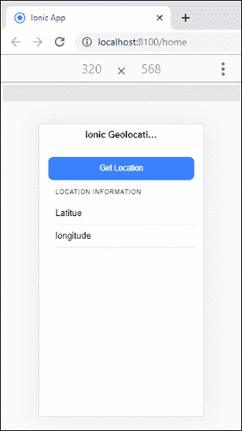
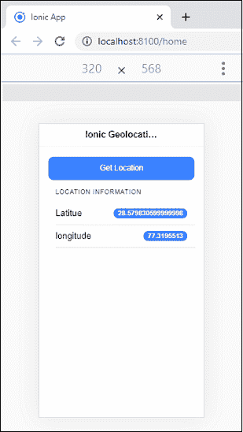

# 离子地理定位

> 原文：<https://www.javatpoint.com/ionic-geolocation>

如今，位置在移动应用中扮演着至关重要的角色。地理定位插件提供关于设备位置的信息，例如**纬度**和**经度**。查找位置信息的一些常见来源是**全球定位系统**(全球定位系统)和从**网络信号**推断的位置，如 IP 地址、无线网络和蓝牙媒体访问控制地址、射频识别和 GSM/码分多址小区标识。

最受欢迎的移动应用程序，如 WhatsApp、脸书和 Instagram，使用地理定位来共享您的位置，而不是解释方向。Ola 和优步的应用程序提供基于地理位置的骑行服务。

地理定位插件基于 **W3C 地理定位应用编程接口规范**，它只在不提供实现的设备上执行。在本教程中，我们将逐步使用地理定位插件来获取当前位置。

**第一步:**创建**新项目**。你可以从[这里](ionic-installation)学习如何在爱奥尼亚 4 中创建一个项目。如果您已经有了一个离子项目，您可以跳过这一步。

**步骤 2:** 接下来，导航到项目，并使用下面的命令安装以下地理定位插件。

```

$ cd myApp
$ ionic cordova plugin add cordova-plugin-geolocation
$ npm install @ionic-native/geolocation

```

**步骤 3:** 导入 **app.module.ts** 文件中的地理定位插件，并将该插件包含在提供者中，如下所示。这是一个强制性的步骤。如果您跳过这一步，您会发现一个错误，比如没有地理定位提供程序。您可以从下面的代码片段中理解它。

```

import { NgModule } from '@angular/core';
import { BrowserModule } from '@angular/platform-browser';
import { RouteReuseStrategy } from '@angular/router';

import { IonicModule, IonicRouteStrategy } from '@ionic/angular';
import { SplashScreen } from '@ionic-native/splash-screen/ngx';
import { StatusBar } from '@ionic-native/status-bar/ngx';

import { AppComponent } from './app.component';
import { AppRoutingModule } from './app-routing.module';
import { Geolocation } from '@ionic-native/geolocation/ngx';
import { WebView } from '@ionic-native/ionic-webview/ngx';

@NgModule({
  declarations: [AppComponent],
  entryComponents: [],
  imports: [BrowserModule, IonicModule.forRoot(), AppRoutingModule],
  providers: [
    StatusBar,
    SplashScreen,
    Geolocation,
    WebView,
    { provide: RouteReuseStrategy, useClass: IonicRouteStrategy }
  ],
  bootstrap: [AppComponent]
})
export class AppModule {}

```

**步骤 4:** 打开 **home.page.ts** 文件，导入地理定位插件，然后使用构造函数为地理定位类创建一个对象引用。现在，创建一个函数来获取当前位置。下面的代码片段为您提供了详细的解释。

```

import { Component } from '@angular/core';
import { Geolocation } from '@ionic-native/geolocation/ngx';
import { LoadingController } from '@ionic/angular';
import { AlertController } from '@ionic/angular';

@Component({
  selector: 'app-home',
  templateUrl: 'home.page.html',
  styleUrls: ['home.page.scss'],
})
export class HomePage {
  lati: any = '';
  longi: any = '';
  constructor(private geolocation: Geolocation, public loadingController: LoadingController, public alertController: AlertController) {

  }
  async getCurrentLocation() {
    const loading = await this.loadingController.create({
      message: 'Please wait...',
      });
    await loading.present();

    this.geolocation.getCurrentPosition({maximumAge: 1000, timeout: 5000, enableHighAccuracy: true }).then((resp) => {
      // resp.coords.latitude
      // resp.coords.longitude
      loading.dismiss();
      this.lati = resp.coords.latitude;
      this.longi = resp.coords.longitude;
      }, er => {
        // alert("error getting location")
        loading.dismiss();
        this.showLoader('Can not retrieve Location');
      }).catch((error) => {
      // alert('Error getting location'+JSON.stringify(error));
      loading.dismiss();
      this.showLoader('Error getting location - ' + JSON.stringify(error));
      });
  }

 async showLoader(msg) {
    const alert = await this.alertController.create({
      message: msg,
      buttons: ['OK']
    });

    await alert.present();
  }
}

```

**第五步:**创建功能后，打开**home.page.html**文件。在这个文件中，你需要创建一个**按钮**和**点击事件**来使用**主页. ts** 文件中定义的功能。

```

<ion-header>
  <ion-toolbar>
    <ion-title>Ionic Geolocation</ion-title>
  </ion-toolbar>
</ion-header>

<ion-content class="ion-padding">
  <ion-button (click)="getCurrentLocation()" expand="block">Get Location</ion-button>
  <ion-list>
    <ion-list-header>
      <ion-label>Location Information</ion-label>
    </ion-list-header>
    <ion-item>
      <ion-label>Latitue</ion-label>
      <ion-badge slot="end">{{lati}}</ion-badge>
    </ion-item>
    <ion-item>
      <ion-label>longitude</ion-label>
      <ion-badge slot="end">{{longi}}</ion-badge>
    </ion-item>
  </ion-list>
</ion-content>

```

**第六步:**现在需要添加目标**平台**部署 app。您可以使用手机运行和测试该应用程序。为此，您需要安装以下命令。

```

$ ionic cordova platform add android
$ ionic cordova run android --aot

```

如果你想在**浏览器**中测试你的应用，运行下面的命令。

```

$ ionic serve

```

**第七步:**执行 app 时，会得到如下图的输出。



现在，点击**获取位置按钮**，你会以经纬度的形式获取你设备的当前位置。可以在下面的屏幕中显示。



* * *