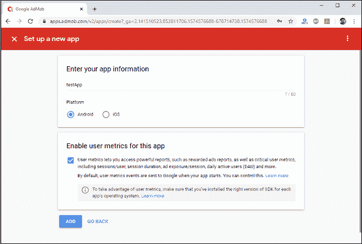
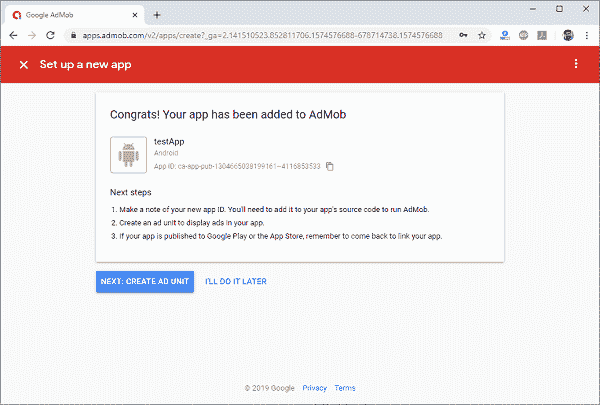
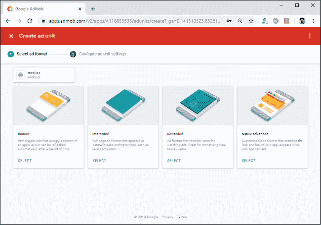
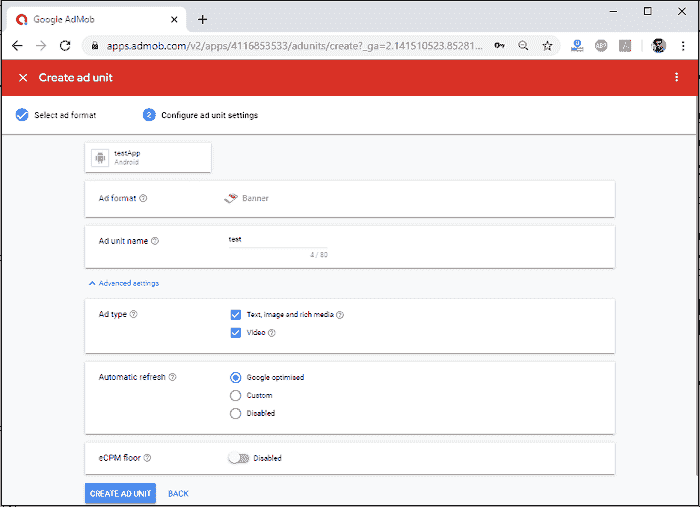

# Ionic AdMob

> 原文：<https://www.javatpoint.com/ionic-admob>

AdMob 是一个针对移动应用的谷歌广告平台，这让开发者很容易从他们的移动应用中赚钱。它提供高质量的货币广告。它允许开发者快速推广他们的应用。它还可以通过结合全球广告商需求、创新的广告格式和先进的应用货币化技术，最大限度地提高每一个印象的价值。它适用于安卓和 iOS 应用。

虽然广告并不总是最好的赚钱方式，但却是从移动应用或网站上赚点钱最简单的方式。在本教程中，我们将学习如何将谷歌 AdMob 添加到 Ionic 应用程序中。在这里，我们将涵盖两种类型的广告平台，即横幅广告和间隙广告。

## 横幅广告

横幅广告显示可以固定在屏幕顶部或底部的矩形广告。它占据了应用布局的一部分，可以在一段时间后自动刷新。这意味着用户将定期看到新的广告，即使他们停留在应用程序的同一个屏幕上。

## 间隙广告

间隙广告在移动应用中为用户提供丰富的交互式整页广告。这些类型的广告被设计成放置在内容之间。它显示静态或视频广告，可以出现在自然休息或过渡点，并创造引人入胜的品牌体验，而不会中断应用程序体验。

如果你想在你的应用中使用广告，你需要在谷歌 AdMob 上有一个账户。因此，如果您在 AdMob 上没有帐户，首先在 AdMob 上创建它。现在，让我们一步一步地看看如何将 AdMob 使用到 Ionic 应用程序中。

**第一步:**创建**新项目**。你可以从这里学习如何在 Ionic 4 中创建一个项目。如果您已经有了一个 Ionic 项目，您可以跳过这一步。

**第二步:**创建一个谷歌 AdMob 账号。要在应用程序中显示广告，您需要设置 AdMob 帐户。如果您尚未创建 AdMob 帐户，请单击此处。现在，登录到 AdMob 控制台。然后，首先，您需要将您的应用程序添加到屏幕下方。



一旦您的应用程序成功添加到谷歌 AdMob，您将获得以下屏幕。



**第 3 步:**一旦你创建了 Ionic App，你必须导航到你的项目，并使用下面的命令安装下面的 AdMob Cordova 插件。这个命令将安装 Cordova 插件和 Ionic 原生包。

```

$ cd myIonicApp

$ cordova plugin add cordova-plugin-admob-free --save --variable ADMOB_APP_ID=""

$ npm install @ionic-native/admob-free 
```

要查找应用编程接口标识，请转到 AdMob 控制台->应用->您的应用->应用设置->应用信息。

**第四步:**接下来，打开 **app.module.ts** 文件，导入 AdMob 插件。另外，我们需要在提供者中设置这个插件，如下所示。

```

import { NgModule } from '@angular/core';
import { BrowserModule } from '@angular/platform-browser';
import { RouteReuseStrategy } from '@angular/router';

import { IonicModule, IonicRouteStrategy } from '@ionic/angular';
import { SplashScreen } from '@ionic-native/splash-screen/ngx';
import { StatusBar } from '@ionic-native/status-bar/ngx';

import { AppComponent } from './app.component';
import { AppRoutingModule } from './app-routing.module';
import { AdMobFree } from '@ionic-native/admob-free/ngx';

@NgModule({
  declarations: [AppComponent],
  entryComponents: [],
  imports: [BrowserModule, IonicModule.forRoot(), AppRoutingModule],
  providers: [
    StatusBar,
    SplashScreen,
    AdMobFree,
    { provide: RouteReuseStrategy, useClass: IonicRouteStrategy}
  ],
  bootstrap: [AppComponent]
})
export class AppModule {}

```

在添加 AdMob 插件作为提供者之后，我们将能够在我们的应用程序中任何需要的地方注入它。

**第五步:**让我们创建一个横幅广告。为此，您需要转到 AdMob 控制台- >您的程序- >成人，然后出现以下屏幕。



现在，选择横幅，并添加如下细节，如给定的图像。



**步骤 6:** 打开 **home.page.ts** 文件，添加以下代码片段。一旦创建了横幅，它将显示在您的应用程序的底部。

```

import { Component } from '@angular/core';
import { AdMobFree, AdMobFreeBannerConfig } from '@ionic-native/admob-free/ngx';

@Component({
  selector: 'app-home',
  templateUrl: 'home.page.html',
  styleUrls: ['home.page.scss'],
})
export class HomePage {
  constructor(public admob: AdMobFree) {
  }
  showBanner() {
      const bannerConfig: AdMobFreeBannerConfig = {
          isTesting: true, // Remove in production
          autoShow: true
         //id: Your Ad Unit ID goes here
          id: 'ca-app-pub-1304665038199161/9978704243'
      };
      this.admob.banner.config(bannerConfig);
      this.admob.banner.prepare().then(() => {
          // success
      }).catch(e => console.log(e));
  }
}

```

**第 7 步:**接下来，打开**home.page.html**并插入以下代码。它负责用户界面。

```

<ion-header>
  <ion-toolbar>
    <ion-title>
      Ionic AdMob
    </ion-title>
  </ion-toolbar>
</ion-header>

<ion-content class="ion-padding">
    <ion-button (click)="showBanner()" expand="full">Show Banner</ion-button><br/>
</ion-content>

```

**第八步:**现在，运行应用。你会在应用程序的底部看到广告。

**第 9 步:**同样，如果你想为整个页面创建广告，那么选择间质，并在**主页. ts** 文件中添加以下代码片段。一旦创建了间隙，它将显示在应用程序的全屏上。

```

import { Component } from '@angular/core';
import { AdMobFree, AdMobFreeBannerConfig, AdMobFreeInterstitialConfig } from '@ionic-native/admob-free/ngx';

@Component({
  selector: 'app-home',
  templateUrl: 'home.page.html',
  styleUrls: ['home.page.scss'],
})
export class HomePage {
  constructor(public admob: AdMobFree) {
  }
  showInterstitial() {
    const interstitialConfig: AdMobFreeInterstitialConfig = {
        isTesting: true, // Remove in production
        autoShow: true
        //id: Your Ad Unit ID goes here.
    };
    this.admob.interstitial.config(interstitialConfig);
    this.admob.interstitial.prepare().then(() => {
        // success
    });
  }
}

```

**第十步:**接下来，打开**home.page.html**并插入以下代码。它负责用户界面。

```

<ion-header>
  <ion-toolbar>
    <ion-title>
      Ionic AdMob
    </ion-title>
  </ion-toolbar>
</ion-header>

<ion-content class="ion-padding">
    <ion-button (click)="showInterstitial()" expand="full">Show Interstitial</ion-button>
</ion-content>

```

**第 11 步:**现在，运行应用。您将在应用程序的全屏上看到广告。

* * *