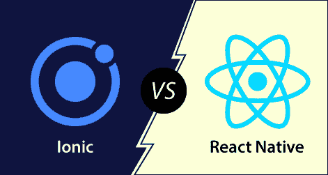

# Ionic 型和反应型天然橡胶的区别

> 原文：<https://www.javatpoint.com/ionic-vs-react-native>

ion 和 React Native 是开发移动应用最常用的两个框架。这两个框架都有一个充满激情的开发人员的大型社区，并在大型企业中使用。在这一部分，我们将看到 Ionic 是如何不同于反应原生。

## Ionic 的

ion 是一个开源 UI 工具包，用于使用 HTML、CSS 和 JavaScript 等网络技术构建高性能、高质量的**移动应用程序、桌面应用程序、**和进步的**网络应用程序**。它允许开发人员一次构建并在任何地方运行。它是由 2013 年浮利公司的**马克斯·林奇、本·斯佩里、**和**亚当·布拉德利**创造的。Ionic 框架的第一个测试版于 2014 年 3 月**发布。**

 **ion 框架主要关注前端用户体验或 UI 交互，处理你的应用的所有观感。它很容易学习，可以与其他库或框架集成，如 Angular、React、Cordova 等。正式来说，Ionic 框架已经和 **Angular** 进行了集成，但是它也为 **Vue.js** 和 **React.js** 提供了支持。

**Ionic**的优势

Ionic 应用的优势如下:

**1。易学**

如果开发人员具有 CSS、HTML 或 JavaScript 框架的基本知识，那么使用 ion 框架学习和开发应用程序是非常容易的。

**2。简单的文档**

ion 提供简单、容易和结构良好的文档。官方文档涵盖了开发人员所需的大部分内容。

**3。跨平台**

Ionic 应用程序可以部署在多个平台上，如 iOS、安卓、桌面和网络，所有这些都有一个代码库。Ionic 应用程序可以写一次，运行在任何地方。

**4。用户界面**

Ionic 的用户界面，如主题和组件是高度可定制的。ion 平台允许其组件适应运行应用程序的平台。

**Ionic**的缺点

Ionic 应用的缺点如下:

**1。性能**

与本机移动应用程序相比，ion 应用程序的性能并不出色。然而，对于大多数普通用户来说，性能差距并不明显。

**2。安全**

使用 Ionic 框架开发的应用程序可能无法像本机应用程序那样提供足够的安全性。例如，如果您正在开发一个金融应用程序，例如银行应用程序，则不建议使用 Ionic 框架。

**3。有限的原生功能**

某些本机函数可能在 Ionic 框架中不可用。在这种情况下，你需要自己开发插件来实现这个功能。然而，有许多插件可以覆盖大部分原生功能。

**4。对电子游戏不好**

Ionic framework 对于依赖图形的高端应用程序或视频游戏来说并不完美。

**5。早期采用者风险**

Ionic 技术仍在发展中。它定期不断地改变它的支持和标准，它的库可以随时完全重写。

## 原生反应

React Native 是一个开源的 JavaScript 框架，用于为 iOS、Android 和 Windows 开发移动应用程序。它是用 JavaScript 构建一个跨平台的移动应用。React Native 与 React 相同，但它使用本机组件，而不是使用 web 组件作为构建块。它的目标是移动平台，而不是浏览器。

脸书社区在 2013 年为其内部项目“黑客马拉松”开发了“反应原生”。2015 年 3 月，脸书宣布 React Native 是开源的，可以在 GitHub 上使用。

**反应原生**的优势

React Native 在构建移动应用程序方面的优势如下:

**跨平台使用:**它提供了“一次构建，随处运行”的功能它可以为安卓、iOS 和视窗平台开发应用程序。

**性能:**用 React Native 编写的代码被编译成原生代码，这使得它能够在所有平台上以相同的方式为所有操作系统提供更接近的原生外观和功能。

**社区:** React Native 提供了一个由充满激情的开发人员组成的大型社区，他们帮助我们找到任何我们需要的答案。

**热重装:**在开发过程中，在你的应用程序代码中做一些改变会立即可见。如果业务逻辑改变了，它的反映会在屏幕上重新加载。

**与时俱进:**iOS 和 Android 的一些功能仍然不受支持，社区总是在发明最佳实践。

**反应原生**的缺点

React Native 在构建移动应用程序方面的缺点如下:

**React Native 还是新的，还不成熟:** React Native 是安卓和 iOS 编程语言中的一个新框架。它仍处于开发阶段，这可能会对应用程序产生负面影响。

**学习难:** React Native 不容易学，尤其是对于一个应用开发领域的新手来说。

**缺乏安全健壮性:** React Native 是一个开源框架，在安全健壮性上造成了差距。当您创建数据高度机密的银行和金融应用程序时，专家建议不要选择 React Native。

**初始化需要更多时间:** React Native 初始化运行时需要大量时间，即使您使用的是高科技小工具和设备。

**存在是不确定的:**随着脸书开发这个框架，它的存在是不确定的，因为它保留了随时取消项目的所有权利。随着 React Native 的人气上升，这种情况不太可能发生。

## Ionic 与天然反应

|  | Ionic 的 | 原生反应 |
| **目的** | 它规定只写一次，到处运行。 | 它可以学习一次，编写任何平台都变得容易。 |
| **开发者** | 它是由漂流公司开发的。 | 脸书社区开发了它。 |
| **语言** | 它基于 HTML、CSS、JavaScript、AngularJS、TypeScript。 | 它基于 React 和 JavaScript |
| **代码语言** | 它使用 TypeScript，这是 JS 的类型化超集，可以在任何浏览器上编译成普通的 JavaScript。 | 它使用 JSX，允许编写看起来像 HTML 的 JavaScript 代码。 |
| **文件** | 它有非常简单、干净和一致的文档。 | 它有非常基本的文档。 |
| **社区支持** | 它有大量的社区支持。 | 它拥有非常强大的社区支持。 |
| **应用开发** | 它构建了一个混合应用程序。 | 它构建了一个本地应用程序。 |
| **性能** | 由于网络视图，它比反应原生慢。 | 它比 Ionical 更快，因为它的渲染类似于本地应用程序。 |
| **测试** | 它可以在任何浏览器中测试。 | 它需要一个设备或仿真器进行测试。 |
| **支撑平台** | 安卓、iOS、UWP、PWA 都可以支持。 | 安卓、iOS、UWP 都可以支持。 |
| **可重用性** | 它提供了最佳的代码重用性。 | 代码需要针对不同的平台进行更改。 |
| **电话硬件可访问性** | 它使用 Apache Cordova。 | 反应原生是有能力的。 |
| **工具集成** | atatus
Backand
StackBlitz
ready mag
jScrambler | iOS
试剂-视图
【bug snag】
【寿辰 ui】
试剂 VR |
| **公司使用** | Sellsuki
启迪
派遣
eTobb
科技之星 | Instagram
微软
雅虎
徒步
Intuit |

* * ***