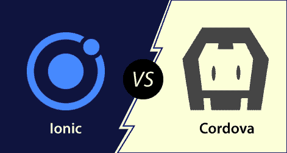

# Ionic和Cordova的区别

> 原文：<https://www.javatpoint.com/ionic-vs-cordova>

Ionic和ApacheCordova不被视为竞争对手；相反，Ionic是建立在Cordova之上的。它们是移动应用开发市场上广泛采用的两种流行技术。这些技术的结合形成了一个被称为混合应用开发的开发平台。这两个框架都有一个充满激情的开发人员的大型社区，并且在大型企业中使用。在这一节中，我们将看到Ionic如何不同于ApacheCordova。

## Apache科多娃

Apache Cordova 是一个开源框架，它允许 web 开发人员使用 HTML、CSS 和 JavaScript 为不同的移动平台创建一个本机应用程序。 **Nitobi** 在 **2009** 创造了它。在 **2011 年，Adobe Systems** 收购了 Nitobi，并将其更名为 Phonegap。

Apache Cordova 允许开发人员访问应用程序的本机功能，如相机、视频录制、音频功能、位置访问等。使用 Cordova，您可以在应用程序中集成许多不同的插件，以满足使用设备硬件来运行应用程序的所有要求。

**Cordova的优势**

ApacheCordova最受欢迎的优势如下:

*   这是一项免费的开源技术。
*   这很容易学。
*   它用于开发跨平台应用程序。
*   它在 JavaScript 上工作。
*   它用于快速有效地进行应用程序开发。
*   它有很多插件，您可以将其集成到应用程序中，以满足运行应用程序的所有要求。
*   它有很好的社区支持，这有助于你摆脱所有的问题。

**Cordova的缺点**

ApacheCordova的缺点如下:

*   它的代码在 web 视图中运行，这使得它的性能变慢。
*   它有基于网络的用户界面在网络视图中运行，因此它不能为应用程序提供良好的外观和感觉。
*   这不是开发游戏应用的正确技术，因为它需要一些目前不可用的高端插件。

## Ionic的

ion 是一个开源 UI 工具包，用于构建高质量的**移动应用、桌面应用、**和进步的**网络应用**。它使用 HTML、CSS 和 JavaScript 等网络技术来创建高质量的跨平台应用程序。它允许开发人员一次构建并在任何地方运行。它是由**马克斯·林奇、本·斯佩里、**和**坝布拉德利**创建的，由浮地公司于 2013 年开发。在【2014 年 3 月推出的第一个版本的 ion 框架。

ion 框架主要关注前端用户体验或 UI 交互，处理你的应用的所有观感。它很容易学习，可以与其他库或框架集成，如 Angular、React、Cordova 等。正式来说，Ionic 框架已经和 **Angular** 进行了集成，但是它也为 **Vue.js** 和 **React.js** 提供了支持。

**Ionic**的优势

Ionic应用的优势如下:

*   如果开发人员具有 CSS、HTML 或 JavaScript 框架的基本知识，那么使用 ion 框架学习和开发应用程序是非常容易的。
*   ion 提供简单、容易和结构良好的文档。官方文档涵盖了开发人员所需的大部分内容。
*   Ionic应用程序可以部署在多个平台上，如 iOS、安卓、桌面和网络，所有这些都有一个代码库。Ionic应用程序可以写一次，运行在任何地方。
*   Ionic的用户界面，如主题和组件是高度可定制的。ion 平台允许其组件适应运行应用程序的平台。

**Ionic**的缺点

Ionic应用的缺点如下:

*   与原生移动应用相比，ion 应用的性能并不出色。然而，对于大多数普通用户来说，性能差距并不明显。
*   使用 Ionic 框架开发的应用程序可能无法像本机应用程序那样提供足够的安全性。例如，如果您正在开发一个金融应用程序，例如银行应用程序，则不建议使用 Ionic 框架。
*   如果不使用 Apache Cordova，您将无法访问 Ionic 中任何特定于设备的功能。Apache Cordova 允许您集成插件，这些插件可以添加访问这些功能的功能。然而，有许多插件可以覆盖大部分原生功能。
*   Ionic技术仍在发展中。它定期不断地改变它的支持和标准，它的库可以随时完全重写。

## Ionic vs Cordova

Ionic和Cordova的主要区别如下:

*   ion 提供了在应用程序中使用的框架。而Cordova提供插件来运行类似于原生应用程序的应用程序。
*   ion 提供了许多不同的功能，需要与应用程序集成，而 Cordova 提供了设备对应用程序的硬件访问。
*   Cordova插件允许你制作自己的插件，而Ionic不提供你制作自己的插件。
*   开发人员选择Cordova是因为它的插件、出色的社区支持以及使用 JavaScript 进行移动开发的能力。相比之下，开发人员选择 ion 是因为它的快速原型、出色的设计和混合移动风格。
*   使用 Cordova 的公司有 BetRocket、掌上酒店、Die Coder GmbH 和 Dial Once。而使用 ion 的公司有 Edify、MAK IT、eTobb 和 Dispatch。
*   与Cordova集成的工具有哨兵、维基、游戏分析、洛基 JS、网络风暴等。而与 Ionic 集成的工具有 Atatus、Readymag、Backand、JScrambler 等。

* * *