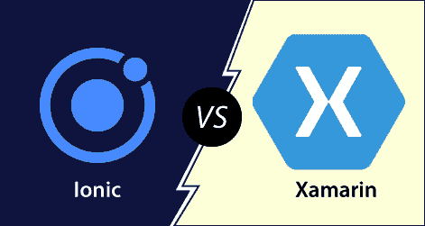

# Ionic 型和 Xamarin 型的区别

> 原文：<https://www.javatpoint.com/ionic-vs-xamarin>

ion 和 Xamarin 是开发混合应用程序最流行的两个框架。在过去的几年里，开发人员选择哪个框架是最好的是一个争论点。这两个框架都有一个充满激情的开发人员的庞大社区，他们为您所有的疑虑提供了解决方案。这两种技术都用于大型企业。在这一节中，我们将看到 Ionic 如何不同于 Xamarin。Ionic 和 Xamarin 的区别不仅限于性能，它还适用于应用程序大小、UX/UI 体验、代码可重用性、第三方库等。

## Ionic 的

ion 是一个开源 UI 工具包，用于使用 HTML、CSS 和 JavaScript 等网络技术构建高性能、高质量的**移动应用程序、**桌面应用程序和渐进式网络应用程序。它允许开发人员一次构建并在任何地方运行。它是由 2013 年漂移公司的**马克斯·林奇、本·斯佩里、**和**亚当·布拉德利**创造的。Ionic 框架的第一个测试版于 2014 年 3 月**发布。**

ion 框架主要关注前端用户体验或 UI 交互，处理你的应用的所有观感。它很容易学习，可以与其他库或框架集成，如 Angular、React、Cordova 等。官方来说，Ionic 框架已经和 Angular 进行了集成，但是它也为 **Vue.js** 和 **React.js** 提供了支持。

**Ionic**的优点

Ionic 应用的优势如下:

*   如果开发人员具有 CSS、HTML 或 JavaScript 框架的基本知识，那么使用 ion 框架学习和开发应用程序是非常容易的。
*   ion 提供简单、容易和结构良好的文档。官方文档涵盖了开发人员所需的大部分内容。
*   Ionic 应用程序可以部署在多个平台上，如 iOS、安卓、桌面和网络，所有这些都有一个代码库。Ionic 应用程序可以写一次，运行在任何地方。
*   Ionic 的用户界面，如主题和组件是高度可定制的。ion 平台允许其组件适应运行应用程序的平台。

**Ionic**的缺点

Ionic 应用的缺点如下:

*   与原生移动应用相比，ion 应用的性能并不出色。然而，对于大多数普通用户来说，性能差距并不明显。
*   使用 Ionic 框架开发的应用程序可能无法像本机应用程序那样提供足够的安全性。例如，如果您正在开发一个金融应用程序，例如银行应用程序，则不建议使用 Ionic 框架。
*   如果不使用 Apache Cordova，您将无法访问 Ionic 中任何特定于设备的功能。Apache Cordova 允许您集成插件，这些插件可以添加访问这些功能的功能。然而，有许多插件可以覆盖大部分原生功能。
*   Ionic 技术仍在发展中。它定期不断地改变它的支持和标准，它的库可以随时完全重写。

## 沙马林

Xamarin 是一个开源的、跨平台的开发框架，它让你可以使用 C#语言构建安卓、iOS、Windows 和 Mac 应用。它由 Xamarin 公司于 2011 年 5 月首次推出。2016 年，微软签署了收购 Xamarin 的协议。微软在微软 Visual Studio IDE 中提供了一个免费工具，用户可以在其中获得 Xamarin 的企业功能。visual studio 支持在模拟器或设备上构建、部署和调试应用程序。我们可以使用 C#语言在 Xamarin 工具中编写代码，并且可以对所有其他平台使用相同的代码。

**Xamarin**的优点

Ionic 应用的优势如下:

*   Xamarin 是最好的原生应用开发平台，允许开发人员构建原生移动应用。它有一个优秀的用户界面和控件来创建一个本地应用程序。
*   Xamarin 允许您为 Windows、Android 和 iOS 应用程序构建跨平台移动应用程序。您还可以在多个平台上共享代码。
*   Xamarin 在应用程序中的 bug 非常少。您还可以使用 Xamarin Insight 增强应用程序性能，这有助于监控和记录崩溃和异常。
*   Xamarin 不需要为不同的移动平台创建不同的 API，因为它可以使用相同的 API 来构建 iOS、Android 和 Windows 应用程序。
*   Xamarin 允许您生成高性能的编译代码，可以访问每一个本机 API。它提供了一种非常简单的方法，可以在不同的移动平台上创建特定于设备的应用程序。
*   Xamarin 拥有庞大的社区支持，可以帮助解决你对应用开发的所有疑虑。
*   Xamarin 允许您多次重用相同的代码，为 Android、iOS 和 Windows 设备创建本机用户界面。

**Xamarin 的缺点**

Xamarin 技术的缺点如下:

*   Xamarin 对个人和小公司是免费的，但对企业来说很贵。这是因为他们需要为微软的 Visual Studio 购买许可证。每一家使用 Xamarin 技术的企业都需要支付高达 2999 美元的费用来订阅 Visual Studio Enterprise。这些许可证的成本取决于开发商的规模和需求。
*   Xamarin 支持大多数。Net 库，但是使用所有开源库可能会很复杂。如果没有特定的包装器，它不支持安卓和 iOS 的所有第三方库。
*   Xamarin 不适合显卡很重的应用，比如视频游戏。如果您的应用程序有丰富的 UX/用户界面，那么它应该在本地实现。
*   Xamarin 使应用程序比其他框架更大。它为发行版增加了 3 到 5 MB，为调试版本增加了大约 20 MB。

## Ionic 型与 Xamarin 型

Ionic 和 Xamarin 之间的对比图如下所示。

|  | Ionic 的 | 沙马林 |
| **定义** | ion 是一个前端框架，用于使用网络技术(如 Vue.js、React.js 和 Angular)开发跨平台应用程序。 | Xamarin 是一个开源的、跨平台的开发框架，它允许你使用 C#语言构建应用程序。 |
| **由**创建 | 它是由 2013 年漂移公司的马克斯·林奇、本·斯佩里和亚当·布拉德利创作的。它于 2014 年 3 月首次推出。 | 它由 Xamarin 公司于 2011 年 5 月首次推出。2016 年，微软签署了收购 Xamarin 的协议。 |
| **语言** | 它使用 C#和。网络语言。 | 它使用 TypeScript 语言。 |
| **性能** | 与 Xamarin 相比，ion 的性能较慢，因为它使用了网络视图。 | 它有更好的性能，因为它接近原生应用。 |
| **尺寸** | Ionic 应用程序的规模很小。 | 与其他框架相比，Xamarin 应用程序的大小更大。 |
| **定价** | 它是免费和开源的。如果组织需要加速开发过程，它会使用一个付费版本的 Ionic pro。 | Xamarin 对个人和小公司是免费的，但对企业来说很贵。这是因为他们需要为微软的 Visual Studio 购买许可证。 |
| **用户体验** | 它提供了一般的用户体验。开发人员过度升级了 Ionic，以继续使用和维持完成。 | 它提供了出色、最快、最真实的用户体验。 |
| **代码可重用性** | 它有一个最佳的代码重用范围。 | 它不提供任何特定的平台代码可重用性。 |
| **64 位支持** | 在最新的更新中，ion 仅在 iOS 上支持 64 位模式。申请。在 Android 上，ion 不支持 64 位模式。 | Xamarin 仅支持 64 位模式。也可以强制在 32 位上编译 |
| **市场和社区支持** | ion 是第二个最受欢迎的框架，它为开发者提供了大量的社区支持。 | Xamarin 拥有庞大的社区支持，可以帮助解决你对应用开发的所有疑虑。 |
| **工具集成** | 一些与 ion 集成的流行工具有 Readymag、JScrambler、WebStorm 和 DevExtreme。 | 与 Xamarin 集成的一些流行工具有 OneSignal、KeeWeb、Logify 和 Raygun。 |
| **公司使用** | Sellsuki、Edify 和 eTobb 是一些使用 ion 的热门公司。 | Rdio、Olo 和 Rumble 是使用 Xamarin 的一些受欢迎的公司。 |

* * *