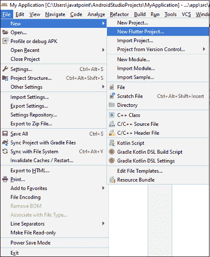
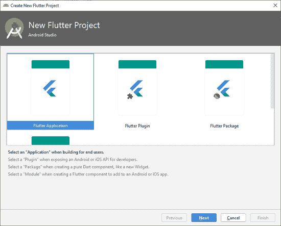
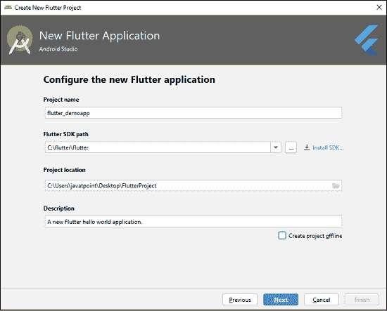
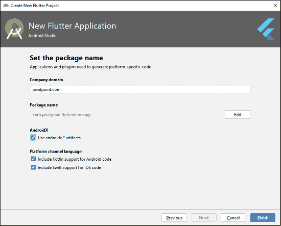
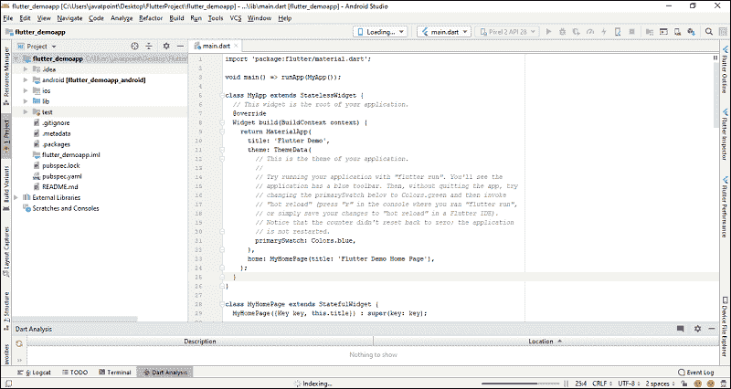
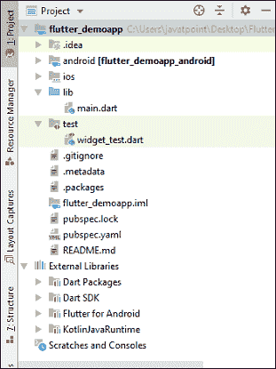
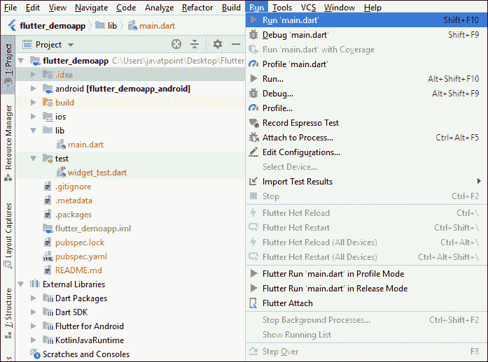
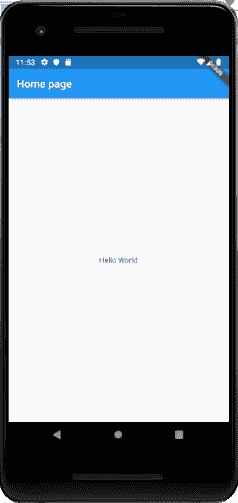

# Flutter的首次应用

> 原文：<https://www.javatpoint.com/flutter-first-application>

在本节中，我们将学习如何在AndroidStudio中创建一个简单的应用程序，以了解 Flutter 应用程序的基础知识。要创建 Flutter 应用程序，请执行以下步骤:

**第一步:**打开AndroidStudio。

**步骤 2:** 创建Flutter项目。要创建项目，请转到文件- >新建- >新Flutter项目。下面的屏幕有助于更清楚地理解它。



**步骤 3:** 在下一个向导中，您需要选择 Flutter Application。为此，选择Flutter应用- >点击下一步，如下图所示。



**第 4 步:**接下来，配置如下图所示的应用细节，点击下一步按钮。

**项目名称:**写下你的申请名称。

**Flutter SDK 路径:** <路径 _to_flutter_sdk >

**项目位置:** <路径 _ 至 _ 项目 _ 文件夹>

**描述:** <一个新的 Flutter hello world 应用程序>。



**第五步:**在下一个向导中，需要设置公司域名，点击完成按钮。



单击“完成”按钮后，创建项目将需要一些时间。当项目被创建时，你将得到一个功能最少的完整的 Flutter 应用程序。



**步骤 6:** 现在，让我们检查 Flutter 项目应用程序的结构及其用途。在下图中，您可以看到 Flutter 应用程序结构的各种文件夹和组件，这将在这里讨论。



**。想法:**这个文件夹在项目结构的最顶端，保存着 Android Studio 的配置。没关系，因为我们不打算和AndroidStudio合作，所以这个文件夹的内容可以忽略。

**。安卓:**这个文件夹保存了一个完整的安卓项目，在你为安卓构建 Flutter 应用程序时使用。当 Flutter 代码被编译成原生代码时，它会被注入到这个安卓项目中，这样结果就是一个原生的安卓应用程序。**比如:**当你在使用安卓模拟器的时候，这个安卓项目是用来搭建安卓应用的，这个安卓应用进一步部署到安卓虚拟设备上。

**。ios:** 这个文件夹保存了一个完整的 Mac 项目，在为 ios 构建 Flutter 应用程序时使用。它类似于为安卓开发应用程序时使用的安卓文件夹。当 Flutter 代码被编译成本机代码时，它将被注入到这个 iOS 项目中，这样结果就是一个本机 iOS 应用程序。为 iOS 构建一个 Flutter 应用程序只有在你使用 macOS 的时候才有可能。

**。lib:** 是必不可少的文件夹，代表图书馆。这是一个文件夹，我们将在其中完成 99%的项目工作。在 lib 文件夹中，我们可以找到包含 Flutter 应用程序代码的 Flutter 文件。默认情况下，该文件夹包含文件 **main.dart** ，这是 Flutter 应用程序的入口文件。

**。测试:**这个文件夹包含一个 Flutter 代码，它是为 Flutter 应用程序编写的，用于在构建应用程序时执行自动化测试。这里对我们来说不太重要。

我们也可以在 Flutter 应用程序中有一些默认文件。在 99.99%的情况下，我们不会手动接触这些文件。这些文件是:

**。gitignore:** 它是一个包含文件、文件扩展名和文件夹列表的文本文件，告诉 Git 在项目中应该忽略哪些文件。Git 是一个版本控制文件，用于在软件开发过程中跟踪源代码的变化。

**。元数据:**是 flutter 工具自动生成的文件，用于跟踪 Flutter 项目的属性。该文件执行内部任务，因此您不需要随时手动编辑内容。

**。软件包:**这是一个由 Flutter SDK 自动生成的文件，用于包含 Flutter 项目的依赖列表。

**flutter_demoapp.iml:** 它总是根据 flutter 项目的名称命名，该名称包含项目的附加设置。该文件执行内部任务，由 Flutter SDK 管理，因此您不需要随时手动编辑内容。

**pubspec.yaml:** 它是项目的配置文件，在处理 Flutter 项目时会用到很多。它允许您了解应用程序的工作方式。该文件包含:

*   项目常规设置，如项目的名称、描述和版本。
*   项目依赖关系。
*   项目资产(例如图像)。

**publispec . lock:**是基于**自动生成的文件。yaml** 文件。它保存了更多关于所有依赖关系的详细设置。

**README.md:** 它是一个自动生成的文件，保存了项目的相关信息。如果我们想与开发者共享信息，我们可以编辑这个文件。

**步骤 7:** 打开 **main.dart** 文件，用以下代码片段替换代码。

```

import 'package:flutter/material.dart';

void main() => runApp(MyApp());

class MyApp extends StatelessWidget {
  // This widget is the root of your application.
  @override
  Widget build(BuildContext context) {
    return MaterialApp(
      title: 'Hello World Flutter Application',
      theme: ThemeData(
        // This is the theme of your application.
        primarySwatch: Colors.blue,
      ),
      home: MyHomePage(title: 'Home page'),
    );
  }
}
class MyHomePage extends StatelessWidget {
  MyHomePage({Key key, this.title}) : super(key: key);
  // This widget is the home page of your application.
  final String title;

  @override
  Widget build(BuildContext context) {
    return Scaffold(
      appBar: AppBar(
        title: Text(this.title),
      ),
      body: Center(
        child: Text('Hello World'),
      ),
    );
  }
}

```

**第八步:**让我们一行行地理解上面的代码片段。

*   要开始 Flutter 编程，首先需要导入 Flutter 包。在这里，我们导入了一个**材料包**。这个包允许你根据安卓指定的材质设计准则创建用户界面。
*   第二行是 Flutter 应用程序的入口点，类似于其他编程语言中的主要方法。它调用 **runApp** 函数，并传递给它一个 **MyApp** 的对象，该函数的主要目的是将给定的小部件附加到屏幕上。
*   第 5 行到第 18 行是一个小部件，用于在 Flutter 框架中创建用户界面。在这里，**statementsWidget**不维护 widget 的任何状态。MyApp 扩展了覆盖其**构建**的状态小部件。构建方法用于创建应用程序用户界面的一部分。在这个块中，构建方法使用 MaterialApp，一个小部件来创建应用程序的根级用户界面，并包含三个属性——标题、主题和主页。
    1.  **标题:**是 Flutter 应用程序的标题。
    2.  **主题:**是小部件的主题。默认情况下，它将蓝色设置为应用程序的整体颜色。
    3.  **Home:** 是应用的内部 UI，为应用设置另一个小部件(MyHomePage)。
*   第 19 行到第 35 行，**我的主页**类似于 MyApp，除了它将返回**脚手架**脚手架小部件是在创建用户界面的 MaterialApp 小部件之后的顶级小部件。这个小部件包含两个属性 **appBar** 和 **body** 。appBar 显示应用程序的标题，body 属性显示应用程序的实际内容。这里 **AppBar** 渲染应用的头部， **Center** 小部件用于子小部件居中， **Text** 是最终的小部件，用于显示文本内容并显示在屏幕中央。

**步骤 9:** 现在，运行应用程序。为此，请转到运行- >运行 main.dart，如下图所示。



**第十步:**最后你会得到如下画面的输出。



* * *