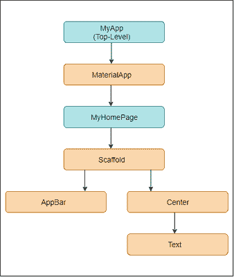
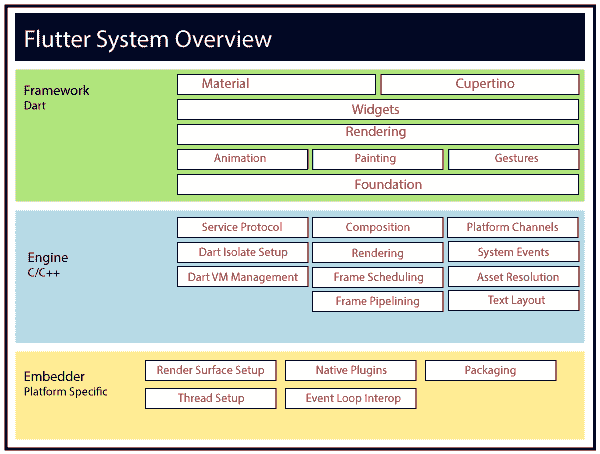

# 颤振结构

> 原文：<https://www.javatpoint.com/flutter-architecture>

在这一节中，我们将讨论 Flutter 框架的体系结构。颤振结构主要由四个部件组成。

1.  颤振发动机
2.  基础图书馆
3.  小工具
4.  设计特定的小部件

### 颤振发动机

它是高质量移动应用程序的可移植运行时，主要基于 C++语言。它实现了 Flutter 核心库，包括动画和图形、文件和网络输入/输出、插件架构、可访问性支持以及用于开发、编译和运行 Flutter 应用程序的 dart 运行时。它采用谷歌的开源图形库 **Skia** 来渲染低级图形。

### 基础图书馆

它包含了编写 Flutter 应用程序的基本构造块所需的所有包。这些库是用 Dart 语言编写的。

### 小工具

在 Flutter 中，一切都是一个小部件，这是这个框架的核心概念。Flutter 中的 Widget 基本上是一个用户界面组件，它影响和控制应用程序的视图和界面。它代表了用户界面一部分的不可改变的描述，包括图形、文本、形状和使用小部件创建的动画。小部件类似于反应组件。

在 Flutter 中，应用程序本身是一个包含许多子小部件的小部件。这意味着该应用程序是顶级小部件，其用户界面是使用一个或多个子小部件构建的，其中也包括子小部件。该功能可以帮助您非常轻松地创建复杂的用户界面。

我们可以从上一节创建的 hello world 示例中理解它。在这里，我们将用下图来解释这个例子。

在上面的例子中，我们可以看到所有的组件都是包含子组件的组件。因此，Flutter 应用程序本身就是一个小部件。

### 设计特定的小部件

Flutter 框架有两组符合特定设计语言的小部件。这些是安卓应用的材质设计和 IOS 应用的库比蒂诺风格。

### 手势

这是一个使用手势检测器在 Flutter 中提供交互(如何监听和响应)的小部件。 **GestureDector** 是一个不可见的小部件，包括其子小部件的点击、拖动和缩放交互。我们还可以通过与手势检测器小部件组合，在现有小部件中使用其他交互功能。

### 国家管理

Flutter 小部件通过使用一个特殊的小部件 StatefulWidget 来维护它的状态。每当它的内部状态改变时，它总是自动重新呈现。重新渲染是通过计算新旧小部件用户界面之间的距离来优化的，并且只渲染必要的变化。

### 层

层是 Flutter 框架的一个重要概念，根据复杂性分为多个类别，并以自上而下的方式排列。最顶层是应用程序的 UI，它是特定于安卓和 iOS 平台的。第二个最顶层包含所有 Flutter 原生小部件。下一层是渲染层，渲染 Flutter 应用程序中的所有内容。然后，这些层深入到手势、基础库、引擎，最后是核心平台特定代码。下图说明了 Flutter 应用程序开发中的层。

* * *