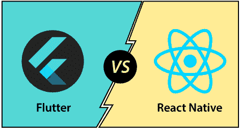

# Flutter和自然反应的区别

> 原文：<https://www.javatpoint.com/flutter-vs-react-native>

近年来，对移动应用的需求，在很大程度上增加了，以至于开发人员有了快速搜索框架来制作应用。为了让这款应用变得更快，许多开发者已经开始使用一款跨平台应用，该应用提供了许多设计电子商务应用、互动应用和社交应用的功能。

在本节中，我们将比较 React Native 和 Flutter，这有助于您确定哪种框架最适合您的应用想法。

### 什么是反应原生？

React Native 是脸书开发的开源 JavaScript 框架。它用于为安卓和 iOS 平台开发真实的本地移动应用程序。它是一个 JavaScript 框架，建立在 React 库的基础上，用一个代码库创建移动应用程序。它使用本机组件，而不是使用 web 组件作为构建块。它具有跨平台功能，允许您一次性编写代码，并且可以在任何平台上运行。它节省了您的开发时间，因为它将使您能够通过为安卓和 iOS 平台使用单一语言 JavaScript 来构建应用程序。

**反应原生**的特征

React Native 为构建移动应用程序提供了许多优势。反应原生的一些基本特性如下:

**开源:** React Native 是免费开源的。这意味着任何人都可以轻松使用它。

**跨平台:**它提供了“一次写，到处跑”的功能它用于为安卓、iOS 和视窗平台创建应用程序。

**用户界面聚焦:**反应原生主要聚焦用户界面。它使应用程序界面高度响应。

**性能:**用 React Native 编写的代码被编译成原生代码，这使得它能够在所有平台上以相同的方式为所有操作系统提供更接近的原生外观和功能。

**热重装:**在开发过程中，在你的应用程序代码中做一些改变会立即可见。如果业务逻辑改变了，它的反映会在屏幕上重新加载。

**对第三方库的支持:** React Native 支持很多第三方库，让一个 app 具有交互性。

**更快的开发:** React Native 允许您重用已经编写的代码。此功能可帮助您快速开发应用程序。它使用一种通用语言为安卓、iOS 和视窗平台构建应用程序，从而加快应用程序的部署、交付和上市时间。

### 什么是 Flutter？

Flutter 是一个 UI 工具包，用于为移动、网络和桌面创建快速、漂亮、本机编译的应用程序。它用一种编程语言和一个代码库来构建应用程序。它是免费和开源的。它最初由谷歌在 2017 年 5 月开发，现在按照 ECMA 标准管理。Flutter 是一个移动框架，使用 Flutter 编程语言创建应用程序。dart 编程与其他编程语言(如 Kotlin 和 Swift)有几个相同的特性，并且可以编译成 JavaScript 代码。

Flutter 主要针对可以在安卓和 iOS 平台上运行的 2D 移动应用进行了优化。我们还可以用它来构建功能齐全的应用，包括相机、存储、地理定位、网络、第三方 SDK 等等。

**Flutter的特征**

Flutter 提供了简单易行的方法，通过丰富的材质设计和小部件来开始构建漂亮的移动和桌面应用程序。Flutter的一些基本特征如下:

**开源:** Flutter 是一个构建移动应用的免费开源框架。

**跨平台开发:**该功能允许 Flutter 一次性编写代码，维护，可以在不同平台上运行。它节省了开发人员的时间、精力和金钱。

**热重新加载:**每当开发人员对代码进行更改时，这些更改都可以通过热重新加载瞬间看到。这意味着应用程序本身可以立即看到变化。这是一个非常方便的特性，允许开发人员立即修复错误。

**可访问的原生特性:**通过 Flutter 的原生代码、第三方集成和平台 API，该特性使应用程序开发过程变得简单而愉快。因此，我们可以轻松访问两个平台上的 SDK。

**最小代码:** Flutter app 采用 Flutter 编程语言开发，采用 JIT 和 AOT 编译，提高整体启动时间、功能和加速性能。JIT 增强了开发系统并刷新了用户界面，而无需额外的努力来构建一个新的系统。

**小部件:**Flutter 框架提供了小部件，能够开发可定制的特定设计。最重要的是，Flutter 有两套小部件:Material Design 和 Cupertino 小部件，它们有助于在所有平台上提供无故障体验。

让我们通过下面的对比图来理解 Flutter 和 React Native 之间的本质区别。

| 概念 | 摆动 | 原生反应 |
| 开发人 | 最早是谷歌推出的。 | 这是脸书首先介绍的。 |
| 释放；排放；发布 | 2017 年 5 月 | 2015 年 6 月 |
| 程序设计语言 | 它使用 **Flutter** 语言创建了一个移动应用。 | 它使用 **JavaScript** 创建移动应用。 |
| 体系结构 | Flutter 使用业务逻辑组件(BLoC)架构。 | React Native 使用 Flux 和 Redux 架构。通量由脸书创造，而 Redux 是社区中的首选。 |
| 用户界面 | 它使用自定义小部件来构建应用程序的用户界面。 | 它使用本机用户界面控制器来创建应用程序的用户界面。 |
| 文件 | Flutter 文档很好，有条理，而且信息量更大。我们可以在一个地方得到所有我们想写的东西。 | React 原生文档对用户友好，但缺乏条理。 |
| 表演 | Flutter应用的性能很快。Flutter 使用 arm C/C++库编译应用程序，使其更接近机器代码，并为应用程序提供更好的本机性能。 | 与 Flutter 应用程序相比，React Native 应用程序的性能较慢。在这里，有时开发人员在运行混合应用程序架构时会遇到问题。 |
| 测试 | Flutter 提供了一套非常丰富的测试功能。这个特性允许开发人员执行单元测试、集成测试和小部件测试。 | React Native 使用可用于测试应用程序的第三方工具。 |
| 社区支持 | 与 React Native 相比，它的社区支持更少。 | 它拥有非常强大的社区支持，可以快速解决问题。 |
| 热重装 | 支持 | 支持 |
| 流行 | GitHub 上的 81200 颗星(2019 年 12 月) | GitHub 上的 83200 颗星(2019 年 12 月) |
| 最新版本 | Flutter-v1.12.13 | React Native-v0.61.0 |
| 行业采用 | 谷歌广告
汉密尔顿
反衬
贤宇 | Facebook
insta gram
LinkedIn
Skype |

* * *