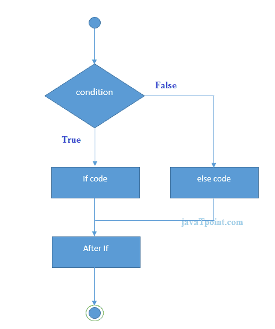

# 什么是 Dart 编程

> 原文：<https://www.javatpoint.com/flutter-dart-programming>

Dart 是由 **Google 在 2011 年**开发的开源、通用、面向对象的 C 风格语法编程语言。Dart 编程的目的是为网络和移动应用程序创建前端用户界面。它正在积极开发中，被编译为用于构建移动应用程序的本机机器代码，灵感来自其他编程语言，如 Java、JavaScript、C#，并且是强类型的。因为 Dart 是一种编译语言，所以您不能直接执行代码；相反，编译器解析它并将其转换成机器代码。

与其他编程语言不同，它支持编程语言的大多数常见概念，如类、接口、函数。Dart 语言不直接支持数组。它支持集合，集合用于复制数据结构，如数组、泛型和可选类型。

下面的例子展示了简单的 Dart 编程。

```

void main() {
  for (int i = 0; i < 5; i++) {
    print('hello ${i + 1}');
  }
}

```

## 数据类型

Dart 是一种强类型编程语言。这意味着，您在编程语言中使用的每个值都有一个字符串或数字类型，并且在编译代码时必须是已知的。在这里，我们将讨论 Dart 编程语言中使用的最常见的基本数据类型。

| 数据类型 | 例子 | 描述 |
| 线 | String myName = 'javatpoint'; | 它保存文本。在这种情况下，可以使用单引号或双引号。一旦你决定了引号，你就应该和你的选择保持一致。 |
| 数字，int，双精度 | int age = 25
双倍价格= 125.50； | num 数据类型代表一个数字。Dart 有两种类型的数字:

*   Integer (it is a number without decimal places. )
*   Double (is a number with decimal places. )

 |
| 布尔代数学体系的 | 布尔 var_name = 真;
或
布尔 var_name = 假; | 它使用 bool 关键字来表示布尔值 true 和 false。 |
| 目标 | 人=人() | 通常，Dart 中的所有内容都是一个对象(例如，整数、字符串)。但是一个物体也可以更复杂。 |

## 变量和函数

变量是内存中存储值的命名空间。变量的名称被称为**标识符**。它们是数据容器，可以存储任何类型的值。例如:

```

var myAge = 50;

```

这里， **myAge** 是存储整数值 50 的变量。我们也可以给它 int 和 double。然而，Dart 有一个特性类型推断，它可以推断值的类型。因此，如果您创建一个带有 **var** 关键字的变量，Dart 可以推断该变量属于整数类型。

除了变量，函数是任何编程语言的另一个核心特征。函数是执行特定任务的一组语句。它们被组织成可读、可维护和可重用的逻辑代码块。函数声明包含函数名、返回类型和参数。以下示例解释了 Dart 编程中使用的函数。

```

//Function declaration
num addNumbers(num a, num b) {
    // Here, we use num as a type because it should work with int and double both.
    return a + b;
}
var price1 = 29.99;
var price2 = 20.81;
var total = addNumbers(price1, price2);
var num1 = 10;
var num2 = 45;
var total2 = addNumbers(num1, num2);

```

## 经营者

Dart 语言支持所有运算符，因为您熟悉其他编程语言，如 C、Kotlin 和 Swift。操作员姓名如下:

*   算术
*   平等
*   增量和减量
*   逻辑学的
*   比较

## 决策和循环

决策是一项功能，允许您在执行指令之前评估条件。Dart 语言支持以下类型的决策陈述:

*   如果语句
*   If-else 语句
*   交换语句

下图解释得更清楚。



### 例子

```

void main() { 
   var num = 12; 
   if (num % 2 = = 0) { 
      print("Number is Even."); 
   } else { 
      print("Number is Odd."); 
   } 
}

```

**循环**用于重复执行一个代码块，直到指定条件变为真。Dart 语言支持以下类型的循环语句:

*   为
*   为..在
*   正在…
*   做..正在…

下图解释得更清楚。


### 例子

```

void main() { 
   var name = ["Peter", "Rinky Ponting", "Abhishek"]; 

   for (var prop in name) { 
      print(prop); 
   } 
}

```

## 评论

注释是**不可执行**代码的行。它们是所有编程语言的主要方面之一。这样做的目的是提供关于项目、变量或操作的信息。Dart 编程中有三种类型的注释:

*   **做格式注释:**是单行注释(//)
*   **阻止注释:**是多行注释(/*...*/)
*   **单据注释:**是用于成员和类型的单据注释(///)

## 继续和中断

Dart 还在循环中使用了 continue 和 break 关键字，以及它需要的其他地方。continue 语句允许您跳过循环中的剩余代码，并立即跳到循环的下一次迭代。我们可以从下面的例子来理解。

### 例子

```

void main() { 
  for(int i=1;i<=10;i++){  
    if(i==5){  
      print("Hello");
      continue; //it will skip the rest statement      
    }  
    print(i);  
  } 
}

```

**break** 语句允许您终止或停止程序的当前流，并在循环体之后继续执行。下面的例子给出了详细的解释。

### 例子

```

void main() { 
  for(int i=1;i<=10;i++){  
    if(i==5){  
      print("Hello");
      break;//it will terminate the rest statement      
    }  
    print(i);  
  } 
}

```

## 最终关键字和常量关键字

我们可以使用一个最终关键字来限制用户。它可以应用于许多环境，如变量、类和方法。

Const 关键字用于声明常量。我们不能在赋值后改变 const 关键字的值。

### 例子

```

void main() { 
  final a = 100;
  const pi = 3.14;
  print(a);
  print(pi);
}

```

## 面向对象编程

Dart 是一种面向对象的编程语言，这意味着 Dart 中的每个值都是一个对象。在 Dart 语言中，数字也是一个对象。Dart 编程支持 OOPs 特性的概念，如对象、类、接口等。

**对象:**对象是实体，具有状态和行为。它可以是物理的，也可以是逻辑的。在 Dart 中，每个值都是一个对象，甚至像文本和数字这样的原始值。Dart 还允许您构建自定义对象来表达数据之间更复杂的关系。

**类:**类是对象的集合。这意味着对象是在类的帮助下创建的，因为每个对象都需要一个蓝图，基于这个蓝图，您可以创建一个单独的对象。类定义包括以下内容:

*   菲尔茨
*   方法
*   构造器
*   吸气剂和沉降剂

让我们看一个例子，它可以帮助您轻松理解 OOPs 概念。

```

class Mobile {
  // Property Declaration
  String color, brandName, modelName;

  // Method Creation
  String calling() {
    return "Mobile can do call to everyone.";
  }
  String musicPlay() {
    return "Mobile can play all types of Music.";
  }
  String clickPicture() {
    return "Mobile can take pictures.";
  }
}

void main() {
  // Object Creation
  var myMob = new Mobile(); 

  // Accessing Class's Property
  myMob.color = "Black"; 
  myMob.brandName = "Apple Inc.";
  myMob.modelName = "iPhone 11 Pro";

  //Display Output
  print(myMob.color);
  print(myMob.modelName);
  print(myMob.brandName);
  print(myMob.calling());
  print(myMob.musicPlay());
  print(myMob.clickPicture());
}

```

在上面的例子中，我们定义了一个类 **Mobile** ，它有三个字符串类型的变量和三个函数或方法。然后，我们创建一个**主**功能，当你的应用程序启动时，Dart 将首先执行该功能。在主菜单中，我们创建一个**对象**来访问类的属性。最后，我们打印输出。

* * *