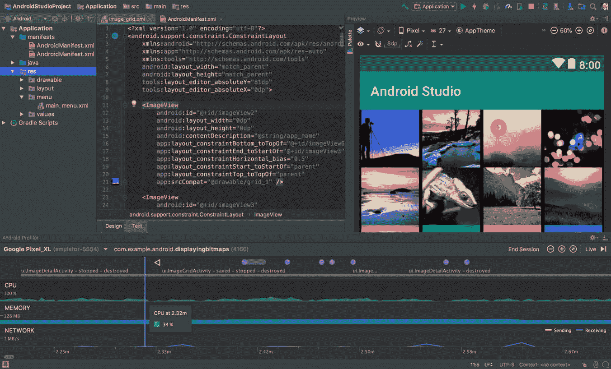
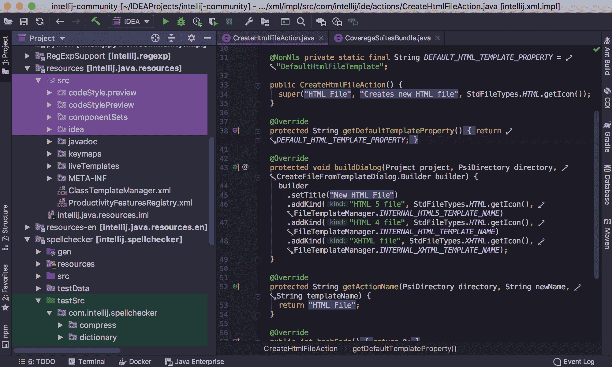
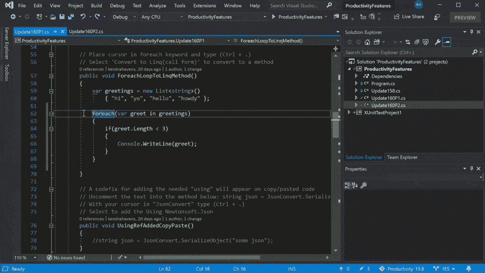
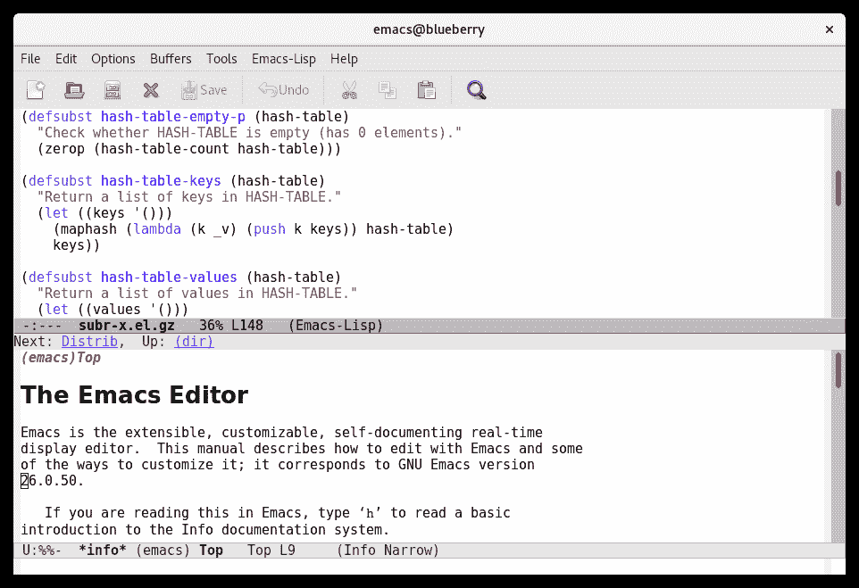

# Flutter 显影剂

> 原文： [https://www.javatpoint.com/flutter-ide](https://www.javatpoint.com/flutter-ide)

IDE(编辑器)是允许用户创建和编辑文本文件的软件程序。在开发领域，编辑器通常指的是源代码编辑器，它包含许多用于编写和编辑代码的特殊功能。

我们可以使用任何文本编辑器创建 Flutter 应用程序，这些编辑器可以很容易地与我们的命令行工具相结合。但是，建议使用编辑器插件(IDE)以获得更好的体验。这些插件带有语法高亮显示、代码完成、小部件编辑辅助、运行和调试支持以及许多其他功能。 [Flutter](https://www.javatpoint.com/flutter) 支持多个 [IDE](https://www.javatpoint.com/ide-full-form) 来构建应用。下面将讨论其中的一些，但是如果您想使用不同的编辑器，您可以继续。

为 Flutter 应用开发提供最有效支持的最流行的集成开发环境是:

*   Android Studio
*   智能理念
*   可视化工作室
*   以太网接口
*   代码魔法

让我们逐一查看每个 IDE。

## Android Studio

它是免费的、开源的，也是用于在各种安卓设备上构建应用程序的最快工具。它为开发 Flutter 应用程序提供了完整的体验，如代码完成、导航、语法突出显示、重构、小部件编辑辅助以及运行和调试支持等。[AndroidStudio](https://www.javatpoint.com/android-studio)的主要目的是加速开发进程，为所有安卓设备构建高质量的应用。它允许开发人员自动修复某些代码问题。

要下载 AndroidStudio，[点击这里](https://developer.android.com/studio)。

## 智能理念

[IntelliJ IDEA](https://www.javatpoint.com/intellij-idea-tutorial) 是开发者中最强大、最受欢迎的 IDE，由**捷脑公司**开发维护。由**Apache 2.0** 授权。它支持多种语言来开发应用程序。它将成为许多开发人员最喜欢的 IDE，因为它支持优秀的插件和全面的内置功能集。如果你要用 **Flutter 语言**开发一个应用程序，与其他 ide 相比，它是一个主要的领导者。它为应用程序开发提供了完整的体验，例如 Flutter 的智能编码帮助，包括代码完成、格式化、导航、意图、重构、内置调试器、与 pub 和 Flutter 分析服务器的集成。它允许我们自动修复某些代码问题。

**IntelliJ Idea 主要有两个版本**:

1.  社区版(免费，开源。)
2.  终极版(付费版，免费试用 30 天)

要下载 IntelliJ Idea，[点击这里](https://www.jetbrains.com/idea/download/#section=windows)。

## Visual Studio 代码

Visual Studio Code 或 VS Code IDE 是市场上开发 Flutter 应用程序的著名编辑器。它免费且易于使用。大多数开发人员使用这个 IDE 进行 Flutter 应用程序开发，因为**微软值得信赖的公司支持它**。具有较高的成长性和支撑性。它提供了一个简单的 Flutter 插件，使应用程序开发更快(在 10 分钟或更短时间内)。它提供了诸如语法突出显示、代码完成、实时错误/警告/TODOs、发布获取包命令、发布升级包命令、类型层次结构等功能。VS 代码编辑器可以在 macOS、Windows 和 [Linux](https://www.javatpoint.com/linux-tutorial) 上工作。

要下载 VS 代码，[点击这里](https://code.visualstudio.com/download)。

## Emacs (Flutter 模式)

这是一个轻量级的集成开发环境，使用 Flutter 和 [Flutter](https://www.javatpoint.com/dart-programming) 为应用程序开发提供支持。它是 **[GitHub](https://www.javatpoint.com/what-is-github)** 上的一个免费开源插件。它可以直接在我们的 Emacs 安装中使用，以便在 Flutter 中编码。它是一个可扩展的、可定制的、自我记录的实时显示编辑器，支持 10000 多个内置命令。Emacs 可以与多种操作系统协同工作，如 [GNU](https://www.javatpoint.com/gnu-full-form) 、GNU/Linux、MacOS、 [Windows](https://www.javatpoint.com/windows) 、FreeBSD、OpenBSD、Solaris。

要下载 Emacs，[点击这里](https://www.gnu.org/software/emacs/download.html)。

## 代码魔法

它也是在创纪录的时间内开发、测试和交付 Flutter 应用程序的有用工具。如果我们使用 Flutter 框架开发一个应用，它将**推动**的开发进程。它提供 **Cinemagic** 来测试和发布该应用。这也有助于营销我们的应用程序，而不会面临许多问题。它是一个免费的开源 IDE。它还允许我们贡献任何东西来改进它的文档。

要下载代码魔法，[点击这里](https://codemagic.io/start/)。

* * *