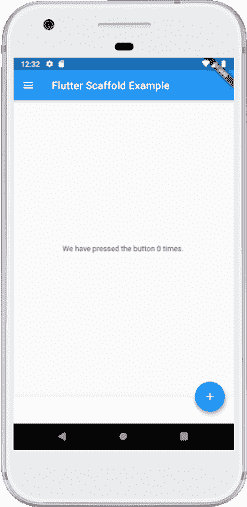
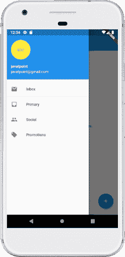

# Flutter支架

> 原文：<https://www.javatpoint.com/flutter-scaffold>

脚手架是 Flutter 中的一个小部件，用于实现基础材料**设计可视化布局结构**。它足够快，可以创建一个通用的移动应用程序，几乎包含了我们创建一个功能和响应 [Flutter](https://www.javatpoint.com/flutter) 应用程序所需的一切。这个小部件能够占据整个设备屏幕。换句话说，我们可以说它主要负责创建一个应用程序屏幕的基础，子小部件在这个基础上保持并在屏幕上呈现。它提供了许多小部件或应用编程接口来显示抽屉、滚动条、底部导航栏、应用程序栏、浮动操作按钮等等。

脚手架类是设置我们的应用程序外观和设计的快捷方式，允许我们不手动构建单个视觉元素。为应用的外观和感觉编写更多的代码可以节省我们的时间。以下是脚手架小部件类的**构造函数和属性**。

```

const Scaffold({
  Key key,
  this.appBar,
  this.body,
  this.floatingActionButton,
  this.floatingActionButtonLocation,
  this.persistentFooterButtons,
  this.drawer,
  this.endDrawer,
  this.bottomNavigationBar,
  this.bottomSheet,
  this.floatingActionButtonAnimator,
  this.backgroundColor,
  this.resizeToAvoidBottomPadding = true,
  this.primary = true,
}) 

```

让我们详细了解上述所有属性。

**1。appBar:** 是一个**横条**，主要显示在脚手架小部件的**顶部**。它是脚手架小部件的主要部分，显示在屏幕顶部。没有这个属性，脚手架小部件是不完整的。它使用本身包含各种属性(如海拔、标题、亮度等)的 appBar 小部件。请参见下面的示例:

```

Widget build(BuildContext context) 
{
  return Scaffold(
    appBar: AppBar(
      title: Text('First Flutter Application'),
    ), )
}

```

在上面的代码中，title 属性使用**文本小部件**在屏幕上显示文本。

**2。正文:**这是这个小部件的另一个主要和必需的属性，它将**在支架**中显示主要内容。它表示应用栏下方和浮动操作按钮&抽屉后面的位置。默认情况下，正文中的小部件位于可用空间的左上角。请参见下面的代码:

```

Widget build(BuildContext context) { 
return Scaffold( 
	appBar: AppBar( 
	title: Text('First Flutter Application'), 
	), 
	body: Center( 
	child: Text("Welcome to Javatpoint", 
		style: TextStyle( color: Colors.black, fontSize: 30.0, 
		), 
	     ), 
	),
}

```

在上面的代码中，我们显示了一段文字**“欢迎来到 Javatpoint！!"**在身体属性上。使用**中心部件**，该文本在页面的**中心**对齐。在这里，我们还使用了 **TextStyle** 小部件来设置文本的样式，例如颜色、字体大小等。

**3。抽屉:**是一个**滑块面板**，显示在机身侧面。通常，它隐藏在移动设备上，但用户可以从左向右或从右向左滑动它来访问抽屉菜单。它使用**抽屉小部件属性**从支架边缘沿**水平方向**滑动，以显示应用程序中的导航链接。在应用程序栏属性中自动为抽屉设置合适的**图标**。**手势**也自动设置为打开抽屉。请参见以下代码。

```

drawer: Drawer( 
		child: ListView( 
		children: const <Widget>[ 
		DrawerHeader( 
			decoration: BoxDecoration( 
			color: Colors.red, 
			), 
			child: Text( 
			'Welcome to Javatpoint', 
			style: TextStyle( 
				color: Colors.green, 
				fontSize: 30, 
			), 
		      ), 
		), 
		ListTile( 
			title: Text('1'), 
		), 
		ListTile(
			title: new Text("All Mail Inboxes"),
			leading: new Icon(Icons.mail),
		),
		Divider(
			height: 0.2,
		),
		ListTile(
			title: new Text("Primary"),
		),
		ListTile(
			title: new Text("Social"),
		),
		ListTile(
			title: new Text("Promotions"),
		), 
	    ], 
         ), 
  ),

```

在上面的代码中，我们使用脚手架的抽屉属性来创建抽屉。我们还使用了一些其他的小部件来使它更有吸引力。在**列表视图**小部件中，我们将面板分为两部分，**标题**和**菜单**。DrawerHeader 属性根据应用程序修改也包含图标或详细信息的面板标题。我们再次使用**列表**在菜单中添加列表项。

**4。浮动动作按钮:**显示在右下角，浮动在机身上方的按钮。它是一个圆形图标按钮，浮动在屏幕内容的固定位置，以促进应用程序中的主要操作。滚动页面时，其位置不能改变。它使用浮动动作按钮小部件属性，使用**脚手架。请参见下面的代码:**

```

Widget build(BuildContext context) { 
         return Scaffold( 
	appBar: AppBar(title: Text('First Flutter Application')), 
	body: Center( 
		child: Text("Welcome to Javatpoint!!"), 
	), 
	floatingActionButton: FloatingActionButton( 
		elevation: 8.0, 
		child: Icon(Icons.add), 
		onPressed: (){ 
		   print('I am Floating Action Button');
		} 
	); 
}

```

在上面的代码中，我们使用了**高程**属性，该属性为按钮赋予了**阴影效果**。我们还使用了图标小部件，使用预加载的 Flutter SDK 图标为按钮提供图标。当用户点击按钮时将调用**onpreceded()**属性，在控制台上将打印语句**“我是浮动动作按钮”**。

**5。backgroundColor:** 该属性用于设置整个 Scaffold 小部件的背景颜色。

```

backgroundColor: Colors.yellow,

```

**6。primary:** 用于判断屏幕顶部是否会显示脚手架。它的默认值是**真**，这意味着应用程序栏的高度扩展了屏幕状态栏的高度。

```

primary: true/false,

```

**7。persistentFooterButton:** 它是显示在脚手架小部件底部的按钮列表。这些属性项始终可见；甚至我们还滚动了脚手架的主体。它总是被包裹在一个**按钮栏部件**中。它们呈现在主体下方，但在底部导航栏上方。

```

persistentFooterButtons: <Widget>[
  RaisedButton(
    onPressed: () {},
    color: Colors.blue,
    child: Icon(
      Icons.add,
      color: Colors.white,
    ),
  ),
  RaisedButton(
    onPressed: () {},
    color: Colors.green,
    child: Icon(
      Icons.clear,
      color: Colors.white,
    ),
  ),
],

```

在上面的代码中，我们使用了显示在脚手架底部的**上升按钮**。我们也可以使用**平板按钮**代替上升按钮。

**8。底部导航栏:**该属性类似于**菜单，在脚手架底部显示导航栏**。这可以在大多数移动应用中看到。此属性允许开发人员在栏中添加多个图标或文本作为项目。它应该呈现在主体和 persistentFooterButtons 下面。请参见下面的代码:

```

bottomNavigationBar: BottomNavigationBar(
  currentIndex: 0,
  fixedColor: Colors.grey,
  items: [
    BottomNavigationBarItem(
      title: Text("Home"),
      icon: Icon(Icons.home),
    ),
    BottomNavigationBarItem(
      title: Text("Search"),
      icon: Icon(Icons.search),
    ),
    BottomNavigationBarItem(
      title: Text("User Profile"),
      icon: Icon(Icons.account_circle),
    ),
  ],
  onTap: (int itemIndex){
    setState(() {
      _currentIndex = itemIndex;
    });
  },
),

```

在上面的代码中，我们使用了 BottomNavigationBar 小部件来显示菜单栏。**固定颜色**属性用于活动图标的**颜色**。**底部导航工具栏**小部件用于在包含文本和图标的栏中添加项目作为其子属性。我们还使用了 **onTap(int itemIndex)** 函数来执行一个动作，当我们点击项目时，它根据它们的索引位置工作。

**9。endDrawer:** 类似于抽屉属性，但默认情况下显示在屏幕右侧。可以从右向左刷，也可以从左向右刷。

**10。resizetovaidbottoninset:**如果是**真**，身体和支架的浮动小部件应该自己调整大小以避开屏幕键盘。底部属性定义屏幕键盘高度。

**11 时。浮动动作按钮位置:**默认位于屏幕右下角。它用于确定浮动操作按钮的位置。它包含许多预定义的常量，如中心停靠、中心浮动、末端停靠、末端浮动等。

以上就是脚手架的各种属性，这些属性为我们提供了脚手架小部件的概述。它的主要目的是熟悉不同的性质和它们在Flutter应用中的用途。如果我们想更详细地了解它，请参考Flutter文档[这里的](https://api.flutter.dev/flutter/material/Scaffold-class.html)。

让我们看看这个例子，在这个例子中，我们试图使用大多数的脚手架属性来快速而容易地理解这个小部件。

在本例中，我们将看到一个带有应用程序栏、底部应用程序栏、浮动操作按钮、浮动操作按钮位置和抽屉属性的脚手架小部件。

```

import 'package:flutter/material.dart';

void main() => runApp(MyApp());

/// This Widget is the main application widget.
class MyApp extends StatelessWidget {
  @override
  Widget build(BuildContext context) {
    return MaterialApp(
      home: MyStatefulWidget(),
    );
  }
}

class MyStatefulWidget extends StatefulWidget {
  MyStatefulWidget({Key key}) : super(key: key);

  @override
  _MyStatefulWidgetState createState() => _MyStatefulWidgetState();
}

class _MyStatefulWidgetState extends State<MyStatefulWidget> {
  int _count = 0;

  Widget build(BuildContext context) {
    return Scaffold(
      appBar: AppBar(
        title: Text('Flutter Scaffold Example'),
      ),
      body: Center(
        child: Text('We have pressed the button $_count times.'),
      ),
      bottomNavigationBar: BottomAppBar(
        shape: const CircularNotchedRectangle(),
        child: Container(
          height: 50.0,
        ),
      ),
      floatingActionButton: FloatingActionButton(
        onPressed: () => setState(() {
          _count++;
        }),
        tooltip: 'Increment Counter',
        child: Icon(Icons.add),
      ),
      floatingActionButtonLocation: FloatingActionButtonLocation.endDocked,
      drawer: Drawer(
        elevation: 20.0,
        child: Column(
          children: <Widget>[
            UserAccountsDrawerHeader(
              accountName: Text("javatpoint"),
              accountEmail: Text("javatpoint@gmail.com"),
              currentAccountPicture: CircleAvatar(
                backgroundColor: Colors.yellow,
                child: Text("abc"),
              ),
            ),
            ListTile(
              title: new Text("Inbox"),
              leading: new Icon(Icons.mail),
            ),
            Divider( height: 0.1,),
            ListTile(
              title: new Text("Primary"),
              leading: new Icon(Icons.inbox),
            ),
            ListTile(
              title: new Text("Social"),
              leading: new Icon(Icons.people),
            ),
            ListTile(
              title: new Text("Promotions"),
              leading: new Icon(Icons.local_offer),
            )
          ],
        ),
      ),
    );
  }
}

```

**输出:**

当我们在 IDE 中运行这个项目时，我们将看到如下截图所示的 UI。



如果我们点击屏幕左上角可以看到的三行，我们会看到抽屉。抽屉可以从右向左或从左向右滑动。见下图。



* * *