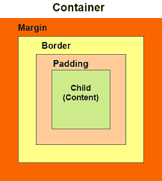
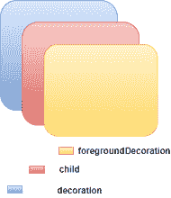
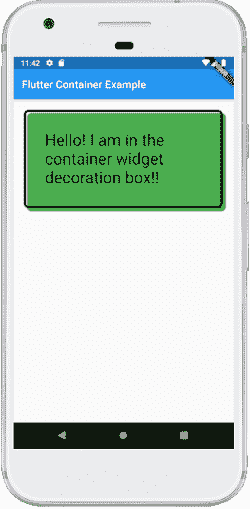
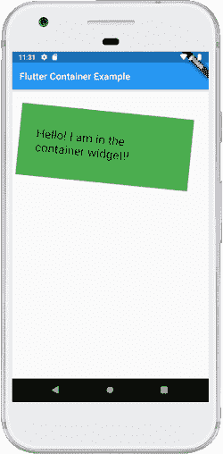

# Flutter 容器

> 原文：<https://www.javatpoint.com/flutter-container>

Flutter 中的容器是一个**父小部件，它可以包含多个子小部件**，并通过宽度、高度、填充、背景颜色等有效地管理它们。它是一个小部件，结合了子小部件的常见绘制、定位和大小调整。它也是一个存储一个或多个小部件并根据我们的需要在屏幕上定位它们的类。一般来说，它类似于一个用于存储内容的盒子。它允许用户使用许多属性来装饰其子部件，例如使用**边距**，该边距将容器与其他内容分开。

容器小部件与 html 中的 **< div >** 标签相同。如果这个小部件不包含任何子小部件，它将自动填充屏幕上的整个区域。否则会按照指定的高度&宽度包裹子小部件。是**注意**这个小部件没有任何父小部件是不能直接渲染的。我们可以使用支架小部件、中心小部件、填充小部件、行小部件或列小部件作为其父小部件。

### 为什么我们在 Flutter 中需要一个容器小部件？

如果我们有一个小部件需要一些背景样式，可能是颜色、形状或大小的限制，我们可以尝试**将其包装在一个容器小部件**中。这个小部件帮助我们组合、装饰和定位它的子小部件。如果我们将小部件包装在一个容器中，那么在不使用任何参数的情况下，我们不会注意到它的外观有任何不同。但是如果我们添加任何属性，如颜色、边距、填充等。在容器中，我们可以根据自己的需要在屏幕上设计小部件的样式。

> 基本容器的子小部件周围有边距、边框和填充属性，如下图所示:



### 容器类的构造函数

以下是容器类构造函数的语法:

```

Container({Key key,
           AlignmentGeometry alignment, 
           EdgeInsetsGeometry padding, 
           Color color, 
           double width, 
           double height,
           Decoration decoration, 
           Decoration foregroundDecoration, 
           BoxConstraints constraints, 
           Widget child, 
           Clip clipBehavior: Clip.none
});

```

## 容器小部件的属性

让我们详细了解容器小部件的一些基本属性。

**1。child:** 该属性用于存储容器的子小部件。假设我们将一个文本小部件作为其子小部件，如下例所示:

```

Container(
	child: Text("Hello! I am in the container widget", style: TextStyle(fontSize: 25)),
)

```

**2。颜色:**该属性用于设置文本的**背景颜色。它还会改变整个容器的背景颜色。请参见下面的示例:**

```

Container(
	color: Colors.green, 
	child: Text("Hello! I am in the container widget", style: TextStyle(fontSize: 25)),
)

```

**3。高度和宽度:**该属性用于根据我们的需要设置容器的高度和宽度。默认情况下，容器总是根据其子小部件占据空间。请参见下面的代码:

```

Container(
	width: 200.0,
	height: 100.0,
	color: Colors.green, 
	child: Text("Hello! I am in the container widget", style: TextStyle(fontSize: 25)),
)

```

**4。边距:**该属性用于包围容器周围的空间。我们可以通过观察容器周围的空白来观察这一点。假设我们使用了 **EdgeInsets.all(25)** 在所有四个方向上设置相等的边距，如下例所示:

```

Container(
	width: 200.0,
	height: 100.0,
	color: Colors.green, 
	margin: EdgeInsets.all(20),
	child: Text("Hello! I am in the container widget", style: TextStyle(fontSize: 25)),
)

```

**5。填充:**该属性用于**设置容器(所有四个方向)的边框与其子小部件之间的距离**。我们可以通过查看容器和子小部件之间的空间来观察这一点。在这里，我们使用了一个 EdgeInsets.all(35)来设置文本和所有四个容器方向之间的间距:

```

Container(
	width: 200.0,
	height: 100.0,
	color: Colors.green, 
	padding: EdgeInsets.all(35),
	margin: EdgeInsets.all(20),
	child: Text("Hello! I am in the container widget", style: TextStyle(fontSize: 25)),
)

```

**6。对齐:**该属性用于**设置容器内孩子的位置**。 [Flutter](https://www.javatpoint.com/flutter) 允许用户以各种方式对齐其元素，例如中心、底部、底部中心、顶部边缘、中心右侧、左侧、右侧等等。在下面的示例中，我们将把它的子对象对齐到右下角的位置。

```

Container(
	width: 200.0,
	height: 100.0,
	color: Colors.green, 
	padding: EdgeInsets.all(35),
	margin: EdgeInsets.all(20),
	alignment: Alignment.bottomRight,
	child: Text("Hello! I am in the container widget", style: TextStyle(fontSize: 25)),
)

```

**7。装饰:**该属性允许开发者**在小部件**上添加装饰。它装饰或绘制孩子背后的小部件。如果我们想在孩子面前装饰或绘画，我们需要使用**进行地面装饰**参数。下图解释了它们之间的区别，前地面装饰覆盖了孩子，后装饰油漆覆盖了孩子。



装饰属性支持许多参数，如颜色、渐变、背景图像、边框、阴影等。是为了保证**我们可以在容器或者装饰中使用颜色属性，但不能同时在**中使用。请参见下面的代码，其中我们添加了边框和阴影属性来装饰盒子:

```

import 'package:flutter/material.dart';

void main() => runApp(MyApp());

/// This Widget is the main application widget.
class MyApp extends StatelessWidget {

  @override
  Widget build(BuildContext context) {
    return MaterialApp(
      home: Scaffold(
        appBar: AppBar(
          title: Text("Flutter Container Example"),
        ),
        body: Container(
          padding: EdgeInsets.all(35),
          margin: EdgeInsets.all(20),
          decoration: BoxDecoration(
            border: Border.all(color: Colors.black, width: 4),
            borderRadius: BorderRadius.circular(8),
            boxShadow: [
              new BoxShadow(color: Colors.green, offset: new Offset(6.0, 6.0),),
            ],
          ),
          child: Text("Hello! I am in the container widget decoration box!!",
              style: TextStyle(fontSize: 30)),
        ),
      ),
    );
  }
}

```

我们将看到如下截图的输出:



**8。transform:**transform 属性允许开发者**旋转容器**。它可以在任何方向旋转容器，即在父小部件中更改容器坐标。在下面的例子中，我们将在 **z 轴**旋转容器。

```

Container(
	width: 200.0,
	height: 100.0,
	color: Colors.green, 
	padding: EdgeInsets.all(35),
	margin: EdgeInsets.all(20),
	alignment: Alignment.bottomRight,
	transform: Matrix4.rotationZ(0.1), 
	child: Text("Hello! I am in the container widget", style: TextStyle(fontSize: 25)),
)

```

**9。约束:**当我们想要**给孩子**添加额外的约束时，使用这个属性。它包含各种构造函数，如紧、松、扩等。让我们看看如何在我们的应用程序中使用这些构造函数:

**紧:**如果我们在这个中使用 size 属性，它会给孩子一个固定值。

```

Container(
	color: Colors.green, 
	constraints: BoxConstraints.tight(Size size)
		: minWidth = size.width, maxWidth = size.width,
		  minHeight = size.height, maxHeight = size.height; 
	child: Text("Hello! I am in the container widget", style: TextStyle(fontSize: 25)),
)

```

**展开:**在这里，我们可以选择高度、宽度，或者两个值都给孩子。

```

Container(
	color: Colors.green, 
	constraints: BoxConstraints.expand(height: 60.0), 
	child: Text("Hello! I am in the container widget", style: TextStyle(fontSize: 25)),
)

```

让我们通过一个例子来理解它，在这个例子中，我们将尝试覆盖大多数容器属性。打开 **main.dart** 文件，用下面的代码替换:

```

import 'package:flutter/material.dart';

void main() => runApp(MyApp());

/// This Widget is the main application widget.
class MyApp extends StatelessWidget {

  @override
  Widget build(BuildContext context) {
    return MaterialApp(
      home: MyContainerWidget(),
    );
  }
}

class MyContainerWidget extends StatelessWidget {
  @override
  Widget build(BuildContext context) {
    return MaterialApp(
      home: Scaffold(
        appBar: AppBar(
          title: Text("Flutter Container Example"),
        ),
        body: Container(
          width: double.infinity,
          height: 150.0,
          color: Colors.green,
          margin: EdgeInsets.all(25),
          padding: EdgeInsets.all(35),
          alignment: Alignment.center,
          transform: Matrix4.rotationZ(0.1),
          child: Text("Hello! I am in the container widget!!",
              style: TextStyle(fontSize: 25)),
        ),
      ),
    );
  }
}

```

**输出**

当我们运行这个应用时，它会给出如下截图:



* * *