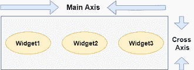
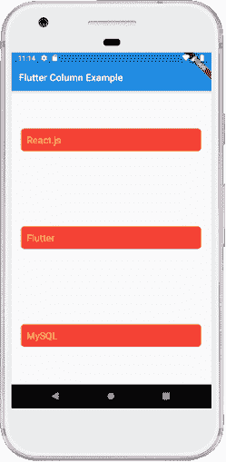

# Flutter 行列

> 原文：<https://www.javatpoint.com/flutter-row-and-column>

在前面几节中，我们已经学习了创建一个简单的 Flutter 应用程序及其对小部件的基本样式。现在，我们将学习如何在屏幕上按行和列排列小部件。行和列不是一个小部件；它们是两个不同的小部件，即行和列。在这里，我们将把这两个小部件集成在一起，因为它们具有相似的属性，可以帮助我们高效快速地理解它们。

行和列是 [Flutter](https://www.javatpoint.com/flutter) 中两个必不可少的小部件，允许开发者根据我们的需要**水平和垂直对齐孩子**。当我们在 Flutter 中设计应用程序用户界面时，这些小部件是非常必要的。

## 要点

1.  行和列小部件是 Flutter 应用程序中最常用的布局模式。
2.  两者都可能需要几个子小部件。
3.  子小部件也可以是行或列小部件。
4.  我们可以扩展或限制特定的儿童小部件。
5.  Flutter 还允许开发人员指定子小部件如何使用行和列小部件的可用空间。

## 行小部件

**这个小部件在屏幕上以水平方向排列其子代**。换句话说，它将期望水平阵列中的子小部件。如果子小部件需要填充可用的水平空间，我们必须将子小部件包装在一个展开的小部件中。

行小部件**不显示为可滚动的**，因为它在可见视图中显示小部件。因此，如果我们连续有更多的孩子，而这些孩子又不适合现有的空间，这就被认为是错误的。如果我们想制作一个可滚动的行小部件列表，我们需要使用 ListView 小部件。

我们可以使用属性**交叉轴对齐**和**主轴对齐**来控制行小部件如何根据我们的选择对齐其子部件。该排的**横轴**将垂直运行**，主轴**将水平运行**。请参见下面的视觉表示，以便更清楚地理解它。******

****

#### 注意:Flutter row 小部件还有其他几个属性，如 mainAxisSize、textDirection、verticalDirection 等。在这里，我们将只讨论 mainAxisAlignment 和 crossAxisAlignment 属性。

我们可以借助以下属性来对齐行的子小部件:

*   **开始:**会从主轴的起点开始放置孩子。
*   **结束:**会把孩子放在主轴的末端。
*   **中心:**会把孩子放在主轴的中间。
*   **space before:**它会将孩子之间的自由空间平均放置。
*   **space round:**它会在第一个和最后一个子部件前后，将子部件之间的空闲空间平均分配给该空间的一半。
*   **空间均匀:**它会将子部件之间的自由空间均匀地放置在第一个和最后一个子部件的前后。

让我们借助一个例子来理解它，在这个例子中，我们将对齐内容，以便在一行中的孩子周围有一个均匀的空间:

```

import 'package:flutter/material.dart';

void main() { runApp(MyApp()); }
class MyApp extends StatelessWidget {
  @override
  Widget build(BuildContext context) {
    return MaterialApp(
      home: MyHomePage()
    );
  }
}

class MyHomePage extends StatefulWidget {
  @override
  _MyHomePageState createState() => _MyHomePageState();
}

class _MyHomePageState extends State<MyHomePage> {
  @override
  Widget build(BuildContext context) {
    return Scaffold(
      appBar: AppBar(
        title: Text("Flutter Row Example"),
      ),
      body: Row(
          mainAxisAlignment: MainAxisAlignment.spaceEvenly,
          children:<Widget>[
            Container(
              margin: EdgeInsets.all(12.0),
              padding: EdgeInsets.all(8.0),
              decoration:BoxDecoration(
                  borderRadius:BorderRadius.circular(8),
                  color:Colors.green
              ),
              child: Text("React.js",style: TextStyle(color:Colors.yellowAccent,fontSize:25),),
            ),
            Container(
              margin: EdgeInsets.all(15.0),
              padding: EdgeInsets.all(8.0),
              decoration:BoxDecoration(
                  borderRadius:BorderRadius.circular(8),
                  color:Colors.green
              ),
              child: Text("Flutter",style: TextStyle(color:Colors.yellowAccent,fontSize:25),),
            ),
            Container(
              margin: EdgeInsets.all(12.0),
              padding: EdgeInsets.all(8.0),
              decoration:BoxDecoration(
                  borderRadius:BorderRadius.circular(8),
                  color:Colors.green
              ),
              child: Text("MySQL",style: TextStyle(color:Colors.yellowAccent,fontSize:25),),
            )
          ]
      ),
    );
  }
}

```

**输出:**

当我们运行这个应用程序时，我们应该得到如下截图所示的用户界面。


## 圆柱

**该小部件在屏幕上垂直排列其子部件**。换句话说，它将期待垂直排列的子小部件。如果子小部件需要填充可用的垂直空间，我们必须将子小部件包装在一个展开的小部件中。

列小部件**不显示为可滚动的**，因为它在可见视图中显示小部件。因此，如果我们在一个不适合可用空间的列中有更多的孩子，这被认为是错误的。如果我们想制作一个列小部件的可滚动列表，我们需要使用列表视图小部件。

我们还可以使用 mainAxisAlignment 和 crossAxisAlignment 属性来控制列小部件如何对齐其子部件。立柱的**横轴**将水平运行**，主轴**将垂直运行**。下面的视觉表现更清楚地解释了这一点。******

****

#### 注意:列小部件还通过使用我们在行小部件中讨论过的相同属性来对齐其内容，例如开始、结束、中心、周围空间、中间空间和均匀空间。

让我们借助一个例子来理解它，在这个例子中，我们将对齐内容，以便在一列中的子级之间有一个均匀的自由空间:

```

import 'package:flutter/material.dart';

void main() { runApp(MyApp()); }
class MyApp extends StatelessWidget {
  @override
  Widget build(BuildContext context) {
    return MaterialApp(
        home: MyHomePage()
    );
  }
}

class MyHomePage extends StatefulWidget {
  @override
  _MyHomePageState createState() => _MyHomePageState();
}

class _MyHomePageState extends State<MyHomePage> {
  @override
  Widget build(BuildContext context) {
    return Scaffold(
      appBar: AppBar(
        title: Text("Flutter Column Example"),
      ),
      body: Column(
          mainAxisAlignment: MainAxisAlignment.spaceBetween,
          children:<Widget>[
            Container(
              margin: EdgeInsets.all(20.0),
              padding: EdgeInsets.all(12.0),
              decoration:BoxDecoration(
                  borderRadius:BorderRadius.circular(8),
                  color:Colors.red
              ),
              child: Text("React.js",style: TextStyle(color:Colors.yellowAccent,fontSize:20),),
            ),
            Container(
              margin: EdgeInsets.all(20.0),
              padding: EdgeInsets.all(12.0),
              decoration:BoxDecoration(
                  borderRadius:BorderRadius.circular(8),
                  color:Colors.red
              ),
              child: Text("Flutter",style: TextStyle(color:Colors.yellowAccent,fontSize:20),),
            ),
            Container(
              margin: EdgeInsets.all(20.0),
              padding: EdgeInsets.all(12.0),
              decoration:BoxDecoration(
                  borderRadius:BorderRadius.circular(8),
                  color:Colors.red
              ),
              child: Text("MySQL",style: TextStyle(color:Colors.yellowAccent,fontSize:20),),
            )
          ]
      ),
    );
  }
}

```

**输出:**

当我们运行这个应用程序时，我们应该得到如下截图所示的用户界面。


**Flutter 还允许开发人员将行和列小部件的子小部件与 crossAxisAlignment 和 mainAxisAlignment 的组合对齐**。让我们以上面的列小部件为例，我们将设置 mainAxisAlignment 为 MainAxisAlignment.spaceAround 和 crossAxisAlignment 为 CrossAxisAlignment.stretch .它将使列的高度等于身体的高度。见下面截图。



### 行和列小部件的缺点:

*   Flutter 中的行小部件没有水平滚动。因此，如果我们在一行中插入了大量无法放入该行的子级，我们将看到溢出消息。
*   Flutter 中的列小部件没有垂直滚动。因此，如果我们在单个列中插入了大量子代，这些子代的总大小不等于屏幕的高度，我们将看到溢出消息。

* * *********