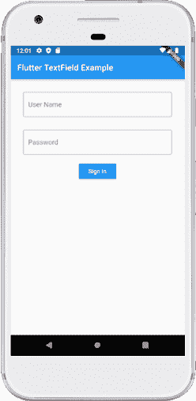
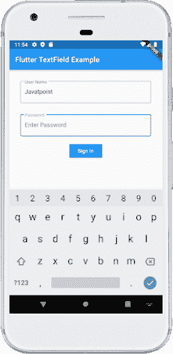
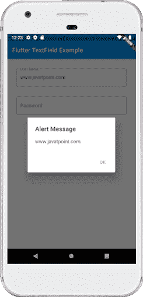

# Dart文本字段

> 原文：<https://www.javatpoint.com/flutter-textfield>

文本字段或文本框是一个**输入元素**，它保存字母数字数据，如姓名、密码、地址等。这是一个图形用户界面控制元素，使用户能够使用可编程代码**输入文本信息**。它可以是单行文本字段(当只需要一行信息时)或多行文本字段(当需要多行信息时)。

Flutter 中的 TextField 是最常用的**文本输入小部件**，它允许用户将键盘上的输入收集到一个 app 中。我们可以使用**文本字段**小部件来构建表单、发送消息、创建搜索体验等等。默认情况下，Flutter 用下划线修饰文本字段。我们还可以使用文本字段添加几个属性，例如标签、图标、内联提示文本和错误文本。如果要完全去除装修属性，需要将装修设置为**空**。

下面的代码解释了 [Flutter](https://www.javatpoint.com/flutter) 中文本文件窗口小部件的**演示示例:**

```

TextField (
  decoration: InputDecoration(
    border: InputBorder.none,
    labelText: 'Enter Name',
    hintText: 'Enter Your Name'
  ),
);

```

文本字段小部件使用的一些最常见的属性如下:

*   **装饰:**用于展示 TextField 周围的装饰。
*   **边框:**用于在 TextField 周围创建默认圆角矩形边框。
*   **标签文本:**用于在选择文本字段时显示标签文本。
*   **提示文本:**用于显示文本字段内部的提示文本。
*   **图标:**用于直接向文本字段添加图标。

我们将通过以下步骤了解如何在 Flutter 应用程序中使用 TextField 小部件:

**步骤 1:** 在您使用的 IDE 中创建一个 Flutter 项目。在这里，我将使用AndroidStudio。

**第二步:**在 Android Studio 中打开项目，导航至 **lib** 文件夹。在该文件夹中，打开**主镖**文件，导入**材料镖**包，如下所示:

```

import 'package:flutter/material.dart';

```

**步骤 3:** 接下来，使用 void main run app 函数调用主 **MyApp 类**，然后创建名为**的主 widget 类，MyApp 使用 StatefulWidget** 进行扩展:

```

void main() => runApp( MyApp() );

class MyApp extends StatefulWidget { }

```

**第 4 步:**接下来，我们需要在类小部件构建区域创建支架小部件- >列小部件，如下所示:

```

class MyApp extends StatefulWidget {
  @override
  Widget build(BuildContext context) {
    return Scaffold(
        appBar: AppBar(
          title: Text('Flutter TextField Example'),
        ),
        body: Padding(
            padding: EdgeInsets.all(15),
            child: Column(
              children: [

              ]
              )
            )
              )
         );
  }
} 
```

**步骤 5:** 最后，创建如下代码所示的 TextField 小部件。

```

child: TextField(
                    obscureText: true,
                    decoration: InputDecoration(
                      border: OutlineInputBorder(),
                      labelText: 'Password',
                      hintText: 'Enter Password',
                    ),
                  ), 

```

让我们看看包含文本字段小部件的完整源代码。这个Dart应用程序需要**两个文本字段和一个上升按钮**。填写完详细信息后，用户点击按钮。由于我们没有在按钮的**OnPreced()**属性中指定任何值，因此它无法将它们打印到控制台。

在 **main.dart** 文件中替换以下代码，查看输出。

```

import 'package:flutter/material.dart';

void main() {
  runApp(MaterialApp( home: MyApp(),));
}

class MyApp extends StatefulWidget {
  @override
  _State createState() => _State();
}

class _State extends State {
  @override
  Widget build(BuildContext context) {
    return Scaffold(
        appBar: AppBar(
          title: Text('Flutter TextField Example'),
        ),
        body: Padding(
            padding: EdgeInsets.all(15),
            child: Column(
              children: <widget>[
                Padding(
                  padding: EdgeInsets.all(15),
                  child: TextField(
                    decoration: InputDecoration(
                      border: OutlineInputBorder(),
                      labelText: 'User Name',
                      hintText: 'Enter Your Name',
                    ),
                  ),
                ),
                Padding(
                  padding: EdgeInsets.all(15),
                  child: TextField(
                    obscureText: true,
                    decoration: InputDecoration(
                      border: OutlineInputBorder(),
                      labelText: 'Password',
                      hintText: 'Enter Password',
                    ),
                  ),
                ),
                RaisedButton(
                  textColor: Colors.white,
                  color: Colors.blue,
                  child: Text('Sign In'),
                  onPressed: (){},
                )
              ],
            )
        )
    );
  }
}</widget> 
```

**输出**

当我们在 android 模拟器中运行应用程序时，我们应该会得到类似于下面截图的 UI:



如果我们在文本框内单击，我们可以看到一个键盘从屏幕底部出现，标签进入边框的左上角，提示文本显示在字段中。下面的截图解释得更清楚了:



## 如何检索文本字段的值？

我们知道 Flutter 并不像安卓那样有一个文本字段小部件的标识。Flutter 允许用户**主要通过两种方式**检索文本:第一种是 onChanged 方法，另一种是 controller 方法。两者都在下面讨论:

**1。onChanged 方法:**这是检索文本字段值最简单的方法。这个方法将当前值存储在一个简单的变量中，然后在文本字段小部件中使用它。以下是示例:

```

String value = "";
TextField(
  onChanged: (text) {
    value = text;
  },
)

```

**2。控制器方法:**使用**文本编辑控制器**检索文本字段值是一种流行的方法。它将被附加到文本字段小部件，然后收听更改并控制小部件的文本值。下面是示例代码:

```

TextEditingController mycontroller = TextEditingController();
TextField(
  controller: mycontroller,
) 

```

用于聆听更改的示例代码。

```

controller.addListener(() {
  // Do something here
});

```

获取或设置值的示例代码。

```

print(controller.text); // Print current value
controller.text = "Demo Text"; // Set new value 

```

让我们详细了解一下在 Flutter 应用程序中通过以下步骤检索文本字段值的第二种方法:

1.  创建文本编辑控件。
2.  使用控制器属性将文本编辑控件附加到文本字段。
3.  使用文本编辑控制器提供的**文本()**方法检索文本字段的值。

现在，在 IDE 中创建新的 Flutter 项目，并打开 **main.dart** 文件。替换 main.dart 文件中的以下代码。在本例中，当用户点击按钮时，我们将显示带有文本字段当前值的**警告对话框**。

```

import 'package:flutter/material.dart';

void main() {
  runApp(MaterialApp( home: MyApp(),));
}

class MyApp extends StatefulWidget {
  @override
  _State createState() => _State();
}

class _State extends State {
  TextEditingController nameController = TextEditingController();
  TextEditingController passwordController = TextEditingController();
  @override
  Widget build(BuildContext context) {
    return Scaffold(
        appBar: AppBar(
          title: Text('Flutter TextField Example'),
        ),
        body: Padding(
            padding: EdgeInsets.all(15),
            child: Column(
              children: <widget>[
                Padding(
                  padding: EdgeInsets.all(15),
                  child: TextField(
                    controller: nameController,
                    decoration: InputDecoration(
                      border: OutlineInputBorder(),
                      labelText: 'User Name',
                      hintText: 'Enter Your Name',
                    ),
                  ),
                ),
                Padding(
                  padding: EdgeInsets.all(15),
                  child: TextField(
                    controller: passwordController,
                    obscureText: true,
                    decoration: InputDecoration(
                      border: OutlineInputBorder(),
                      labelText: 'Password',
                      hintText: 'Enter Password',
                    ),
                  ),
                ),
                RaisedButton(
                  textColor: Colors.white,
                  color: Colors.blue,
                  child: Text('Sign In'),
                  onPressed: (){
                    return showDialog(
                      context: context,
                      builder: (context) {
                        return AlertDialog(
                          title: Text("Alert Message"),
                          // Retrieve the text which the user has entered by
                          // using the TextEditingController.
                          content: Text(nameController.text),
                          actions: <widget>[
                            new FlatButton(
                              child: new Text('OK'),
                              onPressed: () {
                                Navigator.of(context).pop();
                              },
                            )
                          ],
                        );
                      },
                    );
                  },
                )
              ],
            )
        )
    );
  }
}</widget></widget> 
```

**输出:**

当我们在 android 模拟器中运行应用程序时，我们应该会得到类似于下面截图的 UI:


在文本框内单击并添加值，如字段所示。当我们按下**登录按钮**时，出现一个警告对话框，其中包含用户输入到字段中的文本。如果我们点击**确定**按钮，警报对话框将消失。查看下面的截图:



### 如何让 TextField 可扩展？

有时，我们想要扩展一个文本字段，这意味着它可以有多行。通过添加属性 **maxLines** 并将其设置为 **null** ，Flutter 可以非常容易地做到这一点，这是默认设置。默认情况下，我们还可以指定精确的值来扩展行数。

```

TextField(
  maxLines: 4,
)

```

### 如何控制 TextField 值的大小？

文本字段小部件还允许我们限制文本字段中的最大字符数。我们可以通过添加如下**最大长度**属性来实现:

```

TextField(
  maxLength: 10,
),

```

### 如何模糊文本字段值？

晦涩的意思是使字段不可读或不容易理解。晦涩的文字看不清。在 Flutter 中，它主要用于包含密码的文本字段。我们可以通过将**模糊文本**设置为**真**来模糊文本字段中的值。

```

TextField(
  obscureText: true,
), 

```

* * *