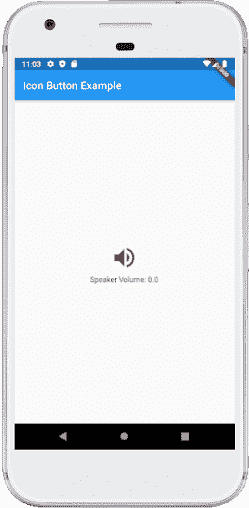

# Flutter 按钮

> 原文：<https://www.javatpoint.com/flutter-buttons>

按钮是**提供给用户触发事件**的图形控制元素，例如采取行动、做出选择、搜索事物等等。它们可以放在用户界面的任何地方，比如对话框、表单、卡片、工具栏等等。

按钮是 Flutter 小部件，它是材料设计库的一部分。Flutter 提供了几种不同形状、样式和功能的按钮。

## 按钮的特点

Flutter 中按钮的标准特征如下:

1.  我们可以轻松地在按钮、形状、颜色、动画和行为上应用主题。
2.  我们还可以在按钮内设置主题图标和文本。
3.  对于不同的特性，按钮可以由不同的子部件组成。

## Flutter 按钮的类型

以下是[Flutter](https://www.javatpoint.com/flutter)中可用的不同类型的按钮:

*   平面按钮
*   凸起按钮
*   浮动按钮
*   下拉按钮
*   图标按钮
*   Inkwell 按钮
*   弹出菜单按钮
*   大纲按钮

让我们详细讨论每个按钮。

### 1.平面按钮

是一个没有太多装饰的**文字标签按钮**，显示**没有任何标高**。平面按钮有两个必需的属性，分别是:**子级和 onpreced()**。它主要用于工具栏、对话框或与其他内容内联。默认情况下，平面按钮没有颜色，其文本为黑色。但是，我们可以分别使用**颜色和**属性对按钮和文本使用颜色。

**示例:**

打开 **main.dart** 文件，用下面的代码替换。

```

import 'package:flutter/material.dart';

void main() {
  runApp(MyApp());
}

class MyApp extends StatefulWidget {
  @override
  _MyAppState createState() => _MyAppState();
}

class _MyAppState extends State {
  @override
  Widget build(BuildContext context) {
    return MaterialApp(
      home: Scaffold(
          appBar: AppBar(
            title: Text('Flutter FlatButton Example'),
          ),
          body: Center(child: Column(children: <widget>[
            Container(
              margin: EdgeInsets.all(25),
              child: FlatButton(
                child: Text('SignUp', style: TextStyle(fontSize: 20.0),),
                onPressed: () {},
              ),
            ),
            Container(
              margin: EdgeInsets.all(25),
              child: FlatButton(
                child: Text('LogIn', style: TextStyle(fontSize: 20.0),),
                color: Colors.blueAccent,
                textColor: Colors.white,
                onPressed: () {},
              ),
            ),
          ]
         ))
      ),
    );
  }
}</widget> 
```

**输出:**

如果运行此应用程序，我们将看到以下屏幕:


### 2.凸起按钮

它是一个按钮，基于材质小部件，具有**矩形主体**。它类似于一个扁平按钮，但它**有一个高度**，当按下按钮时，高度会增加。它沿 Z 轴向用户界面添加尺寸。它有几个属性，如文本颜色、形状、填充、按钮颜色、按钮禁用时的颜色、动画时间、高度等。

该按钮有**两个回拨功能**。

**onPressed():** 按下按钮时触发。

**onLongPress():** 长按按钮时触发。

需要注意的是，如果未指定 onPressed()和 onLongPressed()回调，则该按钮处于**禁用状态**。

**示例:**

打开 **main.dart** 文件，用下面的代码替换。

```

import 'package:flutter/material.dart';

void main() {
  runApp(MyApp());
}

class MyApp extends StatefulWidget {
  @override
  _MyAppState createState() => _MyAppState();
}

class _MyAppState extends State {
  String msg = 'Flutter RaisedButton Example';
  @override
  Widget build(BuildContext context) {
    return MaterialApp(
      home: Scaffold(
          appBar: AppBar(
            title: Text('Flutter RaisedButton Example'),
          ),
        body: Container(
          child: Center(
            child: Column(
              mainAxisAlignment: MainAxisAlignment.center,
              children: [
                Text(msg, style: TextStyle(fontSize: 30, fontStyle: FontStyle.italic),),
                RaisedButton(
                  child: Text("Click Here", style: TextStyle(fontSize: 20),),
                  onPressed: _changeText,
                  color: Colors.red,
                  textColor: Colors.yellow,
                  padding: EdgeInsets.all(8.0),
                  splashColor: Colors.grey,
                )
              ],
            ),
          ),
        ),
      ),
    );
  }
  _changeText() {
    setState(() {
      if (msg.startsWith('F')) {
        msg = 'We have learned FlutterRaised button example.';
      } else {
        msg = 'Flutter RaisedButton Example';
      }
    });
  }
} 
```

**输出:**

当我们运行这个例子时，它会给出下面的截图。如果我们点击**点击这里**按钮，它会改变短信。显示第二张截图。

 

### 3.浮动操作按钮

FAB 按钮是**圆形图标按钮**，在我们的应用程序中触发主要动作。它是当今应用程序中使用最多的按钮。我们可以使用此按钮来添加、刷新或共享内容。Flutter 建议每个屏幕最多使用一个 FAB 按钮。浮动操作按钮有两种类型:

**浮动动作按钮:**它创建了一个简单的圆形浮动按钮，里面有一个子小部件。它必须有一个子参数来显示一个小部件。

**浮动动作按钮。扩展:**它创建了一个宽的浮动按钮，里面有一个图标和一个标签。它使用标签和图标参数，而不是子对象。

**示例:**

打开 **main.dart** 文件，用下面的代码替换。

```

import 'package:flutter/material.dart';

void main() {
  runApp(MyApp());
}

class MyApp extends StatefulWidget {
  @override
  _MyAppState createState() => _MyAppState();
}

class _MyAppState extends State {
  @override
  Widget build(BuildContext context) {
    return MaterialApp(home: Scaffold(
      appBar: AppBar(
        title: Text("FAB Button Example"),
        backgroundColor: Colors.blue,
        actions: <widget>[
          IconButton(icon: Icon(Icons.camera_alt), onPressed: () => {}),
          IconButton(icon: Icon(Icons.account_circle), onPressed: () => {})
        ],
      ),
      floatingActionButton: FloatingActionButton(
        child: Icon(Icons.navigation),
        backgroundColor: Colors.green,
        foregroundColor: Colors.white,
        onPressed: () => {},
      ),
      /*floatingActionButton:FloatingActionButton.extended(
        onPressed: () {},
        icon: Icon(Icons.save),
        label: Text("Save"),
      ), */
    ),
    );
  }
}</widget> 
```

**输出:**

在 android 模拟器中运行该应用程序，它将给出类似于下面截图的 UI。第二个图像是**扩展**按钮的输出。它的编码可以在上面代码的注释部分看到。

 

### 4.下拉按钮

下拉按钮用于在屏幕上创建一个漂亮的覆盖，允许用户从多个选项中选择任何项目。Flutter 提供了一种实现下拉框或下拉按钮的简单方法。此按钮显示当前选定的项目和一个箭头，该箭头打开一个菜单，从多个选项中选择一个项目。

Flutter 提供了一个**dropbdown button 小部件**来实现一个下拉列表。我们可以把它放在我们应用程序的任何地方。

**例**

打开 **main.dart** 文件，用下面的代码替换。

```

import 'package:flutter/material.dart';

void main() => runApp(MaterialApp(
  home: MyApp(),
));

class MyApp extends StatefulWidget {
  @override
  _MyAppState createState() => _MyAppState();
}

class _MyAppState extends State {
  List <listitem>_dropdownItems = [
    ListItem(1, "GeeksforGeeks"),
    ListItem(2, "Javatpoint"),
    ListItem(3, "tutorialandexample"),
    ListItem(4, "guru99")
  ];

  List<dropdownmenuitem>> _dropdownMenuItems;
  ListItem _itemSelected;

  void initState() {
    super.initState();
    _dropdownMenuItems = buildDropDownMenuItems(_dropdownItems);
    _itemSelected = _dropdownMenuItems[1].value;
  }

  List<dropdownmenuitem>> buildDropDownMenuItems(List listItems) {
    List<dropdownmenuitem>> items = List();
    for (ListItem listItem in listItems) {
      items.add(
        DropdownMenuItem(
          child: Text(listItem.name),
          value: listItem,
        ),
      );
    }
    return items;
  }

  @override
  Widget build(BuildContext context) {
    return Scaffold(
      appBar: AppBar(
        title: Text("DropDown Button Example"),
      ),
      body: Column(
        children: <widget>[
          Padding(
            padding: const EdgeInsets.all(10.0),
            child: Container(
              padding: const EdgeInsets.all(5.0),
              decoration: BoxDecoration(
                  color: Colors.greenAccent,
                  border: Border.all()),
              child: DropdownButtonHideUnderline(
                child: DropdownButton(
                    value: _itemSelected,
                    items: _dropdownMenuItems,
                    onChanged: (value) {
                      setState(() {
                        _itemSelected = value;
                      });
                    }),
              ),
            ),
          ),
          Text("We have selected ${_itemSelected.name}"),
        ],
      ),
    );
  }
}

class ListItem {
  int value;
  String name;

  ListItem(this.value, this.name);
}</widget></dropdownmenuitem></dropdownmenuitem></dropdownmenuitem></listitem> 
```

**输出**

在 android 模拟器中运行该应用程序，它将给出类似于下面截图的 UI。第二个图像是下拉按钮中包含的列表的输出。

 

### 5.图标按钮

图标按钮是打印在材质小部件上的**图片。这是一个有用的小部件，它给了 Flutter UI 一种材质设计的感觉。我们还可以定制这个按钮的外观和感觉。简单来说，它是一个图标，当用户触摸它时，它会做出反应。**

**示例:**

打开 **main.dart** 文件，用下面的代码替换。

```

import 'package:flutter/material.dart';

void main() => runApp(MyApp());

class MyApp extends StatelessWidget {
  @override
  Widget build(BuildContext context) {
    return MaterialApp(
      home: Scaffold(
        appBar: AppBar(
          title: Text("Icon Button Example"),
        ),
        body: Center(
          child: MyStatefulWidget(),
        ),
      ),
    );
  }
}
double _speakervolume = 0.0;

class MyStatefulWidget extends StatefulWidget {
  MyStatefulWidget({Key key}) : super(key: key);

  @override
  _MyStatefulWidgetState createState() => _MyStatefulWidgetState();
}

class _MyStatefulWidgetState extends State {
  Widget build(BuildContext context) {
    return Column(
      mainAxisSize: MainAxisSize.min,
      children: <widget>[
        IconButton(
          icon: Icon(Icons.volume_up),
          iconSize: 50,
          color: Colors.brown,
          tooltip: 'Increase volume by 5',
          onPressed: () {
            setState(() {
              _speakervolume += 5;
            });
          },
        ),
        Text('Speaker Volume: $_speakervolume')
      ],
    );
  }
}</widget> 
```

**输出:**

在 android 模拟器中运行该应用程序，它将给出类似于下面截图的 UI。当我们按下**音量按钮**时，它总是会增加 5。



### 6.Inkwell 按钮

InkWell 按钮是一个材质设计概念，用于**触摸响应**。这个小部件位于“材质”小部件之下，在此处实际绘制了油墨反应。它通过添加手势反馈来创建交互式应用程序用户界面。主要用于添加**飞溅涟漪效果**。

**示例:**

打开 **main.dart** 文件，用下面的代码替换。

```

import 'package:flutter/material.dart';

void main() => runApp(MyApp());

class MyApp extends StatefulWidget {
  @override
  _MyAppState createState() => _MyAppState();
}

class _MyAppState extends State {
  int _volume = 0;

  @override
  Widget build(BuildContext context) {
    return MaterialApp(
      home: Scaffold(
        appBar: AppBar(
          title: Text('InkWell Button Example'),
        ),
        body: Center(
          child: new Column(
            mainAxisAlignment: MainAxisAlignment.center,
            children: <widget>[
              InkWell(
                splashColor: Colors.green,
                highlightColor: Colors.blue,
                child: Icon(Icons.ring_volume, size: 50),
                onTap: () {
                  setState(() {
                    _volume += 2;
                  });
                },
              ),
              Text (
                  _volume.toString(),
                  style: TextStyle(fontSize: 50)
              ),
            ],
          ),
        ),
      ),
    );
  }
}</widget> 
```

**输出:**

在 android 模拟器中运行该应用程序，它将给出类似于下面截图的 UI。我们每按一次响铃音量键，音量就会增加 2。


### 7.弹出菜单按钮

是**按下后显示菜单**然后调用 **onSelected** 方法菜单取消的按钮。这是因为从多个选项中选择了项目。该按钮包含文本和图像。主要使用**设置**菜单列出所有选项。它有助于创造出色的用户体验。

**示例:**

打开 **main.dart** 文件，用下面的代码替换。

```

import 'package:flutter/material.dart';

void main() { runApp(MyApp());}

class MyApp extends StatefulWidget {
  @override
  _MyAppState createState() => _MyAppState();
}

class _MyAppState extends State {
  Choice _selectedOption = choices[0];

  void _select(Choice choice) {
    setState(() {
      _selectedOption = choice;
    });
  }
  @override
  Widget build(BuildContext context) {
    return MaterialApp(
      home: Scaffold(
        appBar: AppBar(
          title: const Text('PopupMenu Button Example'),
          actions: <widget>[
            PopupMenuButton<choice>(
              onSelected: _select,
              itemBuilder: (BuildContext context) {
                return choices.skip(0).map((Choice choice) {
                  return PopupMenuItem<choice>(
                    value: choice,
                    child: Text(choice.name),
                  );
                }).toList();
              },
            ),
          ],
        ),
        body: Padding(
          padding: const EdgeInsets.all(10.0),
          child: ChoiceCard(choice: _selectedOption),
        ),
      ),
    );
  }
}

class Choice {
  const Choice({this.name, this.icon});
  final String name;
  final IconData icon;
}

const List <choice>choices = const <choice>[
  const Choice(name: 'Wi-Fi', icon: Icons.wifi),
  const Choice(name: 'Bluetooth', icon: Icons.bluetooth),
  const Choice(name: 'Battery', icon: Icons.battery_alert),
  const Choice(name: 'Storage', icon: Icons.storage),
];

class ChoiceCard extends StatelessWidget {
  const ChoiceCard({Key key, this.choice}) : super(key: key);

  final Choice choice;

  @override
  Widget build(BuildContext context) {
    final TextStyle textStyle = Theme.of(context).textTheme.headline;
    return Card(
      color: Colors.greenAccent,
      child: Center(
        child: Column(
          mainAxisSize: MainAxisSize.min,
          crossAxisAlignment: CrossAxisAlignment.center,
          children: <widget>[
            Icon(choice.icon, size: 115.0, color: textStyle.color),
            Text(choice.name, style: textStyle),
          ],
        ),
      ),
    );
  }
}</widget></choice></choice></choice></choice></widget> 
```

**输出:**

在 android 模拟器中运行该应用程序，它将给出类似于下面截图的 UI。当我们点击屏幕左上角显示的**三点**时，会弹出多个选项。在这里，我们可以选择任何选项，它会将其保留在卡中，如第二个图像所示。

 

### 8.大纲按钮

它类似于平面按钮，但它包含一个薄的灰色圆角矩形边框。它的轮廓边框由 shape 属性定义。

**示例:**

打开 **main.dart** 文件，用下面的代码替换。

```

import 'package:flutter/material.dart';

void main() {
  runApp(MyApp());
}

class MyApp extends StatefulWidget {
  @override
  _MyAppState createState() => _MyAppState();
}

class _MyAppState extends State {
  @override
  Widget build(BuildContext context) {
    return MaterialApp(
      home: Scaffold(
          appBar: AppBar(
            title: Text('Outline Button Example'),
          ),
          body: Center(child: Column(children: <widget>[
            Container(
              margin: EdgeInsets.all(25),
              child: OutlineButton(
                child: Text("Outline Button", style: TextStyle(fontSize: 20.0),),
                highlightedBorderColor: Colors.red,
                shape: RoundedRectangleBorder(
                    borderRadius: BorderRadius.circular(15)),
                onPressed: () {},
              ),
            ),
            Container(
              margin: EdgeInsets.all(25),
              child: FlatButton(
                child: Text('Flat Button', style: TextStyle(fontSize: 20.0),),
                color: Colors.blueAccent,
                textColor: Colors.white,
                onPressed: () {},
              ),
            ),
          ]
          ))
      ),
    );
  }
}</widget> 
```

**输出:**

在 android 模拟器中运行该应用程序，它将给出类似于下面截图的 UI。


### 按钮条

颤动提供了将按钮排列成条或行的灵活性**。按钮栏小部件包含三个属性:**对齐、子级和 mainAxisSize** 。**

 ***   对齐用于向整个按钮栏小部件呈现对齐选项。
*   Children 属性用于获取栏中按钮的数量。
*   mainAxisSize 属性用于为按钮栏提供水平空间。

**示例:**

打开 **main.dart** 文件，用下面的代码替换。

```

import 'package:flutter/material.dart';

void main() {
  runApp(MaterialApp( home: MyApp(),));
}

class MyApp extends StatefulWidget {
  @override
  _State createState() => _State();
}

class _State extends State {
  @override
  Widget build(BuildContext context) {
    return Scaffold(
        appBar: AppBar(
          title: Text('Flutter ButtonBar Example'),
        ),
        body: Padding(
            padding: EdgeInsets.all(10),
            child: Column(
              children: <widget>[
                Padding(
                  padding: EdgeInsets.all(15),
                  child: new ButtonBar(
                    mainAxisSize: MainAxisSize.min,
                    children: <widget>[
                      RaisedButton(
                        child: new Text('Javatpoint'),
                        color: Colors.lightGreen,
                          onPressed: () {/** */},
                      ),
                      FlatButton(
                        child: Text('Flutter'),
                        color: Colors.lightGreen,
                        onPressed: () {/** */},
                      ),
                      FlatButton(
                        child: Text('MySQL'),
                        color: Colors.lightGreen,
                        onPressed: () {/** */},
                      ),
                    ],
                  ),
                ),
              ],
            )
        )
    );
  }
}</widget></widget> 
```

**输出:**

在 android 模拟器中运行该应用程序，它将给出类似于下面截图的 UI。在这里，我们可以看到这三个按钮被放置在一个水平条或行中。


* * ***