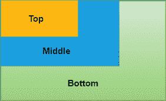
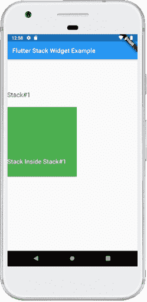

# 颤振栈

> 原文：<https://www.javatpoint.com/flutter-stack>

堆栈是 Flutter 中的一个小部件，它包含一个小部件列表，并将它们放置在另一个小部件的顶部。换句话说，堆栈允许开发人员 ***将多个小部件重叠到单个屏幕*** 中，并从下往上渲染它们。因此，**第一个小部件**是最下面的**项，最后一个小部件是最上面的**项****

 ****### 与堆栈小部件相关的要点

以下是[颤振](https://www.javatpoint.com/flutter)堆栈小部件的要点:

*   堆栈中的子部件可以是**定位的**或**非定位的**。
*   定位的项目包装在定位的小部件中，并且必须具有一个非空属性
*   未定位的子小部件会自动对齐。它根据堆栈的对齐方式显示在屏幕上。孩子的默认位置在左上角。
*   我们可以使用对齐属性来更改小部件的对齐方式。
*   Stack 按顺序放置子部件，第一个子部件在底部，最后一个子部件在顶部。如果我们想重新排序孩子的小部件，需要按照新的顺序重建堆栈。默认情况下，与其他小部件相比，每个堆栈的第一个小部件**具有最大大小**。

### 如何在 Flutter 中使用堆栈小部件？

以下示例有助于快速理解堆栈小部件的使用，该小部件包含三个大小不断缩小的容器:

```

Stack(
  children: <Widget>[
    // Max Size
    Container(
      color: Colors.green,
    ),
    Container(
      color: Colors.blue,
    ),
    Container(
      color: Colors.yellow,
    )
  ],
),

```

它将给出以下输出:



## 堆栈小部件的属性

以下是堆栈小部件使用的属性:

**对齐**:它决定了子小部件在堆栈中的位置。可以是上、下、中、中右等。

```

Stack(
  alignment: Alignment.topCenter, // Center of Top
  children: <Widget>[ ]
)

```

**文字方向**:决定文字方向。它可以绘制文字 ltr(从左到右)或 rtl(从右到左)。

```

Stack(
  textDirection: TextDirection.rtl, // Right to Left
  children: <Widget>[ ]
)

```

**fit** :它会控制堆栈中未定位的子小部件的大小。**有松、扩、通三种类型**。**松散的**用于将子小部件设置小，**扩展**属性使子小部件尽可能大，**通过**根据其父小部件设置子小部件。

```

Stack(
  fit: StackFit.passthrough,
  children: <Widget>[ ]
)

```

**溢出**:当它的内容溢出到堆栈之外时，它控制子小部件，无论是可见的还是剪辑的。

```

Stack(
  overflow: Overflow.clip, // Clip the Content
  children: <Widget>[ ]
)

```

**剪辑行为**:决定内容是否会被剪辑。

### 安置

它不是堆栈参数，但可以在堆栈中用来定位子小部件。以下是定位堆栈的构造函数:

```

const Positioned({
Key key,
this.left,
this.top,
this.right,
this.bottom,
this.width,
this.height,
@required Widget child,
}) 

```

### 堆栈小部件示例

下面的代码解释了如何在 Flutter 中使用堆栈[小部件。在这段代码中，我们将尝试堆栈小部件的大部分基本属性。](https://www.javatpoint.com/flutter-widgets)

```

import 'package:flutter/material.dart';

void main() => runApp(MyApp());

/// This Widget is the main application widget.
class MyApp extends StatelessWidget {
  @override
  Widget build(BuildContext context) {
    return MaterialApp(
      home: MyStackWidget(),
    );
  }
}

class MyStackWidget extends StatelessWidget {
  @override
  Widget build(BuildContext context) {
    return MaterialApp(
      home: Scaffold(
        appBar: AppBar(
          title: Text("Flutter Stack Widget Example"),
        ),
        body: Center(
          child: Stack(
            fit: StackFit.passthrough,
            overflow: Overflow.visible,
            children: [
              // Max Size Widget
              Container(
                height: 300,
                width: 400,
                color: Colors.green,
                child: Center(
                  child: Text(
                    'Top Widget: Green',
                    style: TextStyle(color: Colors.white, fontSize: 20),
                  ),
                ),
              ),
              Positioned(
                top: 30,
                right: 20,
                child: Container(
                  height: 100,
                  width: 150,
                  color: Colors.blue,
                  child: Center(
                    child: Text(
                      'Middle Widget',
                      style: TextStyle(color: Colors.white, fontSize: 20),
                    ),
                  ),
                ),
              ),
              Positioned(
                top: 30,
                left: 20,
                child: Container(
                  height: 100,
                  width: 150,
                  color: Colors.orange,
                  child: Center(
                    child: Text(
                      'Bottom Widget',
                      style: TextStyle(color: Colors.white, fontSize: 20),
                    ),
                  ),
                )
              ),
            ],
          ),
        )
      ),
    );
  }
} 
```

**输出:**

当我们运行应用程序时，我们应该会得到类似于下面截图的屏幕用户界面:


## 颤振指数轨迹

这是 Flutter 中的另一个堆栈小部件， ***通过指定其索引*** 一次只显示一个元素。请参见下面的代码片段:

```

IndexedStack(
  index: 1,
  children: <Widget>[
    Container(
      color: Colors.green,
    ),
    Container(
      color: Colors.blue,
    ),
    Container(
      color: Colors.yellow,
    )
  ],
)

```

IndexedStack 像通常的堆栈一样接受子堆栈，但它一次只显示一个子堆栈。因此，它不是一个堆栈。我们用它来根据我们的需要在一个孩子和另一个孩子之间轻松切换。

### 索引标签小部件示例

下面的代码解释了如何在 Flutter 中使用索引堆栈小部件:

```

import 'package:flutter/material.dart';

void main() => runApp(MyApp());

/// This Widget is the main application widget.
class MyApp extends StatelessWidget {
  @override
  Widget build(BuildContext context) {
    return MaterialApp(
      home: MyStackWidget(),
    );
  }
}

class MyStackWidget extends StatelessWidget {
  @override
  Widget build(BuildContext context) {
    return MaterialApp(
      home: Scaffold(
        appBar: AppBar(
          title: Text("Flutter Stack Widget Example"),
        ),
        body: Center(
          child: IndexedStack(
            index: 0,
            children: [
              Container(
                height: 300,
                width: 400,
                color: Colors.green,
                child: Center(
                  child: Text(
                    'First Widget',
                    style: TextStyle(color: Colors.white, fontSize: 20),
                  ),
                ),
              ),
              Container(
                height: 250,
                width: 250,
                color: Colors.blue,
                child: Center(
                  child: Text(
                    'Second Widget',
                    style: TextStyle(color: Colors.white, fontSize: 20),
                  ),
                ),
              ),
            ],
          ),
        )
      ),
    );
  }
} 
```

**输出:**

当我们运行应用程序时，我们应该会得到类似于下面截图的屏幕用户界面:


### 在 Flutter 中有没有可能把栈包在栈里面？

是的，在 Flutter 中可以在堆栈内部包装堆栈。我们可以通过用高度和宽度属性包装容器内部的第二个堆栈来实现这一点。

请参见下面的代码以更清楚地理解它:

```

import 'package:flutter/material.dart';

void main() => runApp(MyApp());

class MyApp extends StatelessWidget {
  @override
  Widget build(BuildContext context) {
    return MaterialApp(
      home: MyStackWidget(),
    );
  }
}

class MyStackWidget extends StatelessWidget {
  @override
  Widget build(BuildContext context) {
    return MaterialApp(
      home: Scaffold(
        appBar: AppBar(
          title: Text("Flutter Stack Widget Example"),
        ),
        body: Center(
          child: Stack(
            children: [
              Positioned(
                top: 100,
                child: Text(
                    "Stack#1",
                    style: TextStyle(color: Colors.black, fontSize: 20)
                ),
              ),
              Positioned(
                top: 150.0,
                child: Container(
                  height: 220,
                  width: 220,
                  color: Colors.green,
                  child: Stack(
                    children: [
                      Positioned(
                        top:160,
                        child: Text(
                          "Stack Inside Stack#1",
                          style: TextStyle(color: Colors.white, fontSize: 20)
                        ),
                      )
                    ],
                  ),
                ),
              )
            ],
          ),
        )
      ),
    );
  }
}

```

当我们运行应用程序时，我们应该会得到类似于下面截图的屏幕用户界面:



* * *****