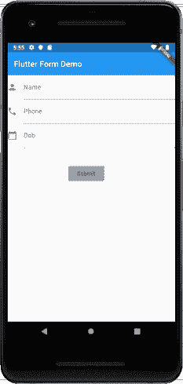
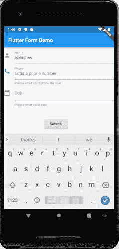

# Flutter形式

> 原文：<https://www.javatpoint.com/flutter-forms>

表单是所有现代移动和网络应用程序不可或缺的一部分。它主要用于与应用程序交互以及从用户那里收集信息。它们可以执行许多任务，这取决于您的业务需求和逻辑的性质，例如用户的身份验证、添加用户、搜索、过滤、订购、预订等。表单可以包含文本字段、按钮、复选框、单选按钮等。

## 创建表单

Flutter 提供了一个**表单小部件**来创建表单。表单小部件充当容器，允许我们对多个表单字段进行分组和验证。创建表单时，需要提供**全局键**。该键唯一标识表单，并允许您在表单字段中进行任何验证。

表单小部件使用子小部件**文本表单域**提供用户输入文本域。这个小部件呈现一个材料设计文本字段，还允许我们在验证错误发生时显示它们。

让我们创建一个表单。首先，创建一个 Flutter 项目，并替换 main.dart 文件中的以下代码。在这段代码中，我们创建了一个名为 **MyCustomForm** 的自定义类。在这个类中，我们将全局键定义为 **_formKey** 。该键持有一个**表单状态**，可以用来检索表单部件。在这个类的 **build** 方法中，我们添加了一些自定义样式，并使用 TextFormField 小部件来提供姓名、电话号码、出生日期等表单字段，或者只是一个普通字段。在文本表单域中，我们使用了**输入编辑**来提供表单属性的外观和感觉，如边框、标签、图标、提示、样式等。最后，我们添加了一个**按钮**来提交表单。

```

import 'package:flutter/material.dart';

void main() => runApp(MyApp());

class MyApp extends StatelessWidget {
  @override
  Widget build(BuildContext context) {
    final appTitle = 'Flutter Form Demo';
    return MaterialApp(
      title: appTitle,
      home: Scaffold(
        appBar: AppBar(
          title: Text(appTitle),
        ),
        body: MyCustomForm(),
      ),
    );
  }
}
// Create a Form widget.
class MyCustomForm extends StatefulWidget {
  @override
  MyCustomFormState createState() {
    return MyCustomFormState();
  }
}
// Create a corresponding State class. This class holds data related to the form.
class MyCustomFormState extends State<MyCustomForm> {
  // Create a global key that uniquely identifies the Form widget
  // and allows validation of the form.
  final _formKey = GlobalKey<FormState>();

  @override
  Widget build(BuildContext context) {
    // Build a Form widget using the _formKey created above.
    return Form(
      key: _formKey,
      child: Column(
        crossAxisAlignment: CrossAxisAlignment.start,
        children: <Widget>[
          TextFormField(
            decoration: const InputDecoration(
              icon: const Icon(Icons.person),
              hintText: 'Enter your name',
              labelText: 'Name',
            ),
          ),
          TextFormField(
            decoration: const InputDecoration(
              icon: const Icon(Icons.phone),
              hintText: 'Enter a phone number',
              labelText: 'Phone',
            ),
          ),
          TextFormField(
            decoration: const InputDecoration(
            icon: const Icon(Icons.calendar_today),
            hintText: 'Enter your date of birth',
            labelText: 'Dob',
            ),
           ),
          new Container(
              padding: const EdgeInsets.only(left: 150.0, top: 40.0),
              child: new RaisedButton(
                child: const Text('Submit'),
                  onPressed: null,
              )),
        ],
      ),
    );
  }
}

```

**输出**

现在，运行该应用程序，您可以在您的安卓仿真器中看到以下屏幕。此表单包含三个字段名称、电话号码、出生日期和提交按钮。



## 表单验证

验证是一种方法，它允许我们纠正或确认某个标准。它确保输入数据的身份验证。

验证表单是所有数字交互中的常见做法。为了在Flutter中验证一个表单，我们需要主要实现三个步骤。

**步骤 1:** 使用带有全局键的表单小部件。

**步骤 2:** 使用 TextFormField 给输入字段赋予验证器属性。

**第 3 步:**创建一个按钮来验证表单字段并显示验证错误。

让我们用下面的例子来理解它。在上面的代码中，我们必须使用 TextFormField 中的 **validator()** 函数来验证输入属性。如果用户输入错误，验证器函数返回一个包含**错误信息**的字符串；否则，验证器功能返回**空值**。在验证器函数中，确保 TextFormField 不是空的。否则，它将返回一条错误消息。

validator()函数可以写成下面的代码片段:

```

validator: (value) {
       if (value.isEmpty) {
             return 'Please enter some text';
       }
       return null;
},

```

现在，打开 **main.dart** 文件，在 TextFormField 小部件中添加 validator()函数。用 main.dart 文件替换下面的代码。

```

import 'package:flutter/material.dart';

void main() => runApp(MyApp());

class MyApp extends StatelessWidget {
  @override
  Widget build(BuildContext context) {
    final appTitle = 'Flutter Form Demo';
    return MaterialApp(
      title: appTitle,
      home: Scaffold(
        appBar: AppBar(
          title: Text(appTitle),
        ),
        body: MyCustomForm(),
      ),
    );
  }
}
// Create a Form widget.
class MyCustomForm extends StatefulWidget {
  @override
  MyCustomFormState createState() {
    return MyCustomFormState();
  }
}
// Create a corresponding State class, which holds data related to the form.
class MyCustomFormState extends State<MyCustomForm> {
  // Create a global key that uniquely identifies the Form widget
  // and allows validation of the form.
  final _formKey = GlobalKey<FormState>();

  @override
  Widget build(BuildContext context) {
    // Build a Form widget using the _formKey created above.
    return Form(
      key: _formKey,
      child: Column(
        crossAxisAlignment: CrossAxisAlignment.start,
        children: <Widget>[
          TextFormField(
            decoration: const InputDecoration(
              icon: const Icon(Icons.person),
              hintText: 'Enter your full name',
              labelText: 'Name',
            ),
            validator: (value) {
              if (value.isEmpty) {
                return 'Please enter some text';
              }
              return null;
            },
          ),
          TextFormField(
            decoration: const InputDecoration(
              icon: const Icon(Icons.phone),
              hintText: 'Enter a phone number',
              labelText: 'Phone',
            ),
            validator: (value) {
              if (value.isEmpty) {
                return 'Please enter valid phone number';
              }
              return null;
            },
          ),
          TextFormField(
            decoration: const InputDecoration(
            icon: const Icon(Icons.calendar_today),
            hintText: 'Enter your date of birth',
            labelText: 'Dob',
            ),
            validator: (value) {
              if (value.isEmpty) {
                return 'Please enter valid date';
              }
              return null;
            },
           ),
          new Container(
              padding: const EdgeInsets.only(left: 150.0, top: 40.0),
              child: new RaisedButton(
                child: const Text('Submit'),
                onPressed: () {
                  // It returns true if the form is valid, otherwise returns false
                  if (_formKey.currentState.validate()) {
                    // If the form is valid, display a Snackbar.
                    Scaffold.of(context)
                        .showSnackBar(SnackBar(content: Text('Data is in processing.')));
                  }
                },
              )),
        ],
      ),
    );
  }
}

```

**输出**

现在，运行应用程序。出现以下屏幕。


在此表单中，如果您将任何输入字段留空，您将获得如下屏幕所示的错误消息。



* * *