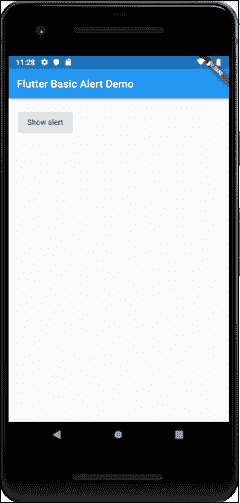
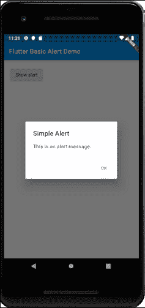
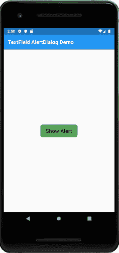
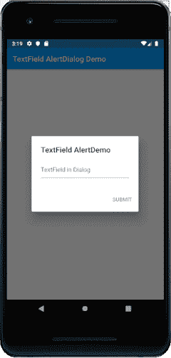
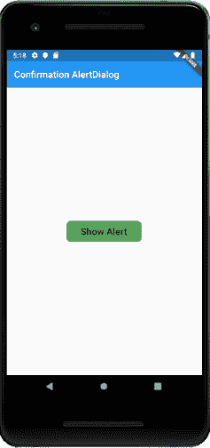
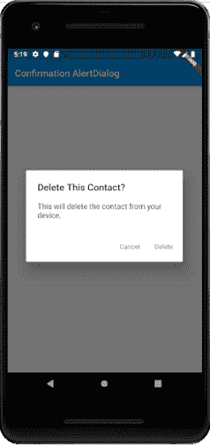
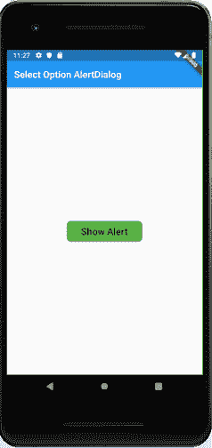
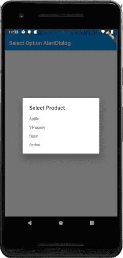

# Flutter 警告对话框

> 原文：<https://www.javatpoint.com/flutter-alert-dialogs>

警报对话框是一个有用的功能，它向用户提供重要信息以做出决定，或者提供选择特定操作或操作列表的能力。它是一个弹出框，出现在应用内容的顶部和屏幕的中间。在恢复与应用程序的交互之前，用户可以手动取消它。

警报可以被认为是一种浮动模式，应该用于快速响应，如密码验证、小应用通知等。警报非常灵活，可以非常容易地定制。

在 Flutter 中，AlertDialog 是一个小部件，它通知用户需要确认的情况。Flutter 警告对话框包含一个显示在内容上方的可选标题和显示在内容下方的操作列表。

## 警报对话框的属性

AlertDialog 小部件的主要属性包括:

**标题:**该属性给出位于警报对话框顶部的警报对话框的标题。标题尽量简短总是好的，这样用户就可以很容易地知道它的用途。我们可以在 AlertDialog 中写下标题如下:

```

AlertDialog(title: Text("Sample Alert Dialog"),

```

**动作:**显示在内容下方。例如，如果需要创建一个按钮来选择是或否，那么它只在 action 属性中定义。我们可以在 AlertDialog 中编写一个动作属性，如下所示:

```

actions: <Widget>[
    FlatButton(child: Text("Yes"),),
    FlatButton(child: Text("No"),)
],)

```

**内容:**该属性定义 AlertDialog 小部件的主体。它是一种文本类型，但也可以包含任何类型的布局小部件。我们可以在 AlertDialog 中使用内容属性，如下所示:

```

actions: <Widget>[
    FlatButton(child: Text("Yes"),),
    FlatButton(child: Text("No"),)
],)
content: Text("It is the body of the alert Dialog"),

```

**内容填充:**它给出了 AlertDialog 小部件内部内容所需的填充。我们可以在 AlertDialog 中使用内容填充属性，如下所示:

```

contentPadding: EdgeInsets.all(32.0),

```

**形状:**此属性为警报对话框提供形状，例如曲线、圆形或任何其他不同的形状。

```

shape: CircleBorder(),
shape: CurveBorder(),

```

我们可以将警报对话框分为多种类型，如下所示:

1.  基本警报对话框
2.  确认警报对话框
3.  选择警报对话框
4.  textfield alert dialog(textfield 警报对话框)

### 基本警报对话框

此警报向用户通知新信息，例如应用程序的更改、新功能、需要确认的紧急情况，或者作为对用户的确认通知，告知用户某项操作是否成功。以下示例解释了基本警报的使用。

**例**

在 AndroidStudio 创建一个 Flutter 项目，用 **main.dart** 文件替换下面的代码。要显示警报，您必须调用 **showDialog()** 函数，该函数包含上下文和**项目生成器**函数。itemBuilder 函数返回一个**对象**，类型为**对话框，**AlertDialog。

```

import 'package:flutter/material.dart';

void main() => runApp(MyApp());

class MyApp extends StatelessWidget {
  @override
  Widget build(BuildContext context) {
    final appTitle = 'Flutter Basic Alert Demo';
    return MaterialApp(
      title: appTitle,
      home: Scaffold(
        appBar: AppBar(
          title: Text(appTitle),
        ),
        body: MyAlert(),
      ),
    );
  }
}

class MyAlert extends StatelessWidget {
  @override
  Widget build(BuildContext context) {
    return Padding(
      padding: const EdgeInsets.all(20.0),
      child: RaisedButton(
        child: Text('Show alert'),
        onPressed: () {
          showAlertDialog(context);
        },
      ),
    );
  }
}

showAlertDialog(BuildContext context) {
  // Create button
  Widget okButton = FlatButton(
    child: Text("OK"),
    onPressed: () {
      Navigator.of(context).pop();
    },
  );

  // Create AlertDialog
  AlertDialog alert = AlertDialog(
    title: Text("Simple Alert"),
    content: Text("This is an alert message."),
    actions: [
      okButton,
    ],
  );

  // show the dialog
  showDialog(
    context: context,
    builder: (BuildContext context) {
      return alert;
    },
  );
}

```

**输出**

现在，运行该应用程序，它将给出以下输出。当您点击“显示警报”按钮时，您将获得警报消息。

 

### textfield alert dialog(textfield 警报对话框)

这个警报对话框可以接受用户输入。在以下示例中，我们将在警报对话框中添加文本字段输入。打开 main.dart 文件并插入以下代码。

```

import 'package:flutter/material.dart';

void main() => runApp(MyApp());

class MyApp extends StatelessWidget {
  // This widget is the root of your application.
  @override
  Widget build(BuildContext context) {
    return MaterialApp(
      title: 'Flutter Alert Demo',
      debugShowCheckedModeBanner: false,
      theme: ThemeData(
        primarySwatch: Colors.blue,
      ),
      //home: MyHomePage(title: 'Flutter Demo Home Page'),
      home: TextFieldAlertDialog(),
    );
  }
}
class TextFieldAlertDialog extends StatelessWidget {
  TextEditingController _textFieldController = TextEditingController();

  _displayDialog(BuildContext context) async {
    return showDialog(
        context: context,
        builder: (context) {
          return AlertDialog(
            title: Text('TextField AlertDemo'),
            content: TextField(
              controller: _textFieldController,
              decoration: InputDecoration(hintText: "TextField in Dialog"),
            ),
            actions: <Widget>[
              new FlatButton(
                child: new Text('SUBMIT'),
                onPressed: () {
                  Navigator.of(context).pop();
                },
              )
            ],
          );
        });
  }

  @override
  Widget build(BuildContext context) {
    return Scaffold(
      appBar: AppBar(
        title: Text('TextField AlertDialog Demo'),
      ),
      body: Center(
        child: FlatButton(
          child: Text(
            'Show Alert',
            style: TextStyle(fontSize: 20.0),),
            padding: EdgeInsets.fromLTRB(20.0,12.0,20.0,12.0),
            shape: RoundedRectangleBorder(
              borderRadius: BorderRadius.circular(8.0)
            ),
          color: Colors.green,
          onPressed: () => _displayDialog(context),
        ),
      ),
    );
  }
}

```

**输出**

现在，运行该应用程序，它将给出以下输出。当你点击**显示提醒按钮时，**你会得到文字输入提醒信息。

 

### 确认警报对话框

确认警告对话框通知用户在应用程序中前进之前确认特定的选择。例如，当用户想要从地址簿中删除联系人时。

**例**

```

import 'package:flutter/material.dart';

void main() {
  runApp(new MaterialApp(home: new MyApp()));
}

class MyApp extends StatelessWidget {
  // This widget is the root of your application.
  @override
  Widget build(BuildContext context) {
    // TODO: implement build
    return new Scaffold(
      appBar: AppBar(
        title: Text("Confirmation AlertDialog"),
      ),
      body: Center(
        child: Column(
          mainAxisAlignment: MainAxisAlignment.center,
          children: <Widget>[
            new RaisedButton(
              onPressed: () async {
                final ConfirmAction action = await _asyncConfirmDialog(context);
                print("Confirm Action $action" );
              },
              child: const Text(
                "Show Alert",
                style: TextStyle(fontSize: 20.0),),
                padding: EdgeInsets.fromLTRB(30.0,10.0,30.0,10.0),
                shape: RoundedRectangleBorder(
                  borderRadius: BorderRadius.circular(8.0)
                ),
                color: Colors.green,
              ),
          ],
        ),
      ),
    );
  }
}
enum ConfirmAction { Cancel, Accept}
Future<ConfirmAction> _asyncConfirmDialog(BuildContext context) async {
  return showDialog<ConfirmAction>(
    context: context,
    barrierDismissible: false, // user must tap button for close dialog!
    builder: (BuildContext context) {
      return AlertDialog(
        title: Text('Delete This Contact?'),
        content: const Text(
            'This will delete the contact from your device.'),
        actions: <Widget>[
          FlatButton(
            child: const Text('Cancel'),
            onPressed: () {
              Navigator.of(context).pop(ConfirmAction.Cancel);
            },
          ),
          FlatButton(
            child: const Text('Delete'),
            onPressed: () {
              Navigator.of(context).pop(ConfirmAction.Accept);
            },
          )
        ],
      );
    },
  );
}

```

**输出**

当您运行该应用程序时，它将给出以下输出。现在，点击显示警报按钮，您将获得确认警报框消息。

 

### 选择选项警报对话框

这种类型的警报对话框显示项目列表，选中后会立即采取行动。

**例**

```

import 'package:flutter/material.dart';

void main() {
  runApp(new MaterialApp(home: new MyApp()));
}

class MyApp extends StatelessWidget {
  // This widget is the root of your application.
  @override
  Widget build(BuildContext context) {
    // TODO: implement build
    return new Scaffold(
      appBar: AppBar(
        title: Text("Select Option AlertDialog"),
      ),
      body: Center(
        child: Column(
          mainAxisAlignment: MainAxisAlignment.center,
          children: <Widget>[
            new RaisedButton(
              onPressed: () async {
                final Product prodName = await _asyncSimpleDialog(context);
                print("Selected Product is $prodName");
              },
              child: const Text(
                "Show Alert",
                style: TextStyle(fontSize: 20.0),),
                padding: EdgeInsets.fromLTRB(30.0,10.0,30.0,10.0),
                shape: RoundedRectangleBorder(
                  borderRadius: BorderRadius.circular(8.0)
                ),
                color: Colors.green,
              ),
          ],
        ),
      ),
    );
  }
}
enum Product { Apple, Samsung, Oppo, Redmi }

Future<Product> _asyncSimpleDialog(BuildContext context) async {
  return await showDialog<Product>(
      context: context,
      barrierDismissible: true,
      builder: (BuildContext context) {
        return SimpleDialog(
          title: const Text('Select Product '),
          children: <Widget>[
            SimpleDialogOption(
              onPressed: () {
                Navigator.pop(context, Product.Apple);
              },
              child: const Text('Apple'),
            ),
            SimpleDialogOption(
              onPressed: () {
                Navigator.pop(context, Product.Samsung);
              },
              child: const Text('Samsung'),
            ),
            SimpleDialogOption(
              onPressed: () {
                Navigator.pop(context, Product.Oppo);
              },
              child: const Text('Oppo'),
            ),
            SimpleDialogOption(
              onPressed: () {
                Navigator.pop(context, Product.Redmi);
              },
              child: const Text('Redmi'),
            ),
          ],
        );
      });
}

```

**输出**

当您运行该应用程序时，它将给出以下输出。现在，点击显示警报按钮，您将获得选择选项警报框消息。一旦您选择了任何可用选项，警报消息就会消失，并且您将在控制台中获得所选选项的消息。

 

* * *