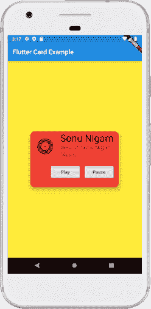

# Dart卡

> 原文：<https://www.javatpoint.com/flutter-card>

卡片是用来表示彼此相关信息的一张纸，如相册、地理位置、联系方式等。 ***旋舞中的一张牌是圆角形状，有阴影*** 。我们主要用它来存储单个对象的内容和动作。在本文中，我们将学习如何在 [Flutter](https://www.javatpoint.com/flutter) 中创建卡片小部件。我们还将学习如何定制卡片小部件。

Flutter 中的卡片创建非常简单。我们只需要调用**卡片构造器**，然后传递一个小部件作为子属性，用于显示卡片内部的内容和动作。请参见下面的简单卡片创建代码:

```

return Card(
    child: Column(
      mainAxisSize: MainAxisSize.min,
      children: <Widget>[
        const ListTile(
          leading: Icon(Icons.album, size: 45),
          title: Text('Sonu Nigam'),
          subtitle: Text('Best of Sonu Nigam Song'),
        ),
      ],
    ),
  );

```

### Dart卡特性

我们可以使用属性自定义卡片。下面给出了一些基本特性:

| 属性名 | 描述 |
| 边框前景 | 它是用来在孩子面前画边框的。默认情况下，这是真的。如果是假的，就在孩子后面画边框。 |
| 颜色 | 它用于给卡片的背景上色。 |
| 海拔 | 它控制卡片下方的阴影大小。高程值越大，阴影距离越大。 |
| 边缘 | 它用来定制卡片的外层空间。 |
| 形状 | 它用于指定卡片的形状。 |
| 阴影颜色 | 它用于绘制卡片的阴影。 |
| 剪辑行为 | 它用于剪辑卡片的内容。 |

如果我们想定制卡片的大小，需要将其放入**容器或尺寸盒**小部件中。在这里，我们可以设置**卡的高度和宽度**，如下图所示:

```

Container(
    width: 150,
    height: 150,
    child: Card(
       ...
    ),
  )

```

借助一个例子，让我们了解如何在 Flutter 中使用卡片小部件。

**示例:**

在本例中，我们将创建一个卡片小部件，显示**专辑信息和两个名为播放和暂停**的动作。在 IDE 中创建一个项目，打开 main.dart 文件，并用下面的代码替换它。

```

import 'package:flutter/material.dart';

void main() => runApp(MyApp());

/// This Widget is the main application widget.
class MyApp extends StatelessWidget {
  @override
  Widget build(BuildContext context) {
    return MaterialApp(
      home: Scaffold(
        appBar: AppBar(title: Text('Flutter Card Example')),
        backgroundColor: Colors.yellow,
        body: MyCardWidget(),
      ),
    );
  }
}

/// This is the stateless widget that the main application instantiates.
class MyCardWidget extends StatelessWidget {
  MyCardWidget({Key key}) : super(key: key);

  @override
  Widget build(BuildContext context) {
    return Center(
      child: Container(
        width: 300,
        height: 200,
        padding: new EdgeInsets.all(10.0),
        child: Card(
          shape: RoundedRectangleBorder(
            borderRadius: BorderRadius.circular(15.0),
          ),
          color: Colors.red,
          elevation: 10,
          child: Column(
            mainAxisSize: MainAxisSize.min,
            children: <Widget>[
              const ListTile(
                leading: Icon(Icons.album, size: 60),
                title: Text(
                  'Sonu Nigam',
                  style: TextStyle(fontSize: 30.0)
                ),
                subtitle: Text(
                  'Best of Sonu Nigam Music.',
                  style: TextStyle(fontSize: 18.0)
                ),
              ),
              ButtonBar(
                children: <Widget>[
                  RaisedButton(
                    child: const Text('Play'),
                    onPressed: () {/* ... */},
                  ),
                  RaisedButton(
                    child: const Text('Pause'),
                    onPressed: () {/* ... */},
                  ),
                ],
              ),
            ],
          ),
        ),
      )
    );
  }
}

```

**输出:**

当我们运行这个应用程序时，它会显示屏幕的用户界面，如下截图所示。



* * *