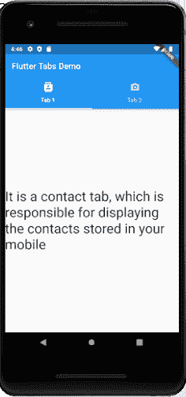
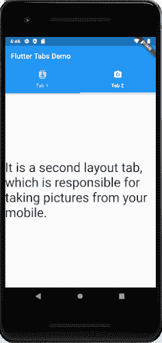
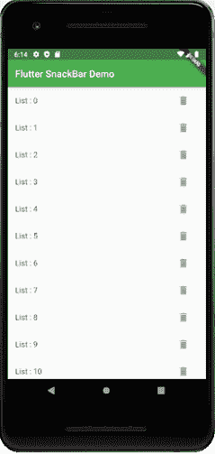
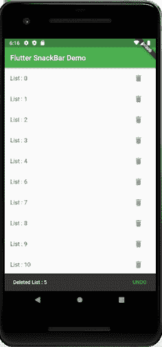

# 笛子要输了

> 原文： [https://www.javatpoint.com/flutter-tabbar](https://www.javatpoint.com/flutter-tabbar)

在这一节中，我们将学习标签栏如何在 Flutter 中工作。选项卡主要用于移动导航。不同操作系统的选项卡样式不同。例如，在安卓设备中，它被放在屏幕的顶部，而在 iOS 设备中，它被放在底部。

在遵循材质设计准则的安卓和 iOS 应用程序中，使用标签是一种常见模式。Flutter 提供了一种创建选项卡布局的便捷方式。要给应用添加标签，我们需要创建一个**标签栏**和**标签栏视图**并用标签控制器将它们连接起来。控制器将两者同步，这样我们就可以有我们需要的行为。

让我们一步一步地看看如何在 Flutter 应用程序中创建一个标签栏。

**步骤 1:** 首先，您需要在 IDE 中创建一个 Flutter 项目。在这里，我将使用 AndroidStudio。

**第二步:**在安卓 Studio 中打开 app，导航到 lib 文件夹。在 lib 文件夹中，创建两个 dart 文件，并将其命名为**第一屏幕**和**第二屏幕。**

在第一个屏幕中编写以下代码:

```

import 'package:flutter/material.dart';

class FirstScreen extends StatelessWidget {
  @override
  Widget build(BuildContext context) {
    return Container(
      child: Center(
        child: Text('It is a contact tab, which is responsible for displaying the contacts stored in your mobile',
            style: TextStyle(fontSize: 32.0),
          )
      ),
    );
  }
}

```

在第二个屏幕中编写以下代码:

```

import 'package:flutter/material.dart';

class SecondScreen extends StatelessWidget {
  @override
  Widget build(BuildContext context) {
    return Container(
      child: Center(
        child: Text('It is a second layout tab, which is responsible for taking pictures from your mobile.',
        style: TextStyle(fontSize: 35.0),
        ),
      ),
    );
  }
}

```

**第三步:**接下来，我们需要创建一个**默认的标签控制器。**默认选项卡控制器创建一个**选项卡控制器**，并使其可用于所有小部件。

```

DefaultTabController(
  // The number of tabs to display.
  length: 2,
  child: // Complete this code in the next step.
);

```

在上面的代码中， **length** 属性说明了应用程序中使用的标签数量。

**第 4 步:**创建选项卡。我们可以使用如下代码所示的**标签栏**小部件来创建标签。

```

DefaultTabController(
  length: 2,
  child: Scaffold(
    appBar: AppBar(
      bottom: TabBar(
        tabs: [
          Tab(icon: Icon(Icons.directions_car)),
          Tab(icon: Icon(Icons.directions_bike)),
        ],
      ),
    ),
  ),
);

```

**步骤 5:** 为每个选项卡创建内容，这样当选择一个选项卡时，它会显示内容。为此，我们必须使用**选项卡视图**小部件作为:

```

TabBarView(
  children: [
  ],
);

```

**第 6 步:**最后，打开 main.dart 文件，插入以下代码

```

import 'package:flutter/material.dart';
import './FirstScreen.dart';
import './SecondScreen.dart';

void main() => runApp(MyApp());

class MyApp extends StatelessWidget {
  @override
  Widget build(BuildContext context) {
    return MaterialApp(
      home: DefaultTabController(
        length: 2,
        child: Scaffold(
          appBar: AppBar(
            title: Text('Flutter Tabs Demo'),
            bottom: TabBar(
              tabs: [
                Tab(icon: Icon(Icons.contacts), text: "Tab 1"),
                Tab(icon: Icon(Icons.camera_alt), text: "Tab 2")
              ],
            ),
          ),
          body: TabBarView(
            children: [
              FirstScreen(),
              SecondScreen(),
            ],
          ),
        ),
      ),
    );
  }
}

```

**输出**

现在，在你的 AndroidStudio 运行这个应用。它将给出如下屏幕，您可以在其中看到两个选项卡图标。因此，当您单击任何选项卡图标时，它将显示相关的屏幕。

 

**显示滚动条**

SnackBar 会在移动设备的屏幕底部和较大设备的左下角给出一条**简短消息**，并从用户那里获得**确认**。小吃店在一定时间后自动消失。

在这里，我们将学习如何在 Flutter 中实现小吃店。在 Flutter 中，小吃店只与脚手架小部件上下文一起工作。

让我们举一个例子，我们显示记录列表，并包含对应于每个列表的删除图标。当我们删除任何记录时，它会在屏幕底部显示一条消息。此消息得到用户的确认。如果没有收到任何确认，消息会自动消失。下面的例子有助于更清楚地理解它。

在 AndroidStudio 创建一个 Flutter 项目。打开 **main.dart** 文件，替换如下代码。

```

import 'package:flutter/material.dart';

void main() => runApp(MyApp());

class MyApp extends StatelessWidget {
  @override
  Widget build(BuildContext context) {
    return MaterialApp(
      theme: ThemeData(
        primarySwatch: Colors.green,
      ),
      home: MyHomePage(),
    );
  }
}

class MyHomePage extends StatefulWidget {
  @override
  _MyHomePageState createState() => _MyHomePageState();
}

class _MyHomePageState extends State<MyHomePage> {
  var lists = List<String>.generate(11, (index) => "List : $index");
  @override
  Widget build(BuildContext context) {
    return Scaffold(
      appBar: AppBar(
        title: Text('Flutter SnackBar Demo'),
      ),
      body: ListView.builder(
        itemCount: lists.length,
        itemBuilder: (context, index) {
          return ListTile(
            title: Text(lists[index]),
            trailing: Container(
              width: 60,
              child: FlatButton(
                child: Icon(
                  Icons.delete,
                  color: Colors.grey,
                ),
                onPressed: () {
                  showSnackBar(context, index);
                },
              ),
            ),
          );
        },
      ),
    );
  }

  void showSnackBar(BuildContext context, int index) {
    var deletedRecord = lists[index];
    setState(() {
      lists.removeAt(index);
    });
    SnackBar snackBar = SnackBar(
      content: Text('Deleted $deletedRecord'),
      action: SnackBarAction(
        label: "UNDO",
        onPressed: () {
          setState(() {
            lists.insert(index, deletedRecord);
          });
        },
      ),
    );
    Scaffold.of(context).showSnackBar(snackBar);
  }
}

```

**输出**

现在，在 Android Studio 中运行该应用。您可以在模拟器中看到下面的屏幕。当您**删除**任意列表时，它会在屏幕底部显示一条消息。如果您点击撤销，它不会删除列表。

 

* * *