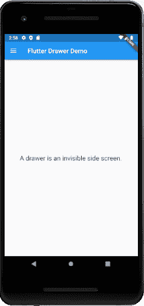
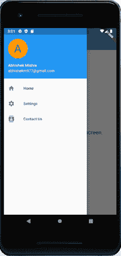

# 飘动抽屉

> 原文：<https://www.javatpoint.com/flutter-drawer>

使用“材质设计”的移动应用有两个主要导航选项。这些导航是**标签**和**抽屉。**抽屉是标签的替代选择，因为有时移动应用没有足够的空间来支持标签。

抽屉是一个不可见的侧屏。它是一个向左滑动的菜单，通常包含应用程序中的重要链接，显示时占据屏幕的一半。

让我们看看抽屉是如何摆动的。Flutter 使用一个抽屉小部件创建一个带有材料设计小部件的**向左滑动菜单**布局。在应用程序中使用抽屉需要以下步骤。

1.  创建一个Flutter项目。
2.  在脚手架小部件中添加抽屉
3.  通过添加内容填充抽屉
4.  关上抽屉。

**步骤 1:** 在 IDE 中创建一个 Flutter 项目。在这里，我将使用AndroidStudio。

**第二步:**在 Android Studio 中打开项目，导航至 **lib** 文件夹。在这个文件夹中，打开 main.dart 文件。

**步骤 3:** 在 main.dart 文件中，在脚手架小部件中创建一个**抽屉**，如下所示。

```

Scaffold(
  drawer: Drawer(
    child: // Populate the Drawer by adding content in the next step.
  )
);

```

**第四步:**接下来，我们需要在抽屉中添加内容。在本例中，我们将使用**列表视图**小部件，如果内容不符合屏幕支持，该部件允许用户滚动抽屉。下面的代码解释得更清楚。

```

Drawer(
  child: ListView(
    padding: EdgeInsets.zero,
    children: <Widget>[
      DrawerHeader(
        child: Text('Drawer Header'),
        decoration: BoxDecoration(
          color: Colors.blue,
        ),
      ),
      ListTile(
        title: Text('Item 1'),
        onTap: () {
          // Update the state of the app.
          // ...
        },
      ),
      ListTile(
        title: Text('Item 2'),
        onTap: () {
          // Update the state of the app.
          // ...
        },
      ),
    ],
  ),
);

```

**第五步:**最后，关上抽屉。我们可以通过使用**导航器**来做到这一点。

让我们看看上述步骤的完整代码。打开 main.dart 文件并替换以下代码。

```

import 'package:flutter/material.dart';

void main() => runApp(MyApp());

class MyApp extends StatelessWidget {
  final appTitle = 'Flutter Drawer Demo';

  @override
  Widget build(BuildContext context) {
    return MaterialApp(
      title: appTitle,
      home: MyHomePage(title: appTitle),
    );
  }
}

class MyHomePage extends StatelessWidget {
  final String title;

  MyHomePage({Key key, this.title}) : super(key: key);

  @override
  Widget build(BuildContext context) {
    return Scaffold(
      appBar: AppBar(title: Text(title)),
      body: Center(child: Text(
          'A drawer is an invisible side screen.',
          style: TextStyle(fontSize: 20.0),
          )
      ),
      drawer: Drawer(
        child: ListView(
          // Important: Remove any padding from the ListView.
          padding: EdgeInsets.zero,
          children: <Widget>[
            UserAccountsDrawerHeader(
              accountName: Text("Abhishek Mishra"),
              accountEmail: Text("abhishekm977@gmail.com"),
              currentAccountPicture: CircleAvatar(
                backgroundColor: Colors.orange,
                child: Text(
                  "A",
                  style: TextStyle(fontSize: 40.0),
                ),
              ),
            ),
            ListTile(
              leading: Icon(Icons.home), title: Text("Home"),
              onTap: () {
                Navigator.pop(context);
              },
            ),
            ListTile(
              leading: Icon(Icons.settings), title: Text("Settings"),
              onTap: () {
                Navigator.pop(context);
              },
            ),
            ListTile(
              leading: Icon(Icons.contacts), title: Text("Contact Us"),
              onTap: () {
                Navigator.pop(context);
              },
            ),
          ],
        ),
      ),
    );
  }
}

```

**输出**

现在，在 Android Studio 中运行该应用。它将显示以下屏幕。



当你点击上图屏幕左上角时，你可以看到向左滑动的抽屉，它通常包含应用程序中的重要链接，占据了屏幕的一半。



* * *