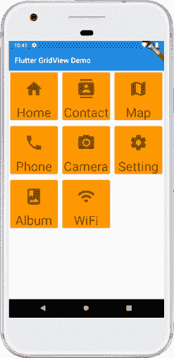
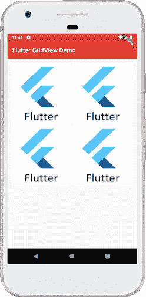
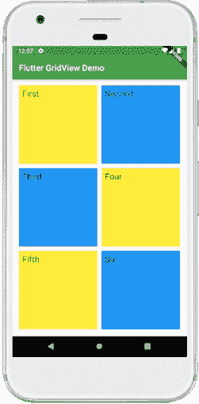

# Flutter GridView

> 原文：<https://www.javatpoint.com/flutter-gridview>

网格视图是一种图形控制元素，用于以表格形式显示项目。在这一节中，我们将学习如何在 Flutter 应用程序的网格视图中渲染项目。

GridView 是 Flutter 中的一个小部件，它以**二维数组**(二维行和列)显示项目。顾名思义，当我们想要在网格中显示项目时，将使用它。我们可以通过点击网格列表来选择所需的项目。这个小部件可以包含**文本、图像、图标**等。根据用户要求以网格布局显示。它也被称为可滚动的二维小部件阵列。因为它是可滚动的，所以我们只能指定它滚动的方向。

网格视图可以通过多种方式实现，如下所示:

1.  [计数()](#count)
2.  [建设者()](#builder)
3.  自定义()
4.  [范围()](#extent)

让我们详细讨论以上所有内容。

## GridView.count()

它是 [Flutter](https://www.javatpoint.com/flutter-layouts) 中最常用的网格布局，因为在这里，我们已经知道了网格的大小。它允许开发者**指定固定的行数和列数**。GriedView.count()包含以下属性:

**croaxiscount:**用于指定网格视图中的列数。

**交叉轴配置:**用于指定交叉轴中列出的每个子小部件之间的像素数。

**mainaxispacing:**用于指定主轴中列出的每个子小部件之间的像素数。

**填充(edgintsgeometry):**用于指定整个小部件列表周围的空间。

**滚动方向:**用于指定 GridView 上项目滚动的方向。默认情况下，它在垂直方向滚动。

**反转:**如果为真，则沿主轴反方向反转列表。

**物理:**用于确定当用户在滚动时到达小部件的末尾或开始时，列表的行为。

**shrinkWrap:** 如果为 false，则可滚动列表在滚动方向上占用更多空间进行滚动。这是不好的，因为它浪费内存，降低应用程序性能。因此，我们将通过将 shrinkWrap 设置为 true 来包装我们的子小部件，以避免滚动时的内存泄漏。

### 例子

让我们用一个例子来理解它，看看如何在 [Flutter](https://www.javatpoint.com/flutter) 中创建 GridView 来创建网格列表。首先，在您正在使用的 IDE 中创建新项目。打开项目，导航到 lib 文件夹，用 **main.dart** 文件替换下面的代码。

```

import 'package:flutter/material.dart';

void main() {runApp(MyApp());}

class MyApp extends StatelessWidget {
  @override
  Widget build(BuildContext context) {
    return MaterialApp(
        home: Scaffold(appBar: AppBar(
          title: Text("Flutter GridView Demo"),
        ),
            body: GridView.count(
                crossAxisCount: 3,
                crossAxisSpacing: 4.0,
                mainAxisSpacing: 8.0,
                children: List.generate(choices.length, (index) {
                  return Center(
                    child: SelectCard(choice: choices[index]),
                  );
                }
                )
            )
        )
    );
  }
}

class Choice {
  const Choice({this.title, this.icon});
  final String title;
  final IconData icon;
}

const List<Choice> choices = const <Choice>[
  const Choice(title: 'Home', icon: Icons.home),
  const Choice(title: 'Contact', icon: Icons.contacts),
  const Choice(title: 'Map', icon: Icons.map),
  const Choice(title: 'Phone', icon: Icons.phone),
  const Choice(title: 'Camera', icon: Icons.camera_alt),
  const Choice(title: 'Setting', icon: Icons.settings),
  const Choice(title: 'Album', icon: Icons.photo_album),
  const Choice(title: 'WiFi', icon: Icons.wifi),
];

class SelectCard extends StatelessWidget {
  const SelectCard({Key key, this.choice}) : super(key: key);
  final Choice choice;

  @override
  Widget build(BuildContext context) {
    final TextStyle textStyle = Theme.of(context).textTheme.display1;
    return Card(
        color: Colors.orange,
        child: Center(child: Column(
            crossAxisAlignment: CrossAxisAlignment.center,
            children: <Widget>[
              Expanded(child: Icon(choice.icon, size:50.0, color: textStyle.color)),
              Text(choice.title, style: textStyle),
            ]
        ),
        )
    );
  }
}

```

在上面的代码中，我们为要在网格中显示的项目创建了一个类，然后添加了一些数据。接下来，我们构建了将要在 GridView 中显示的小部件。

**输出**

当我们在 AndroidStudio 运行该应用时，我们可以在模拟器中看到以下屏幕。



## GridView.builder()

当我们想要**动态或按需**显示数据时，使用该属性。换句话说，如果用户想要创建一个具有大量(无限)子级的网格，那么他们可以将 GridView.builder()构造函数与 slivergriddelegatewithsfixed crossaxiscount 或 slivergriddelegatewithscrossaxiscontent 一起使用。

该小部件的常见属性有:

**项目计数**:用于定义要显示的数据量。

**网格状态**:决定网格或其分割线。其参数不应为空。

**项目生成器**:用于创建将在网格视图中显示的项目。只有当指数>= 0&&指数<项目计数时才会调用。

### 例子

让我们借助一个例子来理解它。打开项目，导航到 lib 文件夹，用 **main.dart** 文件替换下面的代码。

```

import 'package:flutter/material.dart';

void main() => runApp(MyApp());

class MyApp extends StatelessWidget {

  List images = [
    "https://static.javatpoint.com/tutorial/flutter/images/flutter-logo.png",
    "https://static.javatpoint.com/tutorial/flutter/images/flutter-logo.png",
    "https://static.javatpoint.com/tutorial/flutter/images/flutter-logo.png",
    "https://static.javatpoint.com/tutorial/flutter/images/flutter-logo.png"
  ];

  @override
  Widget build(BuildContext context) {
    return MaterialApp(
      home: Scaffold(
        appBar: AppBar(
          title: Text("Flutter GridView Demo"),
          backgroundColor: Colors.red,
        ),
        body: Container(
            padding: EdgeInsets.all(12.0),
            child: GridView.builder(
              itemCount: images.length,
              gridDelegate: SliverGridDelegateWithFixedCrossAxisCount(
                  crossAxisCount: 2,
                  crossAxisSpacing: 4.0,
                  mainAxisSpacing: 4.0
              ),
              itemBuilder: (BuildContext context, int index){
                return Image.network(images[index]);
              },
            )),
      ),
    );
  }
} 
```

**输出**

当我们在 AndroidStudio 运行该应用时，我们可以在模拟器中看到以下屏幕。



## GridView.extent()

当我们想要**用自定义范围值**创建网格时，使用该属性。这意味着每个图块都有最大的交叉轴范围。

### 例子

让我们借助一个例子来理解它。打开项目，导航到 lib 文件夹，用 **main.dart** 文件替换下面的代码。

```

import 'package:flutter/material.dart';

void main() => runApp(MyApp());

class MyApp extends StatelessWidget {
  // This widget is the root of your application.
  @override
  Widget build(BuildContext context) {
    return MaterialApp(
      home: MyGridScreen(),
    );
  }
}

class MyGridScreen extends StatefulWidget {
  MyGridScreen({Key key}) : super(key: key);

  @override
  _MyGridScreenState createState() => _MyGridScreenState();
}

class _MyGridScreenState extends State {
  @override
  Widget build(BuildContext context) {
    return Scaffold(
      appBar: AppBar(
        title: Text("Flutter GridView Demo"),
        backgroundColor: Colors.green,
      ),
      body: Center(
          child: GridView.extent(
            primary: false,
            padding: const EdgeInsets.all(16),
            crossAxisSpacing: 10,
            mainAxisSpacing: 10,
            maxCrossAxisExtent: 200.0,
            children: <widget>[
              Container(
                padding: const EdgeInsets.all(8),
                child: const Text('First', style: TextStyle(fontSize: 20)),
                color: Colors.yellow,
              ),
              Container(
                padding: const EdgeInsets.all(8),
                child: const Text('Second', style: TextStyle(fontSize: 20)),
                color: Colors.blue,
              ),
              Container(
                padding: const EdgeInsets.all(8),
                child: const Text('Third', style: TextStyle(fontSize: 20)),
                color: Colors.blue,
              ),
              Container(
                padding: const EdgeInsets.all(8),
                child: const Text('Four', style: TextStyle(fontSize: 20)),
                color: Colors.yellow,
              ),
              Container(
                padding: const EdgeInsets.all(8),
                child: const Text('Fifth', style: TextStyle(fontSize: 20)),
                color: Colors.yellow,
              ),
              Container(
                padding: const EdgeInsets.all(8),
                child: const Text('Six', style: TextStyle(fontSize: 20)),
                color: Colors.blue,
              ),
            ],
          )),
    );
  }
}</widget> 
```

**输出**

当我们在 AndroidStudio 运行该应用时，我们可以在模拟器中看到以下屏幕。



* * *