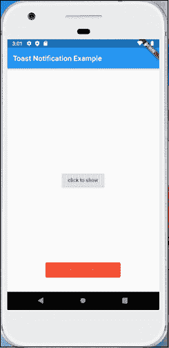

# Flutter祝酒通知

> 原文：<https://www.javatpoint.com/flutter-toast-notification>

颤动吐司也称为**吐司通知**消息。这是一个非常小的消息，主要弹出在设备屏幕的底部。它会在完成开发人员提供的时间后自行消失。开发人员主要使用 toast 通知来显示对用户执行的操作的反馈。

显示吐司通知消息是安卓应用程序的一个基本功能。我们可以通过简单的代码行来实现它。在本节中，我们将学习如何在 [Flutter](https://www.javatpoint.com/flutter) 中实现在[安卓](https://www.javatpoint.com/android-tutorial)和 iOS 中显示吐司信息。要实现吐司通知，我们需要在 Flutter 中导入**Flutter 吐司**库。

在 Flutter 中显示吐司通知需要以下步骤:

*   创建一个Flutter项目
*   在项目中添加颤动吐司依赖项
*   在库中导入 fluttertoast 省道包
*   实现在 Flutter 中显示祝酒词的代码

Flutter 为用户提供了几个属性来显示 toast 消息，如下所示:

| 财产 | 描述 |
| 味精 | 字符串(必需) |
| 到目前为止 | 干杯。长度 _ 短或吐司。长度 _ 长 |
| 重力 | 地球引力。顶部或顶部重力。重心或重心。底部 |
| timeInSecForIos | 它仅用于 Ios ( 1 秒或更长时间) |
| 背景颜色 | 它指定背景颜色。 |
| 文本颜色 | 它指定文本颜色。 |
| 字体大小 | 它指定通知消息的字体大小。 |

**FlutterToast.cancel():** 当您想要取消所有向用户显示消息的请求时，使用该功能。

**让我们看看如何通过以下步骤在 Flutter 应用程序中显示祝酒通知:**

**步骤 1:** 在 IDE 中创建一个 Flutter 项目。在这里，我将使用AndroidStudio。

**第二步:**在[AndroidStudio](https://www.javatpoint.com/android-studio)打开项目，导航至 **lib** 文件夹。在该文件夹中，打开**publispec . YAML**文件。在这里，我们需要在依赖部分添加 flutter toast 库，然后点击**获取包**链接，在您的 **main.dart** 文件中导入该库。

**pubspec.yaml**

```

dependencies:
  flutter:
    sdk: flutter
  cupertino_icons: ^0.1.2
  fluttertoast: ^3.1.0

```

它确保在添加依赖项时，您在 fluttertoast 依赖项的左侧有两个空格**。fluttertoast 依赖项提供了以简单的方式显示 toast 通知的功能。它还可以非常容易地定制吐司弹出窗口的外观。**

**第三步:**打开 **main.dart** 文件，在小部件中创建一个敬酒通知，如下所示。

```

Fluttertoast.showToast(
        msg: 'This is toast notification',
        toastLength: Toast.LENGTH_SHORT,
        gravity: ToastGravity.BOTTOM,
        timeInSecForIos: 1,
        backgroundColor: Colors.red,
        textColor: Colors.yellow
    );

```

让我们看看上述步骤的完整代码。打开 main.dart 文件并替换以下代码。这个代码包含一个按钮，当我们按下这个按钮时，它会通过调用 **FlutterToast.showToast** 来显示 toast 消息。

```

import 'package:flutter/material.dart';
import 'package:fluttertoast/fluttertoast.dart';

class ToastExample extends StatefulWidget {
  @override
  _ToastExampleState createState() {
    return _ToastExampleState();
  }
}

class _ToastExampleState extends State {
  void showToast() {
    Fluttertoast.showToast(
        msg: 'This is toast notification',
        toastLength: Toast.LENGTH_SHORT,
        gravity: ToastGravity.BOTTOM,
        timeInSecForIos: 1,
        backgroundColor: Colors.red,
        textColor: Colors.yellow
    );
  }

  @override
  Widget build(BuildContext context) {
    return MaterialApp(
      title: 'Toast Notification Example',
      home: Scaffold(
          appBar: AppBar(
            title: Text('Toast Notification Example'),
          ),
          body: Padding(
            padding: EdgeInsets.all(15.0),
            child: Center(
              child: RaisedButton(
                child: Text('click to show'),
                onPressed: showToast,
              ),
            ),
          )
      ),
    );
  }
}

void main() => runApp(ToastExample());

```

**输出**

现在，在 Android Studio 中运行该应用。它将显示以下屏幕。


当我们点击**“点击显示”**按钮时，我们可以在屏幕底部看到敬酒信息。请参见下图:



* * *