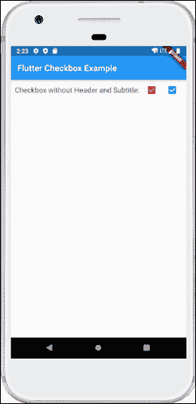
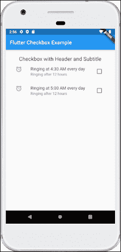

# 颤动复选框

> 原文：<https://www.javatpoint.com/flutter-checkbox>

复选框是一种保存布尔值的输入组件。它是一个图形用户界面元素，允许用户**从几个选项**中选择多个选项。这里，用户只能回答是或否。已标记/选中的复选框表示是，未标记/未选中的复选框表示无值。通常，我们可以看到屏幕上的复选框为带有空格或勾号的**方形框**。对应于每个复选框的标签或标题描述了复选框的含义。

在本文中，我们将学习如何在 Flutter 中使用复选框。在 [Flutter](https://www.javatpoint.com/flutter) 中，我们可以有两种类型的复选框:名为**“复选框”**的紧凑版本复选框和**“复选框列表框”**复选框，它们带有标题和副标题。这些复选框的详细描述如下:

**复选框:**

| 属性 | 描述 |
| 价值 | 无论复选框是否被选中，它都会被使用。 |
| onChanged | 当值改变时，将调用它。 |
| 三态 | 默认情况下，它是假的。它的值也可以是真、假或空。 |
| 活动颜色 | 它指定了所选复选框的颜色。 |
| 检查颜色 | 它指定了选中时检查图标的颜色。 |
| materialstaptargetsize | 它用于配置 tap 目标的大小。 |

**示例:**

下面是复选框的演示示例:

```

Checkbox(
  value: this.showvalue, 
  onChanged: (bool value) {
    setState(() {
      this.showvalue = value; 
    });
  },
),

```

让我们编写完整的代码，看看 checkbox 是如何在 Flutter 中显示的。首先，在 android studio 中创建一个项目，打开 **main.dart** 文件，替换下面给出的代码:

```

import 'package:flutter/material.dart';

void main() {
  runApp(MaterialApp( home: MyHomePage(),));
}

class MyHomePage extends StatefulWidget {
  @override
  _HomePageState createState() => _HomePageState();
}

class _HomePageState extends State<MyHomePage> {
  bool valuefirst = false;
  bool valuesecond = false;

  @override
  Widget build(BuildContext context) {
    return MaterialApp(
      home: Scaffold(
        appBar: AppBar(title: Text('Flutter Checkbox Example'),),
        body: Container(

            child: Column(
              children: <Widget>[
                Row(
                  children: <Widget>[
                    SizedBox(width: 10,),
                    Text('Checkbox without Header and Subtitle: ',style: TextStyle(fontSize: 17.0), ),
                    Checkbox(
                      checkColor: Colors.greenAccent,
                      activeColor: Colors.red,
                      value: this.valuefirst,
                      onChanged: (bool value) {
                        setState(() {
                          this.valuefirst = value;
                        });
                      },
                    ),
                    Checkbox(
                      value: this.valuesecond,
                      onChanged: (bool value) {
                        setState(() {
                          this.valuesecond = value;
                        });
                      },
                    ),
                  ],
                ),
              ],
            )
        ),
      ),
    );
  }
}

```

**输出**

现在在模拟器或设备中执行应用程序，我们将看到下面的屏幕:



**支票本列表标题:**

| 属性 | 描述 |
| 价值 | 无论复选框是否被选中，它都会被使用。 |
| onChanged | 当值改变时，将调用它。 |
| 标题 | 它指定了列表的主要标题。 |
| 小标题 | 它指定了列表的副标题。通常用于添加描述。 |
| 活动颜色 | 它指定了所选复选框的颜色。 |
| 活动颜色 | 它指定了所选复选框的颜色。 |
| 挑选 | 默认情况下，它是假的。它在选择后突出显示文本。 |
| 副手 | 它是显示在复选框前面的小部件。 |

**示例:**

下面是 CheckboxListTitle 的演示示例:

```

CheckboxListTile(
  secondary: const Icon(Icons.abc),
  title: const Text('demo mode'),
     subtitle: Text('sub demo mode'),
  value: this.subvalue, 
  onChanged: (bool value) {
    setState(() {
      this.subvalue = value; 
    });
  },
),

```

让我们编写完整的代码来看看 CheckboxListTitle 是如何在 Flutter 中显示的。首先，在 android studio 中创建一个项目，打开 **main.dart** 文件，替换下面给出的代码:

```

import 'package:flutter/material.dart';

void main() {
  runApp(MaterialApp( home: MyHomePage(),));
}

class MyHomePage extends StatefulWidget {
  @override
  _HomePageState createState() => _HomePageState();
}

class _HomePageState extends State<MyHomePage> {
  bool valuefirst = false;
  bool valuesecond = false;

  @override
  Widget build(BuildContext context) {
    return MaterialApp(
      home: Scaffold(
        appBar: AppBar(title: Text('Flutter Checkbox Example'),),
        body: Container(
            padding: new EdgeInsets.all(22.0),
            child: Column(
              children: <Widget>[
                SizedBox(width: 10,),
                Text('Checkbox with Header and Subtitle',style: TextStyle(fontSize: 20.0), ),
                CheckboxListTile(
                  secondary: const Icon(Icons.alarm),
                  title: const Text('Ringing at 4:30 AM every day'),
                  subtitle: Text('Ringing after 12 hours'),
                  value: this.valuefirst,
                  onChanged: (bool value) {
                    setState(() {
                      this.valuefirst = value;
                    });
                  },
                ),
                CheckboxListTile(
                  controlAffinity: ListTileControlAffinity.trailing,
                  secondary: const Icon(Icons.alarm),
                  title: const Text('Ringing at 5:00 AM every day'),
                  subtitle: Text('Ringing after 12 hours'),
                  value: this.valuesecond,
                  onChanged: (bool value) {
                    setState(() {
                      this.valuesecond = value;
                    });
                  },
                ),
              ],
            )
        ),
      ),
    );
  }
}

```

**输出**

现在在模拟器或设备中执行该应用程序，我们将看到以下屏幕:



* * *