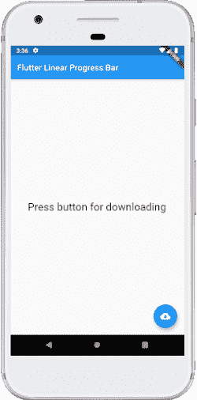
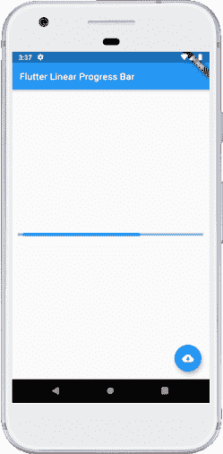
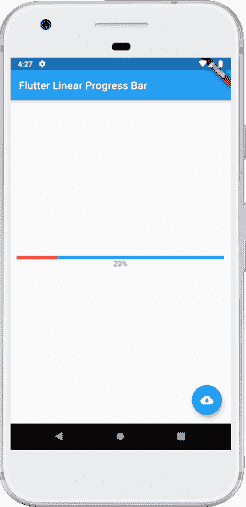
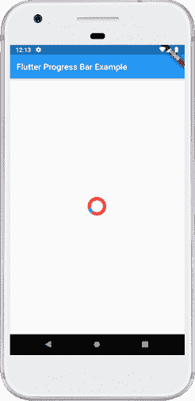
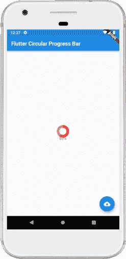

# Dart进度条

> 原文：<https://www.javatpoint.com/flutter-progress-bar>

进度条是用于**显示任务**进度的图形控制元素，如下载、上传、安装、文件传输等。在本节中，我们将了解如何在 flutter 应用程序中显示进度条。

Flutter 可以在两个小部件的帮助下显示进度条，如下所示:

1.  [直线级进模](#LinearProgressIndicator)
2.  [循环渐进指示器](#CircularProgressIndicator)

让我们详细了解一下。

## 线性渐进指示器

线性进度条用于在一条**水平线**中显示任务的进度。

[Dart](https://www.javatpoint.com/flutter)主要提供**两种类型的**线性进度指示器:

**确定:**确定进度条表示**在完成任务的各个点**的实际进度。它的值将从 **0.0 单调增加到 1.0** ，以显示当时完成的任务量。我们需要使用一个从 0.0 到 1.0 的非空值来创建一个确定的进度指标。

**不确定:**不确定进度条不表示完成任务的进度量。这意味着我们不知道任务什么时候完成。**它取得了进步，但没有说明还有多少进步**。我们可以通过使用**空值**来制作一个不确定的进度指标。

### 性能

以下是线性进度指标最常见的属性:

**双值:**用于指定 0.0-1.0 之间的非空值，代表任务进度完成。

**颜色 backgroundColor:** 用于指定小部件的背景颜色。

**动画<颜色>值颜色:**用于将进度指示器的颜色指定为动画值。

### 例子

下面的代码解释了一个**不定线性进度条**的使用，它显示了一个我们不知道何时会完成的下载。一个**浮动按钮**用于将状态从不下载变为下载。没有下载时，显示一条文字；否则，它将显示进度指示器:

```

import 'package:flutter/material.dart';

void main() => runApp(MyApp());

class MyApp extends StatelessWidget {
  @override
  Widget build(BuildContext context) {
    return MaterialApp(
      home: LinearProgressIndicatorApp(),
    );
  }
}

class LinearProgressIndicatorApp extends StatefulWidget {
  @override
  State createState() {
    return LinearProgressIndicatorAppState();
  }
}

class LinearProgressIndicatorAppState extends State <linearprogressindicatorapp>{
  bool _loading;

  @override
  void initState() {
    super.initState();
    _loading = false;
  }

  @override
  Widget build(BuildContext context) {
    return Scaffold(
      appBar: AppBar(
        title: Text("Flutter Linear Progress Bar"),
      ),
      body: Center(
        child: Container(
          padding: EdgeInsets.all(12.0),
          child: _loading ? LinearProgressIndicator() : Text(
              "Press button for downloading",
              style: TextStyle(fontSize: 25)),
        ),
      ),
      floatingActionButton: FloatingActionButton(
        onPressed: () {
          setState(() {
            _loading = !_loading;
          });
        },
        tooltip: 'Download',
        child: Icon(Icons.cloud_download),
      ),
    );
  }
}</linearprogressindicatorapp> 
```

**输出:**

现在，在您的集成开发环境中运行该应用程序。我们可以看到屏幕的 UI 如下截图。



当我们按下浮动按钮时，它将状态从不下载更改为下载，并显示进度指示器，如下图所示:



有时我们想制作一个**确定进度条**，这意味着我们将显示完成任务需要多长时间。在这种情况下，我们可以模拟一个需要时间来完成任务的下载，**更新**线性渐进指示器**的值如下:**

```

import 'dart:async';
import 'package:flutter/material.dart';

void main() => runApp(MyApp());

class MyApp extends StatelessWidget {
  @override
  Widget build(BuildContext context) {
    return MaterialApp(
      home: LinearProgressIndicatorApp(),
    );
  }
}

class LinearProgressIndicatorApp extends StatefulWidget {
  @override
  State createState() {
    return LinearProgressIndicatorAppState();
  }
}

class LinearProgressIndicatorAppState extends State <linearprogressindicatorapp>{
  bool _loading;
  double _progressValue;

  @override
  void initState() {
    super.initState();
    _loading = false;
    _progressValue = 0.0;
  }
  @override
  Widget build(BuildContext context) {
    return Scaffold(
      appBar: AppBar(
        title: Text("Flutter Linear Progress Bar"),
      ),
      body: Center(
        child: Container(
          padding: EdgeInsets.all(12.0),
          child: _loading
              ? Column(
            mainAxisAlignment: MainAxisAlignment.center,
            children: <widget>[
              LinearProgressIndicator(
                backgroundColor: Colors.cyanAccent,
                valueColor: new AlwaysStoppedAnimation<color>(Colors.red),
                value: _progressValue,
              ),
              Text('${(_progressValue * 100).round()}%'),
            ],
          )
              : Text("Press button for downloading", style: TextStyle(fontSize: 25)),
        ),
      ),
      floatingActionButton: FloatingActionButton(
        onPressed: () {
          setState(() {
            _loading = !_loading;
            _updateProgress();
          });
        },
        tooltip: 'Download',
        child: Icon(Icons.cloud_download),
      ),
    );
  }
  // this function updates the progress value
  void _updateProgress() {
    const oneSec = const Duration(seconds: 1);
    new Timer.periodic(oneSec, (Timer t) {
      setState(() {
        _progressValue += 0.1;
        // we "finish" downloading here
        if (_progressValue.toStringAsFixed(1) == '1.0') {
          _loading = false;
          t.cancel();
          return;
        }
      });
    });
  }
}</color></widget></linearprogressindicatorapp> 
```

**输出:**

现在，在您的集成开发环境中运行该应用程序。当我们按下按钮时，它会将状态从不下载更改为下载，并显示当时完成了多少进度，如下图所示:



## 循环进度指示器

它是一个小部件，**旋转以指示应用程序中的等待过程**。它以**圆形**显示任务的进度。它还以两种方式显示进度条:确定和不确定。

当我们想要显示正在进行的任务的进度时，例如下载或上传文件的百分比等，使用**确定进度条**。我们可以通过指定 0.0 到 1.0 之间的值来显示进度。

当我们不想知道正在进行的过程的百分比时，使用**不确定进度条**。默认情况下，循环进度指示器显示不确定的进度条。

### 例子

在下面的例子中，我们将看到**循环进度**指示器处于不确定模式，不显示任何任务的进度。它不断地显示圆圈，这表明有些事情正在解决，我们必须等待它的完成。为此，不需要为循环进度指示器()构造函数指定任何值。请参见以下代码:

```

import 'package:flutter/material.dart';

void main() => runApp(MyApp());

class MyApp extends StatelessWidget {
  @override
  Widget build(BuildContext context) {
    return MaterialApp(
      home: Scaffold(
        appBar: AppBar(
          title: Text('Flutter Progress Bar Example'),
        ),
        body: Center(
            child: CircularProgressIndicatorApp()
        ),
      ),
    );
  }
}

/// This is the stateless widget that the main application instantiates.
class CircularProgressIndicatorApp extends StatelessWidget {
  @override
  Widget build(BuildContext context) {
    return CircularProgressIndicator(
      backgroundColor: Colors.red,
      strokeWidth: 8,);
  }
}

```

**输出:**

现在，在您的集成开发环境中运行该应用程序。我们将看到Dart循环进度指示器的输出，如下图所示:



有时候你想做一个**确定的循环进度**条来显示完成任务需要多少时间。在这种情况下，我们可以模拟一个需要时间来完成任务的下载，并按如下方式更新循环进度指示器的值:

```

import 'dart:async';
import 'package:flutter/material.dart';

void main() => runApp(MyApp());

class MyApp extends StatelessWidget {
  @override
  Widget build(BuildContext context) {
    return MaterialApp(
      home: CircularProgressIndicatorApp(),
    );
  }
}

class CircularProgressIndicatorApp extends StatefulWidget {
  @override
  State createState() {
    return CircularProgressIndicatorAppState();
  }
}

class CircularProgressIndicatorAppState extends State<circularprogressindicatorapp>{
  bool _loading;
  double _progressValue;

  @override
  void initState() {
    super.initState();
    _loading = false;
    _progressValue = 0.0;
  }
  @override
  Widget build(BuildContext context) {
    return Scaffold(
      appBar: AppBar(
        title: Text("Flutter Circular Progress Bar"),
      ),
      body: Center(
        child: Container(
          padding: EdgeInsets.all(14.0),
          child: _loading
              ? Column(
            mainAxisAlignment: MainAxisAlignment.center,
            children: <widget>[
              CircularProgressIndicator(
                strokeWidth: 10,
                backgroundColor: Colors.yellow,
                valueColor: new AlwaysStoppedAnimation<color>(Colors.red),
                value: _progressValue,
              ),
              Text('${(_progressValue * 100).round()}%'),
            ],
          )
              : Text("Press button for downloading", style: TextStyle(fontSize: 25)),
        ),
      ),
      floatingActionButton: FloatingActionButton(
        onPressed: () {
          setState(() {
            _loading = !_loading;
            _updateProgress();
          });
        },
        child: Icon(Icons.cloud_download),
      ),
    );
  }
  // this function updates the progress value
  void _updateProgress() {
    const oneSec = const Duration(seconds: 1);
    new Timer.periodic(oneSec, (Timer t) {
      setState(() {
        _progressValue += 0.2;
        // we "finish" downloading here
        if (_progressValue.toStringAsFixed(1) == '1.0') {
          _loading = false;
          t.cancel();
          return;
        }
      });
    });
  }
}</color></widget></circularprogressindicatorapp> 
```

**输出:**

现在，在您的集成开发环境中运行该应用程序。当我们按下按钮时，它会显示当时完成了多少进度，如下图所示:



* * *