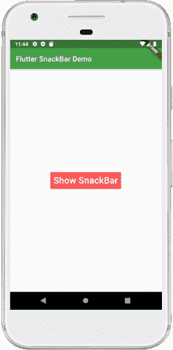
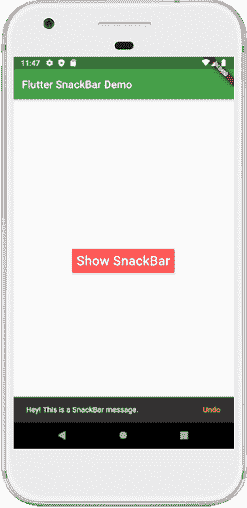

# Flutter锁杆

> 原文：<https://www.javatpoint.com/flutter-snackbar>

Flutter 中的 Snackbar 是一个显示**轻量级消息的小部件，当某些动作发生时**会短暂通知用户。它会在很短的时间内显示消息，当指定的时间结束时，它将从屏幕上消失。默认情况下，小吃店显示在屏幕底部。这是给用户反馈的好方法。它还包含一些允许用户撤消或重做任何操作的操作。通常，小吃店与脚手架部件一起使用。

### 任务栏属性

以下是[Flutter](https://www.javatpoint.com/flutter)中使用的小吃店的重要特性:

| 属性名称 | 描述 |
| 内容 | 它是小吃店的主要内容，实际上是一个文本小部件。 |
| 期间 | 它用于指定小吃店应该显示多长时间。 |
| 行为 | 它用于在用户点击小吃店时采取行动。不能解散或取消。我们只能在小吃店撤销或重做。 |
| 海拔 | 它是放置小吃店的 z 坐标。它用于控制小吃店下方的阴影大小。 |
| 形状 | 它用于定制小吃店的形状。 |
| 行为 | 它用于设置小吃店的位置。 |
| bagroundcolor | 它指定小吃店的背景。 |
| 动画 | 它定义了小吃店的出口和入口。 |

如果我们在手机应用程序中使用了小吃店，它可以让用户在应用程序中获得关于他们行为的信息。在本文中，我们将学习如何使用以下步骤在 Flutter 中添加和显示 SnackBar:

1.  在您正在使用的集成开发环境中创建一个项目。
2.  创建支架部件。
3.  显示滚动条小部件。
4.  提供可选操作。

**步骤 1:** 在正在使用的 IDE 中创建一个 Flutter 项目，然后在 [Android Studio](https://www.javatpoint.com/android-studio) 中打开该项目。打开项目后，我们需要导航到 **lib 文件夹**并打开 **main.dart** 文件。

**第二步:**创建一个**脚手架小部件**负责视觉结构，确保基本小部件不重叠。

```

Scaffold(
  appBar: AppBar(
    title: Text(' SnackBar Example'),
  ),
  body: SnackBarPage(),
);

```

**第三步:**接下来，我们需要显示一个 SnackBar。因此，在脚手架小部件中创建一个小吃店，如下所示:

```

final snackBar = SnackBar(content: Text(' Hey! I am a SnackBar message.'));

// Here, we will use the scaffold widget to show a snack bar.
Scaffold.of(context).showSnackBar(snackBar);

```

**第四步:**接下来，我们可以给小吃店增加一些**动作。例如，假设用户不小心删除了一条消息或发送了一封邮件，那么我们可以在小吃店中提供一个可选的操作来恢复这些消息。下面的演示代码解释得更清楚:**

```

final snackBar = SnackBar(
  content: Text(' Hey! I am a SnackBar message.'),
  action: SnackBarAction(
    label: 'Undo',
    onPressed: () {
      // Write your code to undo the change.
    },
  ),
);

```

让我们看看上述步骤的完整代码。打开 **main.dart** 文件，替换如下代码。该代码包含一个按钮，当用户点击该按钮时，它将显示小吃店消息。它还包含撤消或重做更改的操作。

```

import 'package:flutter/material.dart';

void main() {runApp(MyApp());}

class MyApp extends StatelessWidget {
  @override
  Widget build(BuildContext context) {
    return MaterialApp(
      theme: new ThemeData(
        primaryColor: const Color(0xFF43a047),
        accentColor: const Color(0xFFffcc00),
        primaryColorBrightness: Brightness.dark,
      ),
      home: Scaffold(
        appBar: AppBar(
          title: Text('Flutter SnackBar Demo'),
        ),
        body: SnackBarPage(),
      ),
    );
  }
}

class SnackBarPage extends StatelessWidget {
  @override
  Widget build(BuildContext context) {
    return Center(
      child: RaisedButton(
        child: Text('Show SnackBar', style: TextStyle(fontSize: 25.0),),
        textColor: Colors.white,
        color: Colors.redAccent,
        padding: EdgeInsets.all(8.0),
        splashColor: Colors.grey,
        onPressed: () {
          final snackBar = SnackBar(
            content: Text('Hey! This is a SnackBar message.'),
            duration: Duration(seconds: 5),
            action: SnackBarAction(
              label: 'Undo',
              onPressed: () {
                // Some code to undo the change.
              },
            ),
          );
          Scaffold.of(context).showSnackBar(snackBar);
        },
      ),
    );
  }
}

```

**输出:**

当我们运行这个应用程序时，它会显示屏幕的用户界面，如下截图所示。



如果我们点击**“显示任务栏”**按钮，我们会在屏幕底部看到消息。完成指定时间后，此邮件将被自动删除。请看下面的截图:



* * *