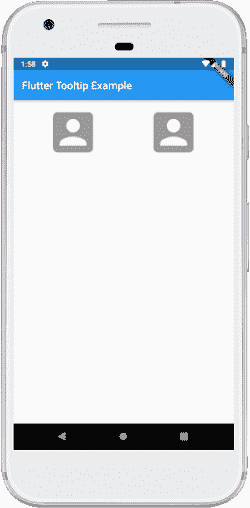
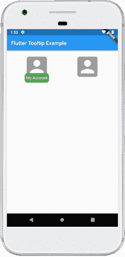

# Flutter工具提示

> 原文： [https://www.javatpoint.com/flutter-tooltip](https://www.javatpoint.com/flutter-tooltip)

工具提示是 Flutter 中的一个材质设计类，**提供文本标签来解释按钮或用户界面动作的功能**。换句话说，它用于在用户在特定小部件上移动或指向时显示附加信息。它增加了我们应用程序的可访问性。如果我们用它包装小部件，那么当用户长按小部件时，它非常有用，因为在这种情况下，它显示为浮动标签。

### 属性:

以下是用于自定义应用程序的属性。

**消息**:是用于在工具提示中显示的字符串消息。

**高度**:用于指定工具提示的子级的高度。

**文本样式**:用于确定工具提示消息的样式。

**边距**:用于确定工具提示周围的空白。

**显示时长**:用于指定长按释放后显示工具提示的时长。默认为 1.5 秒。

**装饰**:用于定义工具提示的形状和背景颜色。默认工具提示形状是一个圆角矩形，边框半径为 4.0 像素。

**垂直间隙设置**:它决定了工具提示和小部件之间的垂直间隙。

**等待持续时间**:用于指定在显示工具提示之前，指针悬停在工具提示小部件上的时间。当指针离开小部件时，工具提示消息将消失。

**填充**:确定插入工具提示子级的空间。默认为 16.0 PX 全方位。

**首选下方**:用于指定工具提示是否显示在小部件下方。默认情况下，这是真的。如果我们没有足够的空间在首选方向显示工具提示，工具提示将在相反的方向显示。

### 如何在 Flutter 中使用工具提示小部件？

我们可以使用[中的工具提示](https://www.javatpoint.com/flutter)作为下面的代码:

```

Tooltip(
        message: 'User Account',
        child: IconButton(
        icon: Icon(Icons.high_quality),
        onPressed: () {
        /* your code */
        },
    ),
),

```

**输出**

### 例子

让我们借助一个例子来理解它，在这个例子中，我们试图涵盖上述大多数属性。在下面的例子中，我们将使用一个带有**图标**的**平板按钮**作为一个孩子，并用一个**工具提示**包围这个按钮。如果我们长按此按钮上的**或**，它将显示一个标签，其中包含为工具提示小部件提供的消息。

```

import 'package:flutter/material.dart';

void main() {runApp(MyApp());}

class MyApp extends StatelessWidget {
  @override
  Widget build(BuildContext context) {
    return MaterialApp(
        home: MyHomePage()
    );
  }
}

class MyHomePage extends StatefulWidget {
  @override
  _MyHomePageState createState() => _MyHomePageState();
}

class _MyHomePageState extends State {
  @override
  Widget build(BuildContext context) {
    return Scaffold(
      appBar: AppBar(
        title: Text("Flutter Tooltip Example"),
      ),
      body: Row(
          mainAxisAlignment: MainAxisAlignment.spaceEvenly,
          children:<widget>[
            Container(
              margin: EdgeInsets.all(10),
              child: Tooltip(
                  waitDuration: Duration(seconds: 1),
                  showDuration: Duration(seconds: 2),
                  padding: EdgeInsets.all(5),
                  height: 35,
                  textStyle: TextStyle(
                      fontSize: 15, color: Colors.white, fontWeight: FontWeight.normal),
                  decoration: BoxDecoration(
                      borderRadius: BorderRadius.circular(10), color: Colors.green),
                  message: 'My Account',
                  child: FlatButton(
                    child: Icon(
                      Icons.account_box,
                      size: 100,
                    ),
                  )),
            ),
            Container(
              margin: EdgeInsets.all(10),
              child: Tooltip(
                  message: 'My Account',
                  child: FlatButton(
                    child: Icon(
                      Icons.account_box,
                      size: 100,
                    ),
                  )
              ),
            )
          ]
      ),
    );
  }
}</widget> 
```

**输出:**

当我们在 IDE 中运行应用程序时，我们会看到如下截图所示的用户界面:



如果我们长按图标，我们会看到如下截图工具提示。



* * *