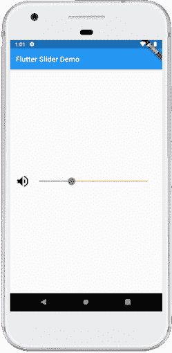
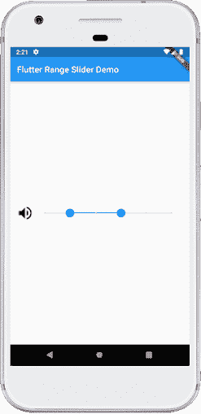
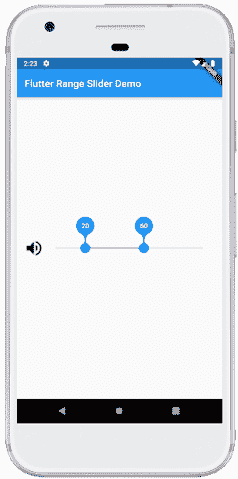
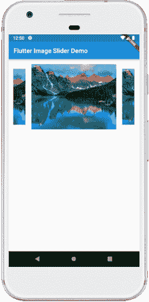

# Flutter滑块

> 原文：<https://www.javatpoint.com/flutter-slider>

Flutter 中的滑块是一个材质设计小部件，用于选择一系列值。这是一个输入小部件，我们可以通过拖动或按下所需的位置来**设置值的范围。在本文中，我们将展示如何在 Flutter 中使用滑块小部件来设置值的范围，以及如何自定义滑块的外观。**

通常，我们使用滑块小部件来更改值。因此，需要将值存储在变量中。这个小部件有一个滑块类，需要 **onChanged()** 函数。每当我们改变滑块位置时都会调用这个函数。

滑块可用于从一组**连续或离散的**值中选择一个值。默认情况下，它使用连续的值范围。如果我们想使用离散值，我们必须为除法使用非空值。这种离散划分表示离散间隔的数量。在获取值之前，我们必须设置**最小值**和**最大值**值。滑块提供最小和最大参数来设置最小和最大限制。**例如**，我们有一组从 0.0 到 50.0 的值，除法是 10，滑块会取像 0.0、10.0、20.0、30.0、40.0 和 50.0 这样的值。

### 滑块属性

以下是[颤动](https://www.javatpoint.com/flutter)中使用的滑块属性。它有两个必需的参数，所有其他参数都是可选的。

| 属性 | 类型 | 描述 |
| 价值 | 两倍 | 这是必需的参数，用于指定滑块的当前值。 |
| onChanged | 两倍 | 这是一个必需的参数，在拖动过程中当用户为滑块选择新值时调用。如果为空，滑块将被禁用。 |
| onChangedStart | 两倍 | 它是一个可选参数，当我们开始选择新值时调用。 |
| onChangedStart | 两倍 | 这是一个可选的参数，当我们为滑块选择了一个新值后调用。 |
| 最大 | 两倍 | 它是一个可选参数，决定了用户可以使用的最大值。默认情况下，它是 1.0。它应该大于或等于最小值。 |
| 部 | 两倍 | 它是一个可选参数，用于确定用户可以使用的最小值。默认情况下，它是 0.0。它应该小于或等于 max。 |
| 分部 | （同 Internationalorganizations）国际组织 | 它决定了离散划分的数量。如果为空，则滑块是连续的。 |
| 标签 | 线 | 它指定将显示在滑块上方的文本标签。它显示离散滑块的值。 |
| 活动颜色 | 颜色类别 | 它决定滑块轨道活动部分的颜色。 |
| 不活动颜色 | 颜色类别 | 它决定了滑块轨道非活动部分的颜色。 |
| SemanticFormatterCallback |  | 它是一个回调，用于创建语义值。默认情况下，它是一个百分比。 |

### “颤动”中的滑块使用以下术语:

**拇指**:是一个圆形，当我们通过拖动改变数值时，它会水平滑动。

**轨迹**:是我们可以滑动拇指的水平线。

**叠加**:拖动时出现在拇指周围。

**刻度线**:用于标记滑块的离散值。

**数值指示器**:当我们定义标签时，它会显示拇指数值的标签。

**激活**:是滑块的激活侧，在拇指和最小值之间。

**非活动**:是滑块的非活动侧，在拇指和最大值之间。

### 如何在 Flutter 中使用滑块小部件？

下面是在 Flutter 中使用滑块小部件的基本示例。

```

Slider(
      min: 0,
      max: 100,
      value: _value,
      onChanged: (value) {
        setState(() {
          _value = value;
        });
      },
    ),

```

### 例子

借助一个例子，让我们了解如何在 Flutter 中使用滑块。在下面的代码中，我们将该值存储为整数，当它作为值参数传递时，必须先将其转换为双精度，然后在 onChanged 方法中舍入为整数。我们还将滑块的**活动部分**指定为**绿色**，而**非活动部分**为**橙色**。

```

import 'package:flutter/material.dart';

void main() => runApp(MyApp());

// This Widget is the main application widget.
class MyApp extends StatelessWidget {
  @override
  Widget build(BuildContext context) {
    return MaterialApp(
      home: MySliderApp(),
    );
  }
}

class MySliderApp extends StatefulWidget {
  MySliderApp({Key key}) : super(key: key);

  @override
  _MySliderAppState createState() => _MySliderAppState();
}

class _MySliderAppState extends State {
  int _value = 6;
  @override
  Widget build(BuildContext context) {
    return Scaffold(
      appBar: AppBar(
        title: Text('Flutter Slider Demo'),
        ),
        body: Padding(
          padding: EdgeInsets.all(15.0),
            child: Center(
                child: Row(
                    mainAxisAlignment: MainAxisAlignment.spaceEvenly,
                    mainAxisSize: MainAxisSize.max,
                    children: [
                      Icon(
                        Icons.volume_up,
                        size: 40,
                      ),
                      new Expanded(
                          child: Slider(
                            value: _value.toDouble(),
                            min: 1.0,
                            max: 20.0,
                            divisions: 10,
                            activeColor: Colors.green,
                            inactiveColor: Colors.orange,
                            label: 'Set volume value',
                            onChanged: (double newValue) {
                              setState(() {
                                _value = newValue.round();
                                });
                              },
                              semanticFormatterCallback: (double newValue) {
                                return '${newValue.round()} dollars';
                              }
                            )
                      ),
                    ]
                )
            ),
          )
      );
  }
} 
```

**输出:**

当我们在 IDE 中运行这个应用时，应该会得到类似下面截图的 UI。这里我们可以**拖动滑块**来设置卷标。



## Flutter范围滑块

它是一个高度可定制的组件，从一系列值中选择一个值。它可以从一组连续或离散的值中选择。

### 为什么是范围滑块？

滑块组件可以基于连续或离散的值集提供单个或多个选择。这里，我们必须预先确定最小值或最大值，以便在一个方向上调整选择。与滑块不同，范围滑块允许两个选择点，提供灵活的调整来设置最大值和最小值。当我们想要控制一个特定的范围时，这种调整使它成为一个有用的功能，比如指示时间长度或价格点。

请参见下面的代码，其中范围值以 10 为间隔，因为我们将滑块分成了从 0 到 100 的十个部分。这意味着我们的值被分成 0、10、20、30、40 等 100。这里，我们将使用 20 和 50 初始化范围值。

```

import 'package:flutter/material.dart';

void main() => runApp(MyApp());

// This Widget is the main application widget.
class MyApp extends StatelessWidget {
  @override
  Widget build(BuildContext context) {
    return MaterialApp(
      home: MySliderApp(),
    );
  }
}

class MySliderApp extends StatefulWidget {
  MySliderApp({Key key}) : super(key: key);

  @override
  _MySliderAppState createState() => _MySliderAppState();
}

class _MySliderAppState extends State {
  RangeValues _currentRangeValues = const RangeValues(20, 60);
  @override
  Widget build(BuildContext context) {
    return Scaffold(
        appBar: AppBar(
          title: Text('Flutter Range Slider Demo'),
        ),
        body: Padding(
          padding: EdgeInsets.all(15.0),
          child: Center(
              child: Row(
                  mainAxisAlignment: MainAxisAlignment.spaceEvenly,
                  mainAxisSize: MainAxisSize.max,
                  children: [
                    Icon(
                      Icons.volume_up,
                      size: 40,
                    ),
                    new Expanded(
                        child: RangeSlider(
                          values: _currentRangeValues,
                          min: 0,
                          max: 100,
                          divisions: 10,
                          labels: RangeLabels(
                            _currentRangeValues.start.round().toString(),
                            _currentRangeValues.end.round().toString(),
                          ),
                          onChanged: (RangeValues values) {
                            setState(() {
                              _currentRangeValues = values;
                            });
                          },
                        )
                    ),
                  ]
              )
          ),
        )
    );
  }
} 
```

**输出:**

当我们在 IDE 中运行这个应用时，应该会得到类似下面截图的 UI。



当我们拖动滑块时，我们可以看到设置卷标的值的范围。



## Flutter图像滑块

图像滑块是在我们的应用程序中显示图像、视频或图形的便捷方式。一般来说，它会在我们的应用屏幕上一次显示一个大图像。这有助于使我们的屏幕对用户更有吸引力。

让我们看看如何在 Flutter 中制作图像滑块。在 Flutter 库中有许多依赖项可以在应用程序中创建滑动图像。在这里，我们将使用 **flutter_swipper 依赖关系**。首先，我们需要在 **puspec.yaml** 文件中添加以下依赖项:

```

dependencies:
  flutter:
    sdk: flutter
  flutter_swiper: ^1.1.6

```

接下来，在 dart 文件中添加这个依赖项，如下所示:

```

 import 'package:flutter_swiper/flutter_swiper.dart';

```

### 例子

下面的代码以简单的方式解释了 flutter_swipper 库的使用。在这里，我们从显示在屏幕上的**网络**中拍摄了一张图像。

```

import 'package:flutter/material.dart';
import 'package:flutter_swiper/flutter_swiper.dart';

void main(){ runApp(MyApp()); }

class MyApp extends StatelessWidget {
  @override
  Widget build(BuildContext context) {
    return MaterialApp(
        home: MyHomeScreen()
    );
  }
}

class MyHomeScreen extends StatelessWidget {
  @override
  Widget build(BuildContext context) {
    return Scaffold(
      appBar: AppBar(title: Text("Flutter Image Slider Demo"),),
      body: Container(
          padding: EdgeInsets.all(10),
          margin: EdgeInsets.all(5),
          alignment: Alignment.center,
          constraints: BoxConstraints.expand(
              height: 225
          ),
          child: imageSlider(context)),
    );
  }
}

Swiper imageSlider(context){
  return new Swiper(
    autoplay: true,
    itemBuilder: (BuildContext context, int index) {
      return new Image.network(
        "https://lh3.googleusercontent.com/wIcl3tehFmOUpq-Jl3hlVbZVFrLHePRtIDWV5lZwBVDr7kEAgLTChyvXUclMVQDRHDEcDhY=w640-h400-e365-rj-sc0x00ffffff",
        fit: BoxFit.fitHeight,
      );
    },
    itemCount: 10,
    viewportFraction: 0.7,
    scale: 0.8,
  );
}

```

**输出:**

当我们在 IDE 中运行这个应用时，应该会得到类似下面截图的 UI。这里**图像自动滑动**。



* * *