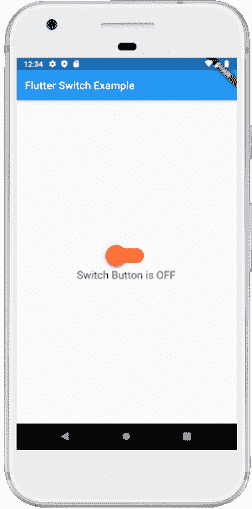

# Dart开关

> 原文：<https://www.javatpoint.com/flutter-switch>

开关是一个双态用户界面元素，用于在**开(选中)或关(未选中)状态**之间切换。通常，它是一个带有拇指滑块的按钮，用户可以在其中来回拖动以选择开或关形式的选项。它的工作原理类似于家庭用电开关。

在[Dart](https://www.javatpoint.com/flutter)中，开关是一个小部件，用于在两个选项之间进行选择，开或关。它不维持国家本身。为了维持这些州，它将把**称为“已变更的”**房产。如果该属性返回的值为**真**，则开关为开，关闭时为假。当该属性为空时，开关小部件被禁用。在本文中，我们将了解如何在 Flutter 应用程序中使用开关小部件。

### 开关小部件的属性

开关小部件的一些基本属性如下:

| 属性 | 描述 |
| onChanged | 每当用户点击开关时，它就会被调用。 |
| 价值 | 它包含一个布尔值 true 或 false 来控制开关功能是打开还是关闭。 |
| 活动颜色 | 它用于指定开关圆形球打开时的颜色。 |
| 活动跟踪颜色 | 它指定了开关跟踪条的颜色。 |
| inactiveThubmColor | 它用于指定开关圆形球关闭时的颜色。 |
| 不活动跟踪颜色 | 它指定关闭时的开关跟踪条颜色。 |
| dragStartBehavior | 它处理拖动开始行为。如果我们将其设置为 DragStartBehavior.start，拖动会将开关从打开移动到关闭。 |

**例**

在这个应用中，我们定义了一个**开关小部件**。每次切换开关小部件时，都会调用 onChanged 属性，并将开关的新状态作为值。为了存储开关状态，我们定义了一个**布尔变量 isSwitched** ，如下代码所示。

打开您正在使用的集成开发环境，并创建一个 Flutter 应用程序。接下来，打开 **lib** 文件夹，用以下代码替换 **main.dart** 。

```

import 'package:flutter/material.dart';

void main() => runApp(MyApp());

class MyApp extends StatelessWidget {
  @override
  Widget build(BuildContext context) {
    return MaterialApp(
        home: Scaffold(
            appBar: AppBar(
              backgroundColor: Colors.blue,
              title: Text("Flutter Switch Example"),
            ),
            body: Center(
                  child: SwitchScreen()
            ),
        )
    );
  }
}

class SwitchScreen extends StatefulWidget {
  @override
  SwitchClass createState() => new SwitchClass();
}

class SwitchClass extends State {
  bool isSwitched = false;
  var textValue = 'Switch is OFF';

  void toggleSwitch(bool value) {

    if(isSwitched == false)
    {
      setState(() {
        isSwitched = true;
        textValue = 'Switch Button is ON';
      });
      print('Switch Button is ON');
    }
    else
    {
      setState(() {
        isSwitched = false;
        textValue = 'Switch Button is OFF';
      });
      print('Switch Button is OFF');
    }
  }
  @override
  Widget build(BuildContext context) {
    return Column(
        mainAxisAlignment: MainAxisAlignment.center,
        children:[ Transform.scale(
            scale: 2,
            child: Switch(
              onChanged: toggleSwitch,
              value: isSwitched,
              activeColor: Colors.blue,
              activeTrackColor: Colors.yellow,
              inactiveThumbColor: Colors.redAccent,
              inactiveTrackColor: Colors.orange,
            )
          ),
          Text('$textValue', style: TextStyle(fontSize: 20),)
        ]);
  }
}

```

**输出:**

当我们在模拟器或设备中运行应用程序时，我们应该得到类似于下面截图的用户界面



如果我们按下开关，它会将它们的状态从关闭变为打开。请看下面的截图:


### 如何在 Flutter 中自定义开关按钮？

Flutter 还允许用户自定义他们的开关按钮。定制使用户界面更具交互性。我们可以通过在 **pubspec.yaml** 文件中添加**自定义开关依赖项**来实现，然后将其导入到 dart 文件中。

**示例:**

打开 **main.dart** 文件，用以下代码替换:

```

import 'package:flutter/material.dart';
import 'package:custom_switch/custom_switch.dart';

void main() => runApp(MyApp());

class MyApp extends StatelessWidget {
  @override
  Widget build(BuildContext context) {
    return MaterialApp(
        home: Scaffold(
            appBar: AppBar(
              backgroundColor: Colors.blue,
              title: Text("Custom Switch Example"),
            ),
            body: Center(
                  child: SwitchScreen()
            ),
        )
    );
  }
}

class SwitchScreen extends StatefulWidget {
  @override
  SwitchClass createState() => new SwitchClass();
}

class SwitchClass extends State {
  bool isSwitched = false;
  @override
  Widget build(BuildContext context) {
    return Column(
        mainAxisAlignment: MainAxisAlignment.center,
        children:<Widget>[
            CustomSwitch(
              value: isSwitched,
              activeColor: Colors.blue,
              onChanged: (value) {
                print("VALUE : $value");
                setState(() {
                  isSwitched = value;
                });
              },
            ),
          SizedBox(height: 15.0,),
          Text('Value : $isSwitched', style: TextStyle(color: Colors.red,
              fontSize: 25.0),)
        ]);
    }
}

```

**输出:**

当我们在模拟器或设备中运行应用程序时，我们应该得到类似于下面截图的用户界面:


如果我们按下开关，它会将它们的状态从关闭变为打开。请看下面的截图:


* * *