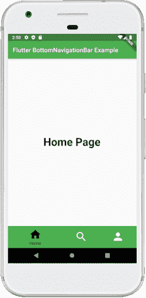
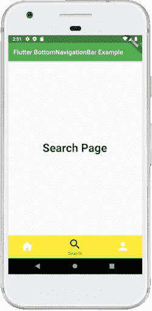

# Dart底部导航栏

> 原文：<https://www.javatpoint.com/flutter-bottom-navigation-bar>

底部导航栏在过去几年中变得流行，用于不同用户界面之间的导航。许多开发人员使用底部导航，因为大多数应用程序现在都可以使用这个小部件在不同屏幕之间导航。

Flutter **中的底部导航栏可以包含多个项目**，如文本标签、图标或两者都有。它允许用户在应用的顶层视图之间快速导航。如果我们使用更大的屏幕，最好使用**侧导航栏**。

在 [Flutter](https://www.javatpoint.com/flutter) 应用中，我们通常会结合脚手架小部件设置底部导航栏。**脚手架**小部件提供了**脚手架.底部导航栏**参数来设置底部导航栏。需要注意的是，只添加 BottomNavigationBar 不会显示导航项。需要为接受底部导航项目部件列表的项目属性设置**底部导航项目**。

**在底部导航栏添加项目时，请记住以下要点:**

*   我们只能在底部导航中显示少量的小部件，可以是 2 到 5 个。
*   它必须至少有两个底部导航项目。否则，我们会得到一个错误。
*   它需要有图标和标题属性，我们需要为它们设置相关的小部件。

### 底部导航栏小部件的属性

下面是底部导航栏小部件使用的属性:

**项:**定义要在底部导航栏中显示的列表。它使用的参数 BottomNavigationBarItem 包含下面给出的超属性:

```

const BottomNavigationBarItem({
    @required this.icon,
    this.title,
    Widget activeIcon,
    this.backgroundColor,
  }) 

```

**current itex:**确定屏幕上当前活动的底部导航栏项目。

**onTap:** 当我们轻击屏幕上的一个项目时，它被调用。

**图标大小:**用于指定所有底部导航项图标的大小。

**固定颜色:**用于设置所选项目的颜色。如果我们没有为图标或标题设置颜色，它将被显示。

**类型:**决定底部导航栏的布局和行为。它以两种不同的方式表现，即:**固定**和移动。如果为空，将使用 fixed。否则，它将使用移动，当我们点击一个按钮时，我们可以看到一个动画。

### 示例:

借助一个例子，让我们了解如何在 Flutter 应用程序中创建底部导航栏。所以，打开 android studio，创建 Flutter 应用程序。下一个。打开 **main.dart** 文件，用下面的代码删除其代码:

```

import 'package:flutter/material.dart';

void main() => runApp(MyApp());

/// This Widget is the main application widget.
class MyApp extends StatelessWidget {
  @override
  Widget build(BuildContext context) {
    return MaterialApp(
      home: MyNavigationBar (),
    );
  }
}

class MyNavigationBar extends StatefulWidget {
  MyNavigationBar ({Key key}) : super(key: key);

  @override
  _MyNavigationBarState createState() => _MyNavigationBarState();
}

class _MyNavigationBarState extends State<MyNavigationBar > {
  int _selectedIndex = 0;
  static const List<Widget> _widgetOptions = <Widget>[
    Text('Home Page', style: TextStyle(fontSize: 35, fontWeight: FontWeight.bold)),
    Text('Search Page', style: TextStyle(fontSize: 35, fontWeight: FontWeight.bold)),
    Text('Profile Page', style: TextStyle(fontSize: 35, fontWeight: FontWeight.bold)),
  ];

  void _onItemTapped(int index) {
    setState(() {
      _selectedIndex = index;
    });
  }

  @override
  Widget build(BuildContext context) {
    return Scaffold(
      appBar: AppBar(
        title: const Text('Flutter BottomNavigationBar Example'),
          backgroundColor: Colors.green
      ),
      body: Center(
        child: _widgetOptions.elementAt(_selectedIndex),
      ),
      bottomNavigationBar: BottomNavigationBar(
        items: const <BottomNavigationBarItem>[
          BottomNavigationBarItem(
            icon: Icon(Icons.home),
            title: Text('Home'),
            backgroundColor: Colors.green
          ),
          BottomNavigationBarItem(
            icon: Icon(Icons.search),
            title: Text('Search'),
            backgroundColor: Colors.yellow
          ),
          BottomNavigationBarItem(
            icon: Icon(Icons.person),
            title: Text('Profile'),
            backgroundColor: Colors.blue,
          ),
        ],
        type: BottomNavigationBarType.shifting,
        currentIndex: _selectedIndex,
        selectedItemColor: Colors.black,
        iconSize: 40,
        onTap: _onItemTapped,
        elevation: 5
      ),
    );
  }
}

```

在上面的代码中，我们在脚手架小部件中使用了 BottomNavigationBar。该导航包含**三个底部导航组件**。在这里，我们将**当前状态**设置为 0，选择一个处于**绿色**的项目。 **onTap()** 功能用于更改所选项目的索引，然后显示相应的消息。

**输出:**

当我们运行应用程序时，我们应该会得到类似于下面截图的用户界面:



当我们点击底部导航栏中的**搜索图标**时，会出现如下画面。



* * *