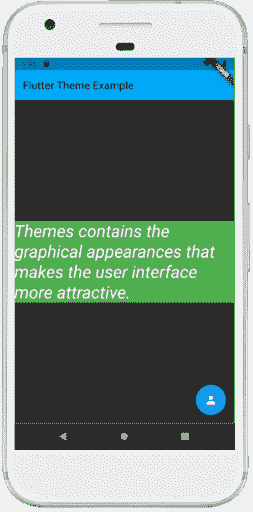

# Dart主题

> 原文：<https://www.javatpoint.com/flutter-themes>

主题是包含我们网站或移动应用屏幕的**图形外观**的预设包。它使用户界面更具吸引力。**我们主要使用主题来分享整个应用的颜色和字体风格**。

在移动开发中，我们的应用必须增加**光明**和**黑暗**主题。如今的大多数人更喜欢深色版的主题，而不是浅色版的主题，因为这样可以让他们看起来更舒服，并延长电池寿命。

在 [Flutter](https://www.javatpoint.com/flutter) 中，我们可以使用包含应用程序特定区域的颜色和字体样式的**主题小部件**或者定义**应用程序范围内的**主题。应用程序范围内的主题也是主题小部件，它们在我们的应用程序根中的 **MaterialApp** 小部件下创建。

定义一个主题后，我们可以在任何小部件中使用它，只要我们在应用程序中需要它。Flutter 中的材质小部件也可以使用我们的主题来设置应用栏、按钮、按钮、复选框等的字体样式和背景颜色。

Flutter 在创建应用程序时使用默认主题。如果我们想为整个应用程序共享一个自定义主题，我们需要在 MateialApp()小部件下使用一个**主题数据**。

有时，我们希望在应用程序的部分覆盖应用程序范围的主题。在这种情况下，我们需要在主题小部件中包装应用程序的部分。Flutter 为我们提供了两种方法:

1.  通过创建唯一的主题数据
2.  通过扩展父主题

### 通过创建唯一的主题数据

当我们不想继承任何应用程序颜色或字体样式时，使用第一种方法。在这种情况下，我们将创建主题数据()的实例，并将其传递给主题小部件，如下面的代码片段所示:

```

Theme(
  data: ThemeData(
    accentColor: Colors.blue,
  ),
  child: FloatingActionButton(
    onPressed: () {},
    child: Icon(Icons.person),
  ),
);

```

### 通过扩展父主题

如果您不想覆盖任何内容，请使用扩展父主题的第二种方法。可以用 **copyWith()** 方法处理。请参见下面的代码片段:

```

Theme(
  data: Theme.of(context).copyWith(accentColor: Colors.blue),
  child: FloatingActionButton(
    onPressed: null,
    child: Icon(Icons.person),
  ),
);

```

### 如何使用主题

定义一个主题后，我们可以用**的【主题】(上下文)**方法将其用于**小部件构建()**方法中。该方法查看小部件树，并返回树中的第一个主题。如果您的小部件上没有定义，应用程序的主题将被返回。

在下面的代码片段中，**浮动动作按钮**使用这种技术返回**重音**。

```

Container(
  color: Theme.of(context).accentColor,
  child: Text(
    'Text with a background color',
    style: Theme.of(context).textTheme.headline,
  ),
);

```

通过下面的例子，让我们了解如何在 Flutter 应用程序中使用主题数据。

```

import 'package:flutter/material.dart';

void main() {runApp(MyApp());}

class MyApp extends StatelessWidget {
  @override
  Widget build(BuildContext context) {
    return MaterialApp(
      theme: ThemeData(
        // Define the default brightness and colors.
        brightness: Brightness.dark,
        primaryColor: Colors.lightBlue,
        accentColor: Colors.green,

        // Define the default font family.
        fontFamily: 'Monotype Coursiva',

        // Define the TextTheme that specifies the default
        // text styling for headlines, titles, bodies of text, and more.
        textTheme: TextTheme(
          headline: TextStyle(fontSize: 32.0, fontStyle: FontStyle.italic, fontFamily: 'Hind')
        ),
      ),
      home: MyThemePage(),
    );
  }
}

class MyThemePage extends StatelessWidget {
  @override
  Widget build(BuildContext context) {
    return Scaffold(
      appBar: AppBar(
        title: Text('Flutter Theme Example'),
      ),
      body: Center(
        child: Container(
          color: Theme.of(context).accentColor,
          child: Text(
            'Themes contains the graphical appearances that makes the user interface more attractive.',
            style: Theme.of(context).textTheme.headline,
          ),
        ),
      ),
      floatingActionButton: Theme(
        data: Theme.of(context).copyWith(
          colorScheme:
          Theme.of(context).colorScheme.copyWith(secondary: Colors.blue),
        ),
        child: FloatingActionButton(
          onPressed: null,
          child: Icon(Icons.person),
        ),
      ),
    );
  }
}

```

**输出:**

当我们在设备或模拟器中运行应用程序时，我们将看到类似于下面截图的用户界面。



* * *