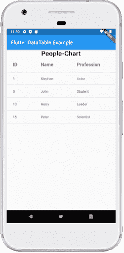

# Flutter台

> 原文：<https://www.javatpoint.com/flutter-table>

表格允许用户按行和列排列数据。它用于以结构化格式存储和显示我们的数据，这有助于我们轻松地比较相关值对。

Flutter 还允许用户在移动应用程序中创建表格布局。我们可以使用**表格小部件**在 Flutter 中创建一个表格，该小部件为其子代使用表格布局算法。这个小部件有几个属性来增强或修改表格布局。这些属性是:边框、子级、列宽、文本方向、文本基线等。

### 当我们使用表格部件时？

当我们想要存储多个具有相同列宽的行，并且每个列(表)包含相同的数据时，可以使用表小部件。 [Flutter](https://www.javatpoint.com/flutter) 使用**网格视图小部件**提供了另一种方法。

要创建一个表，我们必须使用以下东西:

1.  首先，我们需要在正文中添加一个**表格小部件**。
2.  接下来，我们必须在表小部件的**子级**中添加**表行**。由于表小部件有多行，所以我们使用子代，而不是子代。
3.  最后，我们需要在 TableRow 小部件的子部件中添加**TableCell**。现在，我们可以在这个地方编写任何小部件，就像我们将要使用**文本小部件**一样。

```

TableRow(children: [
  TableCell(child: Text('javatpoint')),
  TableCell(
    child: Text('Flutter'),
  ),
  TableCell(child: Text('Android')),
  TableCell(child: Text('MySQL')),
]),

```

在使用这个小部件时，我们必须知道这些规则:

1.  这个小部件自动决定列宽，列宽在 TableCells 之间平均分配。如果不相等，我们会得到一个错误，说表中的每个 TableRow 必须有相同数量的子表，这样每个单元格都被填充。否则，桌子会有洞。
2.  每行都有相同的高度，这将等于 TableCell 的最高高度。
3.  表的子代只能有 TableRow 小部件。

让我们借助下面给出的一个例子来理解它，在这个例子中，我们试图涵盖与这个小部件相关的每一件事情:

```

import 'package:flutter/material.dart';

void main() {runApp(MyApp());}

class MyApp extends StatefulWidget {
  @override
  _TableExample createState() => _TableExample();
}

class _TableExample extends State<MyApp> {
  @override
  Widget build(BuildContext context) {
    return MaterialApp(
      home: Scaffold(
          appBar: AppBar(
            title: Text('Flutter Table Example'),
          ),
          body: Center(
              child: Column(children: <Widget>[
                Container(
                  margin: EdgeInsets.all(20),
                  child: Table(
                    defaultColumnWidth: FixedColumnWidth(120.0),
                    border: TableBorder.all(
                        color: Colors.black,
                        style: BorderStyle.solid,
                        width: 2),
                    children: [
                      TableRow( children: [
                        Column(children:[Text('Website', style: TextStyle(fontSize: 20.0))]),
                        Column(children:[Text('Tutorial', style: TextStyle(fontSize: 20.0))]),
                        Column(children:[Text('Review', style: TextStyle(fontSize: 20.0))]),
                      ]),
                      TableRow( children: [
                        Column(children:[Text('Javatpoint')]),
                        Column(children:[Text('Flutter')]),
                        Column(children:[Text('5*')]),
                      ]),
                      TableRow( children: [
                        Column(children:[Text('Javatpoint')]),
                        Column(children:[Text('MySQL')]),
                        Column(children:[Text('5*')]),
                      ]),
                      TableRow( children: [
                        Column(children:[Text('Javatpoint')]),
                        Column(children:[Text('ReactJS')]),
                        Column(children:[Text('5*')]),
                      ]),
                    ],
                  ),
                ),
              ])
          )),
    );
  }
}

```

**输出:**

当我们在模拟器或设备中运行应用程序时，我们将看到下面的截图:


## Flutter数据表

Flutter 还允许我们在应用程序中创建另一个名为 **DataTable** 的小部件。这是一个材料设计数据表，我们可以在其中显示带有**列标签和**行的数据。这个小部件根据单元格数据自动调整表格的列。使用这个小部件显示数据是很昂贵的，因为在这里，所有的数据都必须测量两次。首先，它测量了每一列的尺寸，其次，它实际上布置了表格。因此，我们必须确保这个小部件只能在行数较少时使用。

数据表小部件使用**列和行属性**存储信息。columns 属性包含使用**数据列**数组的数据，Row 属性包含使用**数据行**数组的信息。数据行具有子属性**单元**，该子属性采用一组**数据单元**。数据列有一个子属性**标签**，它将小部件作为**值**。我们还可以在数据表中提供文本、图像、图标或任何其他小部件。

以下是数据表的语法:

```

DataTable(
  columns: [
    DataColumn(label: ),
    DataColumn(label: )),
  ],
  rows: [
    DataRow(cells: [
      DataCell( ),
      DataCell( ),
      ...
      DataCell( ),
    ]),
    DataRow(cells: [
      DataCell( ),
      DataCell( ),
      ...
      DataCell( ),
    ]),
  ],
),

```

**例**

让我们了解如何在 Flutter 应用程序中使用数据表。这里，我们将定义一个简单的数据表，它有**三列标签和四行**:

```

import 'package:flutter/material.dart';

void main() {runApp(MyApp());}

class MyApp extends StatefulWidget {
  @override
  _DataTableExample createState() => _DataTableExample();
}

class _DataTableExample extends State<MyApp> {
  @override
  Widget build(BuildContext context) {
    return MaterialApp(
      home: Scaffold(
          appBar: AppBar(
            title: Text('Flutter DataTable Example'),
          ),
          body: ListView(children: <Widget>[
            Center(
                child: Text(
                  'People-Chart',
                  style: TextStyle(fontSize: 25, fontWeight: FontWeight.bold),
                )),
            DataTable(
              columns: [
                DataColumn(label: Text(
                    'ID',
                    style: TextStyle(fontSize: 18, fontWeight: FontWeight.bold)
                )),
                DataColumn(label: Text(
                    'Name',
                    style: TextStyle(fontSize: 18, fontWeight: FontWeight.bold)
                )),
                DataColumn(label: Text(
                    'Profession',
                    style: TextStyle(fontSize: 18, fontWeight: FontWeight.bold)
                )),
              ],
              rows: [
                DataRow(cells: [
                  DataCell(Text('1')),
                  DataCell(Text('Stephen')),
                  DataCell(Text('Actor')),
                ]),
                DataRow(cells: [
                  DataCell(Text('5')),
                  DataCell(Text('John')),
                  DataCell(Text('Student')),
                ]),
                DataRow(cells: [
                  DataCell(Text('10')),
                  DataCell(Text('Harry')),
                  DataCell(Text('Leader')),
                ]),
                DataRow(cells: [
                  DataCell(Text('15')),
                  DataCell(Text('Peter')),
                  DataCell(Text('Scientist')),
                ]),
              ],
            ),
          ])
      ),
    );
  }
}

```

**输出:**

当我们在模拟器或设备中运行应用程序时，我们将看到下面的截图:



* * *