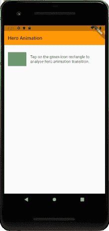

# Flutter 动画

> 原文：<https://www.javatpoint.com/flutter-animation>

动画在 Flutter 中是一个非常强大和重要的概念。我们无法想象任何移动应用程序没有动画。当你点击一个按钮或者从一个页面移动到另一个页面时，都是动画。动画增强了用户体验，使应用程序更具交互性。

[Flutter](https://www.javatpoint.com/flutter) 为动画提供了出色的支持，可以将动画分为两大类，具体如下:

*   补间动画
*   基于物理的动画

## 补间动画

它是介于之间的**的简称。在补间动画中，需要定义动画的**起点**和**终点**。它意味着动画从开始值开始，然后经过一系列中间值，最后到达结束值。它还提供了时间线和曲线，定义了过渡的时间和速度。小部件框架提供了如何从起点和终点过渡的计算。**

### 例子

```

ColorTween {
    begin: color.green,
    end: color.blue,
}

```

## 基于物理的动画

这是一种动画，可以让你的应用交互感觉**逼真**和**互动**。它模拟真实世界的动画/运动，例如您想要动画一个小部件，如弹簧、下落或重力摆动。因此，它是响应用户输入/移动而动画化的动画。最简单的例子就是飞行时间，所经过的行程距离会根据物理定律来计算。

Flutter 为动画提供了两种技术。这些技术是:

1.  隐式动画
2.  显式动画

下图展示了 Flutter 中的动画层次结构，并更清楚地解释了隐式和显式动画。


现在，我们来看看如何在 Flutter 中创建明确的动画。动画主要有三个支柱，如下所示:

1.  心脏
2.  动画课
3.  动画控制器

### 心脏

自动收报机是一个以规则的时间间隔发送信号的类，即大约每秒 60 次。你可以用你的手表来理解它，它每隔一段时间就会转动一次。在每次滴答时，Ticker 都会提供一个回调方法，该方法的持续时间是在开始后的第一秒。即使打卡机在不同的时间启动，它也总是自动同步的。这背后的原因是，计时器给出了相对于开始计时后第一个刻度的经过时间。

### 动画

动画类是动画系统的核心构件。动画不是别的，但它代表一个值(特定类型)，可以在动画的生命周期内改变。在 Flutter 中，执行动画的小部件以动画对象为参数。这个动画对象给出了他们读取动画当前值的信息，以及他们监听该值变化的信息。动画类包含两个方法**添加监听器()**和**添加状态监听器()**。当动画的值改变时，它会通知所有添加了 addListener()的侦听器。同样，当动画的状态改变时，它会通知所有添加了 addStatusListener()的侦听器。

最常见的动画类有:

*   **动画<双> :** 它在一定的持续时间内在两个十进制数之间插入值。
*   **动画<颜色> :** 它在两个颜色值之间插值颜色。
*   **动画<尺寸> :** 它在两个尺寸值之间插入尺寸。

### 动画控制器

动画控制器是一个允许我们控制动画的类。每当应用程序为新帧做好准备时，它总是会生成新值。例如，它控制动画的开始、停止、前进或重复。一旦动画控制器被创建，我们就可以开始基于它构建其他动画，比如反向动画和弯曲动画。

```

animcontroller = AnimationController(vsync: this, duration: Duration(milliseconds: 2500));

```

这里，duration 选项控制动画过程的**持续时间**，vsync 选项用于优化动画中使用的资源。

使用动画控制器所需的基本步骤是:

**第一步:**首先，用参数实例化一个 AnimationController，比如持续时间和 vsync。

**步骤 2:** 添加所需的侦听器，如 addListener()或 addStatusListener()。

**第三步:**开始动画。

**第 4 步:**在监听器回调方法中执行动作(例如，setState)。

**第五步:**最后，处理动画。

让我们看一个简单的动画例子，它使用了一个动画类和动画控制器。以下示例显示了给出动画起点和终点的**补间动画**。打开项目，在 **main.dart** 文件中替换以下代码。

```

import 'package:flutter/animation.dart';
import 'package:flutter/material.dart';

void main() => runApp(MyApp());

class MyApp extends StatelessWidget {
  // This widget is the root of your application.
  @override
  Widget build(BuildContext context) {
    return MaterialApp(
      title: 'Flutter Animation',
      theme: ThemeData(
        // This is the theme of your application.
        primarySwatch: Colors.blue,
      ),
      home: MyHomePage(),
    );
  }
}
class MyHomePage extends StatefulWidget {
  _HomePageState createState() => _HomePageState();
}
class _HomePageState extends State<MyHomePage> with SingleTickerProviderStateMixin {
  Animation<double> animation;
  AnimationController animationController;
  @override
  void initState() {
    super.initState();
    animationController = AnimationController(vsync: this, duration: Duration(milliseconds: 2500));
    animation = Tween<double>(begin: 0.0, end: 1.0).animate(animationController);
    animation.addListener((){
      setState((){
        print (animation.value.toString());
      });
    });
    animation.addStatusListener((status){
      if(status == AnimationStatus.completed){
        animationController.reverse();
      } else if(status == AnimationStatus.dismissed) {
        animationController.forward();
        }
      });
      animationController.forward();
    }
  @override
  Widget build(BuildContext context) {
    return Center(
      child: AnimatedLogo(
        animation: animation,
      )
    );
  }
}
class AnimatedLogo extends AnimatedWidget {
  final Tween<double> _sizeAnimation = Tween<double> (begin: 0.0, end: 500.0);
  AnimatedLogo({Key key, Animation animation}):super(key: key, listenable: animation);
  @override
  Widget build(BuildContext context) {
    final Animation<double> animation = listenable;
    return Transform.scale(
      scale: _sizeAnimation.evaluate(animation),
      child: FlutterLogo(),
    );
  }
}

```

**输出**

当你在[AndroidStudio](https://www.javatpoint.com/android-studio)运行应用时，你会得到输出。在屏幕中，您将看到 Flutter 标志**正向和反向缩放**。


## 弯曲动画

当需要对动画对象应用非线性曲线时，弯曲动画非常有用。因此，它将动画的进程定义为非线性曲线。

### 语法:

```

CurvedAnimation(parent: animationController, curve: Curves.bounceOut));

```

让我们用前面的例子来理解它。要添加曲线，在 AndroidStudio 打开上一个应用，添加**曲线动画**而不是**动画控制器**。或者替换下面一行:

```

animation = Tween<double>(begin: 0.0, end: 1.0).animate(animationController);

```

用下面的线。

```

animation = Tween<double>(begin: 0.0, end: 1.0).animate(animationController);

```

现在，当你运行该应用程序时，你会看到一个带有 Flutter 标志的**弹跳效果**，在向前和向后缩放的过程中。

## 英雄动画

英雄动画是一种动画类型，当应用程序进入下一页时，一个屏幕的元素**会飞向新的屏幕。我们可以通过下面的例子来理解它，其中一个动画采用了像图标/图像这样的元素，一旦你点击图标，屏幕就会飞到下一页。下面的例子解释得更清楚。**

打开 Flutter 应用程序，在 **main.dart** 文件中替换以下代码。

```

import 'package:flutter/material.dart';

void main() => runApp(MyApp());

class MyApp extends StatelessWidget {
  // This widget is the root of your application.
  @override
  Widget build(BuildContext context) {
    return MaterialApp(
      title: 'Flutter Application',
      theme: ThemeData(
        primarySwatch: Colors.orange,
      ),
      home: HeroAnimation(title: 'Hero Animation'),
    );
  }
}

class HeroAnimation extends StatefulWidget {
  HeroAnimation({Key key, this.title}) : super(key: key);
  final String title;

  @override
  _HeroAnimationState createState() => _HeroAnimationState();
}

class _HeroAnimationState extends State<HeroAnimation> {

  Widget _greenRectangle() {
    return Container(
      width: 75,
      height: 75,
      color: Colors.green,
    );
  }

  Widget _detailPageRectangle() {
    return Container(
      width: 150,
      height: 150,
      color: Colors.red,
    );
  }

  @override
  Widget build(BuildContext context) {
    return Scaffold(
      appBar: AppBar(
        title: Text(widget.title),
      ),
      body: buildDemoWidget(context),
    );
  }

  Widget buildDemoWidget(BuildContext context) {
    return Center(
      child: Column(
        crossAxisAlignment: CrossAxisAlignment.start,
        children: <Widget>[
          SizedBox(
            height: 30.0,
          ),
          ListTile(
            leading: GestureDetector(
              child: Hero(
                tag: 'hero-rectangle',
                child: _greenRectangle(),
              ),
              onTap: () => _gotoDetailsPage(context),
            ),
            title: Text('Tap on the green icon rectangle to analyse hero animation transition.'),
          ),
        ],
      ),
    );
  }

  void _gotoDetailsPage(BuildContext context) {
    Navigator.of(context).push(MaterialPageRoute(
      builder: (ctx) => Scaffold(
        body: Center(
          child: Column(
            mainAxisAlignment: MainAxisAlignment.center,
            children: <Widget>[
              Hero(
                tag: 'hero-rectangle',
                child: _detailPageRectangle(),
              ),
              Text('This is a place where you can see details about the icon tapped at previous page.'),
            ],
          ),
        ),
      ),
    ));
  }
}

```

**输出**

当您在 Android Studio 中运行该应用程序时，您将获得以下屏幕。



要显示英雄动画，点击绿色图标，它会立即飞到一个新的屏幕，在那里你会得到关于被点击项目的细节。


* * *