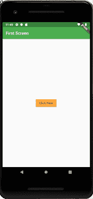
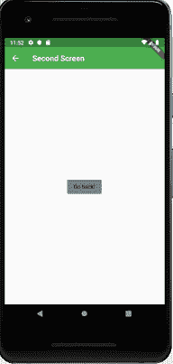
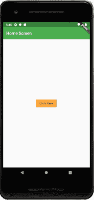
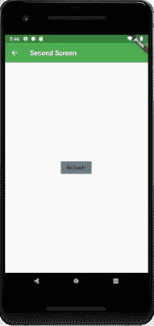

# Dart导航和航路规划

> 原文：<https://www.javatpoint.com/flutter-navigation-and-routing>

导航和路由是所有移动应用程序的一些核心概念，它允许用户在不同的页面之间移动。我们知道，每个移动应用程序都包含几个用于显示不同类型信息的屏幕。**例如**一个 app 可以有一个包含各种产品的屏幕。当用户点击该产品时，它会立即显示该产品的详细信息。

在 Flutter 中，屏幕和页面被称为**路线，**这些路线只是一个小部件。在安卓系统中，路线类似于**活动**，而在 iOS 系统中，它相当于**视图控制器。**

在任何移动应用中，导航到不同的页面定义了应用的工作流程，处理导航的方式被称为**路由。** Flutter 提供了一个基本的路由类 **MaterialPageRoute** 和两个方法 **Navigator.push()** 和 **Navigator.pop()** ，展示了如何在两条路由之间导航。在应用程序中启动导航需要以下步骤。

**第一步:**首先需要创建两条路线。

**步骤 2:** 然后，使用 Navigator.push()方法从一条路线导航到另一条路线。

**第三步:**最后，使用 Navigator.pop()方法导航到第一条路线。

让我们举一个简单的例子来理解两条路线之间的导航:

## 创建两条路线

在这里，我们将创建两条导航路线。在这两条路线中，我们只创建了一个**按钮。**当我们点击第一页的按钮，它会导航到第二页。同样，当我们点击第二页上的按钮时，它将返回到第一页。下面的代码片段在 Flutter 应用程序中创建了两条路线。

```

class FirstRoute extends StatelessWidget {
  @override
  Widget build(BuildContext context) {
    return Scaffold(
      appBar: AppBar(
        title: Text('First Route'),
      ),
      body: Center(
        child: RaisedButton(
          child: Text('Open route'),
          onPressed: () {
            // Navigate to second route when tapped.
          },
        ),
      ),
    );
  }
}

class SecondRoute extends StatelessWidget {
  @override
  Widget build(BuildContext context) {
    return Scaffold(
      appBar: AppBar(
        title: Text("Second Route"),
      ),
      body: Center(
        child: RaisedButton(
          onPressed: () {
            // Navigate back to first route when tapped.
          },
          child: Text('Go back!'),
        ),
      ),
    );
  }
}

```

### 使用 Navigator.push()方法导航到第二条路线

Navigator.push()方法用于导航/切换到新的路线/页面/屏幕。这里， **push()** 方法在堆栈上添加一个页面/路线，然后使用**导航器进行管理。**我们再次使用 MaterialPageRoute 类，该类允许使用特定于平台的动画在路线之间进行转换。下面的代码解释了 Navigator.push()方法的使用。

```

// Within the `FirstRoute` widget
onPressed: () {
  Navigator.push(
    context,
    MaterialPageRoute(builder: (context) => SecondRoute()),
  );
}

```

### 使用 Navigator.pop()方法返回第一条路线

现在，我们需要使用 Navigator.pop()方法关闭第二条路线并返回到第一条路线。 **pop()** 方法允许我们从堆栈中移除当前路线，该堆栈由导航器管理。

To implement a return to the original route, we need to update the **onPressed()** callback method in the SecondRoute widget as below code snippet:

```

// Within the SecondRoute widget
onPressed: () {
  Navigator.pop(context);
}

```

现在，让我们看看实现两条路线之间导航的完整代码。首先，创建一个 Flutter 项目，并在 **main.dart** 文件中插入以下代码。

```

import 'package:flutter/material.dart';

void main() {
  runApp(MaterialApp(
    title: 'Flutter Navigation',
    theme: ThemeData(
      // This is the theme of your application.
      primarySwatch: Colors.green,
    ),
    home: FirstRoute(),
  ));
}

class FirstRoute extends StatelessWidget {
  @override
  Widget build(BuildContext context) {
    return Scaffold(
      appBar: AppBar(
        title: Text('First Screen'),
      ),
      body: Center(
        child: RaisedButton(
          child: Text('Click Here'),
          color: Colors.orangeAccent,
          onPressed: () {
            Navigator.push(
              context,
              MaterialPageRoute(builder: (context) => SecondRoute()),
            );
          },
        ),
      ),
    );
  }
}

class SecondRoute extends StatelessWidget {
  @override
  Widget build(BuildContext context) {
    return Scaffold(
      appBar: AppBar(
        title: Text("Second Screen"),
      ),
      body: Center(
        child: RaisedButton(
          color: Colors.blueGrey,
          onPressed: () {
            Navigator.pop(context);
          },
          child: Text('Go back'),
        ),
      ),
    );
  }
}

```

**输出**

当你在**AndroidStudio中运行项目时，**你会在你的模拟器中得到如下画面。这是第一个只包含一个按钮的屏幕。



点击按钮**点击此处，**您将导航到如下图所示的第二个屏幕。接下来，当您点击**返回按钮时，**将返回第一页。



## 使用命名路线导航

我们已经学习了如何通过创建新路线导航到新屏幕，并使用导航器进行管理。导航器维护基于堆栈的路线历史。如果在应用程序的许多部分需要导航到同一个屏幕，这种方法是没有好处的，因为它会导致**代码重复。**这个问题的解决方案可以通过定义命名路线来移除，并且可以使用**命名路线**进行导航。

我们可以使用 **Navigator.pushNamed()** 函数来处理命名路线。该函数接受两个必需的参数(构建上下文和字符串)和一个可选参数。此外，我们知道负责页面转换的 MaterialPageRoute。如果我们不使用这个，那么很难改变页面。

以下步骤是必要的，它们演示了如何使用命名路由。

**第一步:**首先，我们需要创建两个屏幕。下面的代码在我们的应用程序中创建了两个屏幕。

```

class HomeScreen extends StatelessWidget {
  @override
  Widget build(BuildContext context) {
    return Scaffold(
      appBar: AppBar(
        title: Text('Home Screen'),
      ),
      body: Center(
        child: RaisedButton(
          child: Text('Click Here'),
          color: Colors.orangeAccent,
          onPressed: () {
            //
          },
        ),
      ),
    );
  }
}

class SecondScreen extends StatelessWidget {
  @override
  Widget build(BuildContext context) {
    return Scaffold(
      appBar: AppBar(
        title: Text("Second Screen"),
      ),
      body: Center(
        child: RaisedButton(
          color: Colors.blueGrey,
          onPressed: () {
            //
          },
          child: Text('Go back!'),
        ),
      ),
    );
  }
}

```

**步骤 2:** 定义路线。

在这一步，我们必须定义路线。MaterialApp 构造函数负责定义初始路线和其他路线本身。这里，初始路由告诉页面的开始，routes 属性定义了可用的命名路由和小部件。下面的代码解释得更清楚。

```

MaterialApp(
  title: 'Named Route Navigation',
  theme: ThemeData(
    // This is the theme of your application.
    primarySwatch: Colors.green,
  ),
  // It start the app with the "/" named route. In this case, the app starts
  // on the HomeScreen widget.
  initialRoute: '/',
  routes: {
    // When navigating to the "/" route, build the HomeScreen widget.
    '/': (context) => HomeScreen(),
    // When navigating to the "/second" route, build the SecondScreen widget.
    '/second': (context) => SecondScreen(),
  },
));

```

**第三步:**使用 Navigator.pushNamed()函数导航到第二个屏幕。

在这一步中，我们需要调用 Navigator.pushNamed()方法进行导航。为此，我们需要在**主屏幕**的构建方法中更新一个 onPressed()回调，如下代码片段所示。

```

onPressed: () {
  // Navigate to the second screen by using the named route.
  Navigator.pushNamed(context, '/second');
}

```

**第 4 步:**使用 Navigator.pop()函数返回第一个屏幕。

这是最后一步，我们将使用 Navigator.pop()方法在第一个屏幕上返回。

```

onPressed: () {
  Navigator.pushNamed(context, '/second');
},

```

让我们在 Flutter 项目中看到上面解释的完整代码，并在模拟器中运行它以获得输出。

```

import 'package:flutter/material.dart';

void main() {
  runApp( MaterialApp(
    title: 'Named Route Navigation',
    theme: ThemeData(
      // This is the theme of your application.
      primarySwatch: Colors.green,
    ),
    // Start the app with the "/" named route. In this case, the app starts
    // on the FirstScreen widget.
    initialRoute: '/',
    routes: {
      // When navigating to the "/" route, build the FirstScreen widget.
      '/': (context) => HomeScreen(),
      // When navigating to the "/second" route, build the SecondScreen widget.
      '/second': (context) => SecondScreen(),
    },
  ));
}

class HomeScreen extends StatelessWidget {
  @override
  Widget build(BuildContext context) {
    return Scaffold(
      appBar: AppBar(
        title: Text('Home Screen'),
      ),
      body: Center(
        child: RaisedButton(
          child: Text('Click Here'),
          color: Colors.orangeAccent,
          onPressed: () {
            Navigator.pushNamed(context, '/second');
          },
        ),
      ),
    );
  }
}

class SecondScreen extends StatelessWidget {
  @override
  Widget build(BuildContext context) {
    return Scaffold(
      appBar: AppBar(
        title: Text("Second Screen"),
      ),
      body: Center(
        child: RaisedButton(
          color: Colors.blueGrey,
          onPressed: () {
            Navigator.pop(context);
          },
          child: Text('Go back!'),
        ),
      ),
    );
  }
}

```

**输出**



点击按钮**点击此处，**您将导航到如下图所示的第二个屏幕。接下来，当您点击**返回按钮时，**将返回主页。



* * *