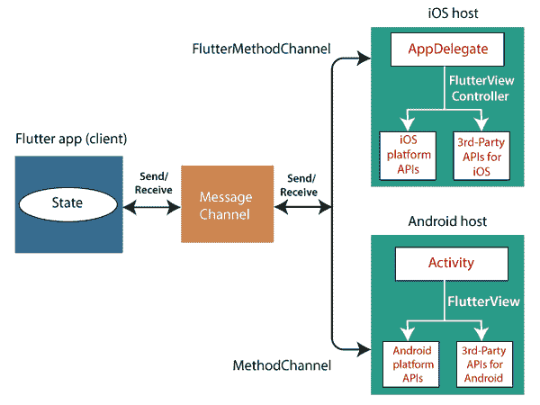
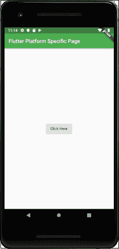

# 创建安卓平台特定的代码

> 原文：<https://www.javatpoint.com/flutter-creating-android-platform-specific-code>

在这一节中，我们将看到如何在 Flutter 中编写定制的特定于平台的代码。Flutter 是一个优秀的框架，它提供了一种处理/访问平台特定特性的机制。这个特性允许开发者扩展 Flutter 框架的功能。可以通过框架轻松访问的一些重要的特定于平台的功能包括摄像头、电池电量、浏览器等。

Flutter 使用一个灵活的系统来调用特定于平台的应用编程接口，这些应用编程接口要么在安卓上以 Java 或 Kotlin 代码提供，要么在 iOS 上以 Objective-C 或 Swift 代码提供。在 Flutter 中访问平台特定代码的一般思路是通过**消息协议。**消息通过公共消息通道在**客户端**(用户界面)和**主机**(平台)之间传递。这意味着客户端使用此消息通道向主机发送消息。接下来，主机监听该消息通道，接收消息，执行适当的功能，最后将结果返回给客户端。

下面的框图显示了合适的特定于平台的代码架构。



消息通道使用标准消息**编解码器** (StandardMessageCodec 类)，它支持对类似 JSON 的值进行高效的二进制序列化，如字符串、布尔值、数字、字节缓冲区以及列表和映射等。当您发送和接收值时，这些值的序列化和反序列化会在客户端和主机之间自动工作。

下表显示了在安卓和 iOS 平台上接收 dart 值的方式，反之亦然:

| 镖 | 机器人 | ios |
| 空 | 空 | nil(嵌套时为 NSNull) |
| 弯曲件 | java.lang.Boolean | NSNumber numberWithBool： |
| （同 Internationalorganizations）国际组织 | java.lang.Integer | nsnumber number number item: |
| 两倍 | java.lang.Double | nsnumber numberwithdouble: |
| 线 | java.lang.String | NSString 是: |
| Uint8List | 字节[] | flutterstandartypedadata typedadatawitthbytes: |
| Int32List | int[] | flutterstandartypedadata typedadata 在 t32 内: |
| Int64List | 长[] | flutterstandartypedadata typedadata with t64: |
| Float64List 列表 | 双[] | flutterstandartypedadata typedadata with float 64: |
| 目录 | java.util.arraylist | 国家保密 |
| 地图 | java.util.HashMAp | NSDictionary |

让我们创建一个简单的应用程序来演示如何调用特定于平台的 API 来打开浏览器。为此，我们需要在 Android Studio 中创建一个 Flutter 项目，并在 **main.dart** 文件中插入以下代码。

```

import 'package:flutter/material.dart';
import 'dart:async';
import 'package:flutter/services.dart';

void main() => runApp(MyApp());
class MyApp extends StatelessWidget {
  @override
  Widget build(BuildContext context) {
    return MaterialApp(
      title: 'Flutter DemoApplication',
      theme: ThemeData(
        primarySwatch: Colors.green,
      ),
      home: MyHomePage(
          title: 'Flutter Platform Specific Page'
      ),
    );
  }
}
class MyHomePage extends StatelessWidget {
  MyHomePage({Key key, this.title}) : super(key: key);
  final String title;
  static const platform = const MethodChannel('flutterplugins.javatpoint.com/browser');
  Future<void> _openBrowser() async {
    try {
      final int result = await platform.invokeMethod('openBrowser', <String, String>{
        'url': "https://www.javatpoint.com"
      });
    }
    on PlatformException catch (e) {
      // Unable to open the browser
      print(e);
    }
  }
  @override
  Widget build(BuildContext context) {
    return Scaffold(
      appBar: AppBar(
        title: Text(this.title),
      ),
      body: Center(
        child: RaisedButton(
          child: Text('Click Here'),
          onPressed: _openBrowser,
        ),
      ),
    );
  }
}

```

在上面的文件中，我们导入了一个 **service.dart** 文件，其中包含了调用平台特定代码的功能。在**我的主页**小部件中，我们创建了一个消息通道，并编写了一个方法 _ **打开浏览器**来调用平台特定的代码。

```

  Future<void> _openBrowser() async {
    try {
      final int result = await platform.invokeMethod('openBrowser', <String, String>{
        'url': "https://www.javatpoint.com"
      });
    }
    on PlatformException catch (e) {
      // Unable to open the browser 
	  print(e);
    }
  }

```

最后，我们创建了一个按钮来打开浏览器。

现在，我们需要提供定制的特定于平台的实现。为此，导航到 Flutter 项目的**安卓文件夹**，选择 Java 或 Kotlin 文件，并将以下代码插入到**主活动**文件中。这段代码可能会根据 Java 或 Kotlin 语言而改变。

```

package com.javatpoint.flutterplugins.flutter_demoapplication

import android.app.Activity
import android.content.Intent
import android.net.Uri
import android.os.Bundle
import io.flutter.app.FlutterActivity
import io.flutter.plugin.common.MethodCall
import io.flutter.plugin.common.MethodChannel
import io.flutter.plugin.common.MethodChannel.MethodCallHandler
import io.flutter.plugin.common.MethodChannel.Result
import io.flutter.plugins.GeneratedPluginRegistrant

 class MainActivity:FlutterActivity() {
    override fun onCreate(savedInstanceState:Bundle?) {
        super.onCreate(savedInstanceState)
        GeneratedPluginRegistrant.registerWith(this)
        MethodChannel(flutterView, CHANNEL).setMethodCallHandler { call, result ->
        val url = call.argument<String>("url")
        if (call.method == "openBrowser") {
            openBrowser(call, result, url)
        } else {
            result.notImplemented()
        }
    }
 }
 private fun openBrowser(call:MethodCall, result:Result, url:String?) {
    val activity = this
    if (activity == null)
    {
        result.error("UNAVAILABLE", "It cannot open the browser without foreground activity", null)
        return
    }
    val intent = Intent(Intent.ACTION_VIEW)
    intent.data = Uri.parse(url)
    activity!!.startActivity(intent)
    result.success(true as Any)
 }

 companion object {
    private val CHANNEL = "flutterplugins.javatpoint.com/browser"
 }
}

```

在 **MainActivity.kt** 文件中，我们创建了一个方法 **openBrowser()** 来打开浏览器。

```

private fun openBrowser(call:MethodCall, result:Result, url:String?) {
    val activity = this
    if (activity == null)
    {
        result.error("UNAVAILABLE", "It cannot open the browser without foreground activity", null)
        return
    }
    val intent = Intent(Intent.ACTION_VIEW)
    intent.data = Uri.parse(url)
    activity!!.startActivity(intent)
    result.success(true as Any)
 }

```

**输出**

现在，在你的 AndroidStudio 运行这个应用，你会得到以下输出。点击**按钮点击这里，**可以看到浏览器首页画面启动。




* * *