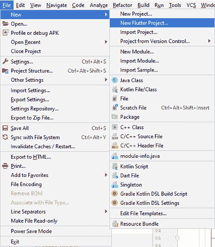
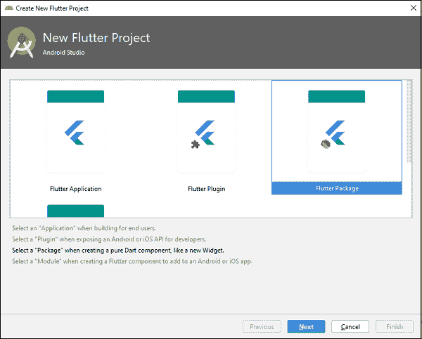
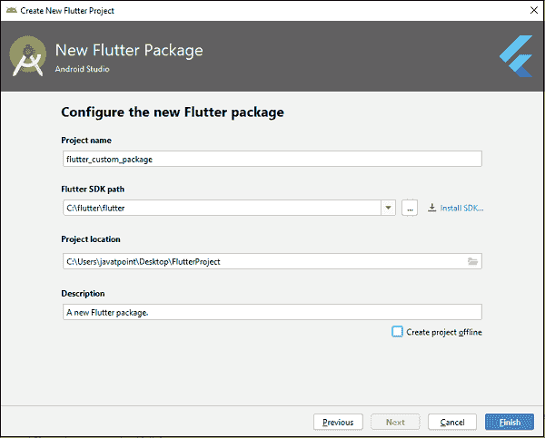

# 颤振包

> 原文：<https://www.javatpoint.com/flutter-packages>

包是包含一组相似类型的类、接口和子包的命名空间。我们可以把包想象成类似于我们电脑上的不同文件夹，我们可以把电影放在一个文件夹中，把图像放在另一个文件夹中，把软件放在另一个文件夹中，等等。在 Flutter 中，Dart 通过一个包来组织和共享一组功能。Flutter 总是支持共享包，这是由其他开发人员为 Flutter 和 Dart 生态系统贡献的。这些包允许我们构建应用程序，而不必从头开始开发一切。

包的一般结构如下所示(假设一个演示包为 mycustom_package):

**lib/src/*:** 它包含私有 Dart 代码文件。

**lib/mydemo_package.dart:** 是一个主 dart 代码文件。我们可以将其导入应用程序，如下所示:

```

import 'package:mycustom_package/mycustom_package.dart'

```

我们还可以将任何其他代码文件导出到主代码文件中，语法如下:

```

Export src/my_code.dart

```

**lib/*:** 是一个目录，包含包中的公共代码。我们可以通过以下方式访问该代码:

```

import 'package:mydemo_package/sub_folder/custom_file.dart'

```

**pubspec.yaml:** 它是项目的配置文件，在处理 Flutter 项目时会用到很多。该文件包含:

*   项目常规设置，如项目的名称、描述和版本。
*   项目依赖关系。
*   项目资产(例如图像)。

### 包的类型

根据功能，我们可以将包分为两种类型:

1.  省道包
2.  插件包

**镖包:**是一个通用包，用镖语言编写，比如路径包。这个包可以在两种环境中使用，无论是网络平台还是移动平台。它还包含一些特定于 Flutter 的功能，因此依赖于 Flutter 框架，例如 **fluro 包**。

**插件包:**它是一个专门的 Dart 包，包含一个用 Dart 代码编写的 API，并且依赖于 Flutter 框架。它可以与特定于平台的底层平台实现相结合，例如安卓(使用 Java 或 Kotlin)和 iOS(使用 Objective C 或 Swift)。这个包的例子是电池和图像拾取插件包。

### 开发一个颤振包或插件

开发一个 Flutter 插件或包类似于创建一个 Dart 应用程序或 Dart 包。但是，它也有一些例外，这意味着插件总是使用特定于安卓或 iOS 等平台的系统应用编程接口来获得所需的功能。现在，让我们一步一步地看看如何在 Flutter 中开发一个包。

**第一步:**首先打开安卓工作室，点击文件菜单- >选择一个新的 Flutter 项目。屏幕上将出现一个对话框。



**第二步:**在该对话框中，需要选择一个新的颤振项目选项，如下图所示，点击**下一步**。



**第三步:**在下一个对话框中，输入你的包的所有细节，如项目名称、项目位置和项目描述。填写完所有详细信息后，单击完成。



**第四步:**最后，你的项目创建完成。现在，打开 flutter_custom_package.dart 文件，删除项目创建时创建的默认代码。然后插入以下代码。这段代码片段创建了一个**警告框**包。

```

library flutter_custom_package;

import 'package:flutter/material.dart';

class CustomPackageAlertBox {
  static Future showCustomAlertBox({
    @required BuildContext context,
    @required Widget willDisplayWidget,
  }) {
    assert(context != null, "If context is null!!");
    assert(willDisplayWidget != null, "If willDisplayWidget is null!!");
    return showDialog(
        context: context,
        builder: (context) {
          return AlertDialog(
            shape: RoundedRectangleBorder(
              borderRadius: BorderRadius.all(Radius.circular(20)),
            ),
            content: Column(
              mainAxisSize: MainAxisSize.min,
              children: <Widget>[
                willDisplayWidget,
                MaterialButton(
                  color: Colors.white70,
                  child: Text('Close Alert'),
                  onPressed: () {
                    Navigator.of(context).pop();
                  },
                )
              ],
            ),
            elevation: 12,
          );
        });
  }
}

```

现在，您需要测试您新创建的包。要测试包，请创建一个新项目。在这个项目中，首先打开 **pubspec.yaml** 文件，并在依赖项部分输入以下代码。

```

dependencies: 
   flutter: 
      sdk: flutter 
   flutter_custom_package: 
      path: ../

```

当您在 pubspec.yaml 文件中添加自定义包时，安卓工作室会提醒您更新该文件。要更新文件，请单击“获取依赖项”，并确保在更新文件时有互联网连接。安卓工作室会自动从互联网上获取软件包，并为您的应用程序进行配置。现在，你可以使用这个包了。您可以导入 dart 文件中的包，如下行所示:

```

import 'package: flutter_custom_package/flutter_custom_package.dart';

```

### 如何发布包

当你成功实现了一个包，你可以在 [pub.dev](https://pub.dev/packages/http) 上发布，这样任何人都可以在项目中轻松使用。

在发布包之前，请确保 pubspec.yaml、README.md 和 CHANGELOG.md 文件的内容完整且正确。

接下来，在终端窗口中运行以下命令来分析包的每个阶段。

```

$ flutter pub publish --dry-run

```

最后，需要运行以下命令**发布**包。

```

$ flutter pub publish

```

* * *