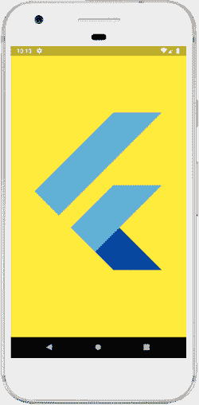
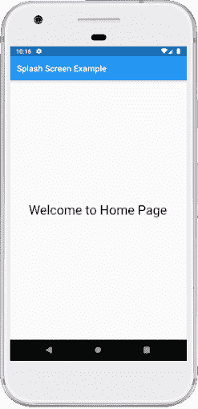
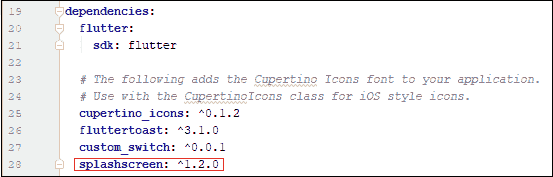
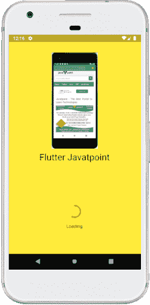

# 颤动闪屏

> 原文：<https://www.javatpoint.com/flutter-splash-screen>

闪屏是启动屏幕、开始屏幕或引导屏幕，它是包含图像、徽标和软件当前版本的图形控制元素。**是应用程序加载时显示的第一个屏幕**。它也可以是应用程序的欢迎屏幕，在手机游戏或程序启动时提供简单的初始体验。闪屏只是一个显示屏，允许用户在硬件加载时查看一些东西，以便向用户呈现软件。

闪屏的常见元素包含一个**公司名称和标志或一个标题**。最常见的闪屏示例是启动 Flutter 应用程序时的 Flutter 徽标或启动 Microsoft 操作系统时的 Microsoft 徽标。在本教程中，我们将看到如何在 [Flutter](https://www.javatpoint.com/flutter) 应用程序中创建闪屏。

### 闪屏特征

以下是闪屏的基本特征:

*   它主要用于应用程序的品牌或身份识别，并向用户展示品牌印象。
*   它也可以用来在硬件加载时显示一些加载进度指示器，以便向用户呈现软件。
*   当启动屏幕加载完成时，用户会获得另一个功能屏幕，它可能是主屏幕或仪表板，然后被遗忘。一旦加载完成，我们就不能按后退按钮返回初始屏幕。

在这里，我们将解释在应用程序中添加闪屏的两种方法。

**方法一:**在第一种方法中，我们将实现**定时器()功能**在我们的 app 中创建一个闪屏。

首先，在您正在使用的 IDE 中创建新项目。打开项目，导航到 lib 文件夹，用 **main.dart** 文件替换下面的代码。

```

import 'dart:async';
import 'package:flutter/material.dart';

void main() { runApp(MyApp());}

class MyApp extends StatelessWidget {
  @override
  Widget build(BuildContext context) {
    return MaterialApp(
      home: MyHomePage(),
      debugShowCheckedModeBanner: false,
    );
  }
}

class MyHomePage extends StatefulWidget {
  @override
  SplashScreenState createState() => SplashScreenState();
}
class SplashScreenState extends State<MyHomePage> {
  @override
  void initState() {
    super.initState();
    Timer(Duration(seconds: 5),
            ()=>Navigator.pushReplacement(context,
            MaterialPageRoute(builder:
                (context) => HomeScreen()
            )
         )
    );
  }
  @override
  Widget build(BuildContext context) {
    return Container(
        color: Colors.yellow,
        child:FlutterLogo(size:MediaQuery.of(context).size.height)
    );
  }
}
class HomeScreen extends StatelessWidget {
  @override
  Widget build(BuildContext context) {
    return Scaffold(
      appBar: AppBar(title:Text("Splash Screen Example")),
      body: Center(
          child:Text("Welcome to Home Page",
              style: TextStyle( color: Colors.black, fontSize: 30)
          )
      ),
    );
  }
}

```

在上面的代码中，我们有一个方法 **initState()** 在有状态小部件插入到小部件树中时调用一次。这个方法首先调用 **super.initState()** 然后调用 Timer 函数。定时器功能包含两个参数，第一个参数是**持续时间**，第二个参数是要执行的**动作**。我们已经指定了持续时间五秒，完成时间后，当前屏幕将被替换为应用程序的主屏幕，即 HomeScreen()。

**输出:**

当我们打开应用程序时，我们将首先看到 flutter 徽标 5 秒钟，如下图所示。



完成 5 秒后，它将显示我们应用程序的主屏幕，如下图所示。



**方法二:**在第二种方法中，我们将使用一个**闪屏包**在我们的 app 中创建一个闪屏。该软件包提供了许多属性，如下所示:

```

SplashScreen ({ Color loaderColor,
int seconds, 
double photoSize, 
Image image, 
Text loadingText, 
Color backgroundColor,
Text title, 
TextStyle styleTextUnderTheLoader, 
dynamic onClick, 
dynamic navigateAfterSeconds, 
ImageProvider<dynamic> imageBackground, 
Gradient gradientBackground})

```

首先，在您正在使用的 IDE 中创建新项目。打开项目，导航到 lib 文件夹，打开 **pubspec.yaml** 文件，我们需要在其中添加**闪屏依赖项**，如下图:



现在，打开 **main.dart** 文件，用下面的代码替换。

```

import 'dart:async';
import 'package:flutter/material.dart';
import 'package:splashscreen/splashscreen.dart';

void main() { runApp(MyApp()); }

class MyApp extends StatelessWidget {
  @override
  Widget build(BuildContext context) {
    return MaterialApp(
      theme: ThemeData(
        primarySwatch: Colors.green,
      ),
      home: SplashScreenPage(),
      debugShowCheckedModeBanner: false,
    );
  }
}
class SplashScreenPage extends StatelessWidget {
  @override
  Widget build(BuildContext context) {
    return SplashScreen(
      seconds: 5,
      navigateAfterSeconds: new HomeScreen(),
      backgroundColor: Colors.yellow,
      title: new Text('Flutter Javatpoint',textScaleFactor: 2,),
      image: new Image.network(
          'https://static.javatpoint.com/tutorial/flutter/images/flutter-creating-android-platform-specific-code3.png'
      ),
      loadingText: Text("Loading"),
      photoSize: 150.0,
      loaderColor: Colors.red,
    );
  }
}
class HomeScreen extends StatelessWidget {
  @override
  Widget build(BuildContext context) {
    return Scaffold(
      appBar: AppBar(title:Text("Splash Screen Example")),
      body: Center(
          child:Text("Welcome to Home Page",
              style: TextStyle( color: Colors.black, fontSize: 30)
          )
      ),
    );
  }
}

```

在上面的代码中，我们有一个名为 **SplashScreenPage()** 的主页，它将返回 **SplashScreen 类**。这个类有几个属性用于显示启动屏幕，比如标题、图像、背景色、渐变背景、秒、加载文本等。**第二个**属性用于用户看到闪屏的时间，完成后会导航到新的屏幕，即我们 app 中的**主屏幕()**。

**输出:**

当我们打开应用程序时，我们会先看到图像和加载图标 5 秒钟，如下图所示。当指定的时间结束时，我们将导航到应用程序的主页。



* * *