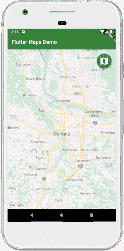
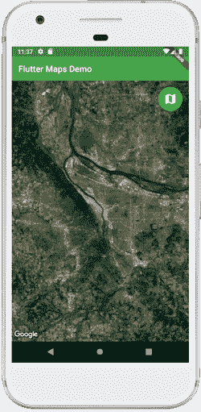
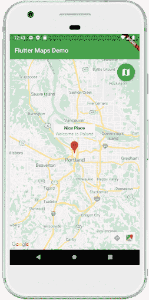

# 飘动谷歌地图

> 原文：<https://www.javatpoint.com/flutter-google-maps>

地图被用来简单直观地获取世界信息。它通过显示世界各地的形状和大小、位置以及它们之间的距离来呈现世界各地。我们可以使用**谷歌地图 Flutter 插件**在我们的应用程序中添加地图。这个插件可以自动访问谷歌地图服务器，显示地图，并响应用户手势。它还允许我们在地图上添加标记。

### 为什么要使用带有 Flutter 的谷歌地图？

[Flutter](https://www.javatpoint.com/flutter) 开发者更喜欢谷歌地图应用，因为它们**为[安卓](https://www.javatpoint.com/android-tutorial)和 iOS 都**提供了原生性能。它允许我们一次性实现代码，并允许他们为两个设备(安卓和 iOS)运行代码。谷歌地图 Flutter 插件在谷歌地图小部件中提供，支持**initialcamerapoposition、地图类型**和 **onMapCreated** 。我们可以在地球上的任何地方设置相机和标记的位置。我们可以根据自己的选择来设计标记。它还在**相机位置**中带有缩放属性，以在初始页面上提供谷歌地图视图的缩放。

让我们一步步来看看如何在 Flutter 应用中添加谷歌地图。

**步骤 1:** 创建新项目。在 IDE 中打开该项目，导航到 **lib** 文件夹，然后打开**publispec . YAML**文件进行地图设置。

**第二步:**在 pubspec.yaml 文件中，我们需要在依赖部分添加 Google Maps Flutter 插件，该插件在 pub.dartlang.org 作为 **google_maps_flutter** 提供。添加依赖项后，点击**获取包**链接，在 **main.dar** t 文件中导入库。

```

dependencies:  
  flutter:  
    sdk: flutter  
  cupertino_icons: ^0.1.2  
  google_maps_flutter: ^0.5.21

```

它确保我们在添加依赖项时，在 google_maps_flutter 依赖项的左侧留下了两个空格。

**第三步:**下一步是为你的项目获取一个 **API 密钥。如果我们使用的是安卓平台，那么请按照[安卓地图软件开发工具包:获取应用编程接口密钥](https://developers.google.com/maps/documentation/android-sdk/get-api-key)上的说明进行操作。创建 API 密钥后，将其添加到应用程序清单文件中。我们可以通过导航到**Android/app/src/main/androidmanifest . XML**找到这个文件，如下所示:**

```

<manifest ...
  <application ...
    <meta-data android:name="com.google.android.geo.API_KEY"
               android:value="YOUR ANDROID API KEY HERE"/> 

```

**第 4 步:**接下来，将包导入到 dart 文件中，如下所示:

```

import 'package:google_maps_flutter/google_maps_flutter.dart';

```

**第五步:**现在，我们准备添加一个谷歌地图小部件，开始创建一个 UI 来显示地图。

### 例子

让我们借助一个例子来理解它。

```

import 'package:flutter/material.dart';
import 'package:google_maps_flutter/google_maps_flutter.dart';

void main() => runApp(MyApp());

class MyApp extends StatefulWidget {
  @override
  _MyAppState createState() => _MyAppState();
}

class _MyAppState extends State {
  GoogleMapController myController;

  final LatLng _center = const LatLng(45.521563, -122.677433);

  void _onMapCreated(GoogleMapController controller) {
    myController = controller;
  }

  @override
  Widget build(BuildContext context) {
    return MaterialApp(
      home: Scaffold(
        appBar: AppBar(
          title: Text('Flutter Maps Demo'),
          backgroundColor: Colors.green,
        ),
        body: Stack(
          children: <widget>[
            GoogleMap(
              onMapCreated: _onMapCreated,
              initialCameraPosition: CameraPosition(
                target: _center,
                zoom: 10.0,
              ),
            ),
            Padding(
              padding: const EdgeInsets.all(14.0),
              child: Align(
                alignment: Alignment.topRight,
                child: FloatingActionButton(
                  onPressed: () => print('You have pressed the button'),
                  materialTapTargetSize: MaterialTapTargetSize.padded,
                  backgroundColor: Colors.green,
                  child: const Icon(Icons.map, size: 30.0),
                ),
              ),
            ),
          ],
        ),
      ),
    );
  }
}</widget> 
```

在上面的代码中，我们注意到了这些术语:

**mapController** :类似于我们在 Flutter 中看到的其他控制器。它控制谷歌地图类的所有活动。这里，它管理相机功能，如位置、动画、缩放等。

**onMapCreated** :是创建地图调用的方法，以一个 MapController 作为参数。

**initial 摄像机位置**:这是一个必需的参数，用于设置我们想要开始的摄像机位置。它允许我们设定我们想要在地图上指向世界的哪个部分。

**堆叠**:用于将其他 Flutter 小部件放置在地图小部件的顶部。

**输出:**

当我们运行应用程序时，它应该会返回如下截图所示的屏幕界面:


### 如何改变地图外观？

我们可以更改地图外观，如普通视图、卫星视图等。使用**映射类型**属性。此属性允许开发人员显示地图切片的类型。谷歌地图小部件主要提供五种类型的切片，如下所示:

*   **无**:不显示任何地图图块。
*   **正常**:显示地图上有交通、标签、细微地形信息的瓦片。
*   **卫星**:显示所在位置的卫星影像(航拍)。
*   **地形**:显示一片土地的具体物理特征(表示地形的类型和高度)。
*   **混合**:显示带有一些标签或叠加的卫星图像。

我们可以通过在上面的代码中创建一个变量 _ **currentMapType** 来显示当前的地图类型，然后将**地图类型:_currentMapType** 添加到**谷歌地图**小部件中。

```

MapType _currentMapType = MapType.normal;

@override
Widget build(BuildContext context) {
  return MaterialApp(
    GoogleMap(
      mapType: _currentMapType,
    ),
  );
} 

```

接下来，我们必须在一个 **setState** ()函数调用中添加一个方法来修改 _currentMapType 的值。此方法将更新地图外观，以匹配 _currentMapType 变量的新值。

```

void _onMapTypeButtonPressed() {
  setState(() {
    _currentMapType = _currentMapType = = MapType.normal
        ? MapType.satellite
        : MapType.normal;
  });
}

```

最后，将 **onPressed** 属性替换为 _**on aptypebuttonpressed**。

```

child: FloatingActionButton(
  onPressed: _onMapTypeButtonPressed
),

```

让我们看看改变地图外观的完整代码。打开 dart 文件，并用下面的代码替换它:

```

import 'package:flutter/material.dart';
import 'package:google_maps_flutter/google_maps_flutter.dart';

void main() => runApp(MyApp());

class MyApp extends StatefulWidget {
  @override
  _MyAppState createState() => _MyAppState();
}

class _MyAppState extends State {
  GoogleMapController myController;

  final LatLng _center = const LatLng(45.521563, -122.677433);

  MapType _currentMapType = MapType.normal;

  void _onMapTypeButtonPressed() {
    setState(() {
      _currentMapType = _currentMapType == MapType.normal
          ? MapType.satellite
          : MapType.normal;
    });
  }

  void _onMapCreated(GoogleMapController controller) {
    myController = controller;
  }

  @override
  Widget build(BuildContext context) {
    return MaterialApp(
      home: Scaffold(
        appBar: AppBar(
          title: Text('Flutter Maps Demo'),
          backgroundColor: Colors.green,
        ),
        body: Stack(
          children: <widget>[
            GoogleMap(
              onMapCreated: _onMapCreated,
              initialCameraPosition: CameraPosition(
                target: _center,
                zoom: 10.0,
              ),
              mapType: _currentMapType
            ),
            Padding(
              padding: const EdgeInsets.all(14.0),
              child: Align(
                alignment: Alignment.topRight,
                child: FloatingActionButton(
                  onPressed: _onMapTypeButtonPressed,
                  materialTapTargetSize: MaterialTapTargetSize.padded,
                  backgroundColor: Colors.green,
                  child: const Icon(Icons.map, size: 30.0),
                ),
              ),
            ),
          ],
        ),
      ),
    );
  }
}</widget> 
```

**输出:**

当我们运行应用程序时，它应该会返回如下截图所示的屏幕界面:



如果我们点击地图图标，我们将获得我们指定位置的卫星图像。请参见下图:



### 如何在地图上添加标记？

标记标识地图上的位置。我们可以使用谷歌地图小部件中的**标记属性**在地图上添加标记。通常，当我们将相机从一个位置移动到另一个位置时，会显示标记。**例如**，如果我们想从波兰搬到加州，当摄像机移动到加州时，我们可以在那个特定的位置看到一个标记。

我们可以通过创建存储地图标记的变量 _ **标记**来添加标记，然后将该变量设置为谷歌地图小部件中的标记属性。

```

final Set _markers = {};
@override
Widget build(BuildContext context) {
  return MaterialApp(
    GoogleMap(
      markers: _markers,
    ),
  );
} 
```

接下来，需要通过添加以下代码来跟踪地图上的当前摄像机位置:

```

LatLng _currentMapPosition = _center;

void _onCameraMove(CameraPosition position) {
  _currentMapPosition = position.target;
}

@override
Widget build(BuildContext context) {
  return MaterialApp(
    GoogleMap(
      onCameraMove: _onCameraMove,
    ),
  );
} 

```

最后，我们需要通过修改一个 **setState** ()函数调用中的 _markers 在地图中添加一个标记。

```

void _onAddMarkerButtonPressed() {
  setState(() {
    _markers.add(Marker(
      markerId: MarkerId(_lastMapPosition.toString()),
      position: _currentMapPosition,
      infoWindow: InfoWindow(
        title: 'Nice Place'
      ),
      icon: BitmapDescriptor. defaultMarkerWithHue(BitmapDescriptor.hueViolet)
    ));
  });
}

```

让我们看看添加标记到地图的完整代码。打开 dart 文件，并用下面的代码替换它:

```

import 'package:flutter/material.dart';
import 'package:google_maps_flutter/google_maps_flutter.dart';

void main() => runApp(MyApp());

class MyApp extends StatefulWidget {
  @override
  _MyAppState createState() => _MyAppState();
}

class _MyAppState extends State {
  GoogleMapController mapController;
  static final LatLng _center = const LatLng(45.521563, -122.677433);
  final Set <marker>_markers = {};
  LatLng _currentMapPosition = _center;

  void _onAddMarkerButtonPressed() {
    setState(() {
      _markers.add(Marker(
        markerId: MarkerId(_currentMapPosition.toString()),
        position: _currentMapPosition,
        infoWindow: InfoWindow(
          title: 'Nice Place',
          snippet: 'Welcome to Poland'
        ),
        icon: BitmapDescriptor.defaultMarker,
      ));
    });
  }

  void _onCameraMove(CameraPosition position) {
    _currentMapPosition = position.target;
  }

  void _onMapCreated(GoogleMapController controller) {
    mapController = controller;
  }

  @override
  Widget build(BuildContext context) {
    return MaterialApp(
      home: Scaffold(
        appBar: AppBar(
          title: Text('Flutter Maps Demo'),
          backgroundColor: Colors.green,
        ),
        body: Stack(
          children: <widget>[
            GoogleMap(
              onMapCreated: _onMapCreated,
              initialCameraPosition: CameraPosition(
                target: _center,
                zoom: 10.0,
              ),
              markers: _markers,
              onCameraMove: _onCameraMove
            ),
            Padding(
              padding: const EdgeInsets.all(14.0),
              child: Align(
                alignment: Alignment.topRight,
                child: FloatingActionButton(
                  onPressed: _onAddMarkerButtonPressed,
                  materialTapTargetSize: MaterialTapTargetSize.padded,
                  backgroundColor: Colors.green,
                  child: const Icon(Icons.map, size: 30.0),
                ),
              ),
            ),
          ],
        ),
      ),
    );
  }
}</widget></marker> 
```

**输出:**

运行应用，我们会得到屏幕的 UI 作为第一张截图。当我们点击按钮时，它会在地图的最后一个位置显示标记。当我们点击标记时，显示的信息给出了位置的标题和片段。

 

* * *