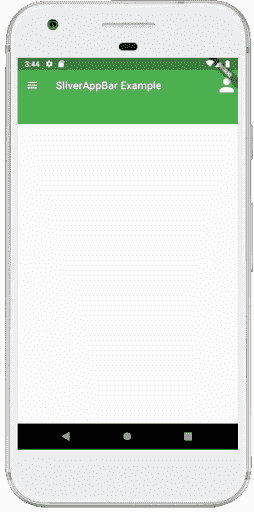
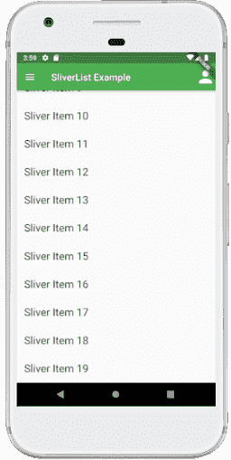
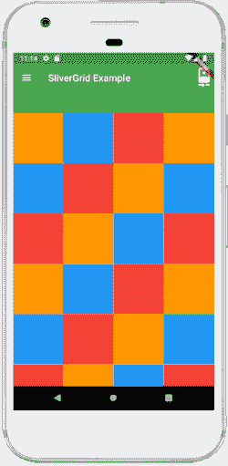
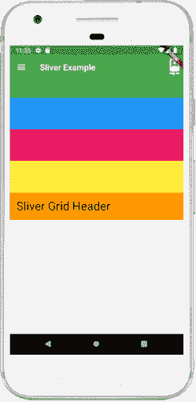

# Flutter 条

> 原文：<https://www.javatpoint.com/flutter-slivers>

**长条是可滚动区域的一部分，用于实现自定义滚动效果**。换句话说，小部件是视口的一部分。我们可以使用 slivers 实现所有的可滚动视图，比如 ListView、GridView。这是一个较低级别的接口，它提供了对实现可滚动区域的出色控制。当在可滚动区域中滚动大量子小部件时，它非常有用。由于它们是基于视口的，因此它可以基于几个事件和偏移来更改它们的形状、大小和范围。

Flutter 提供了几种细长条，其中一些如下:

*   SliverAppBar
*   切片列表
*   silvergrid

## 如何使用细长条？

需要注意的是，所有长条的组件应该始终放置在 **CustomScrollView** 中。之后，我们可以组合切片列表来创建自定义的可滚动区域。

## 什么是 CustomScrollView？

[Flutter](https://www.javatpoint.com/flutter) 中的 CustomScrollView 是一个滚动视图，允许我们创建各种滚动效果，例如网格、列表和扩展标题。它有一个**长条属性**，我们可以在这里传递一个小部件列表，包括 SliverAppBar、SliverToBoxAdapter、SliverList 和 SliverGrid 等。

让我们详细讨论每一条。

## SliverAppBar

SliverAppBar 是 Flutter 中的一个材质设计应用程序栏，它与 CustomScrollView 集成在一起。通常，我们将其用作 CustomScrollView 的第一个子级。**它的高度可以变化，并浮动在滚动视图的另一个小部件**上方。它允许我们创建一个具有各种滚动效果的应用程序栏。

### 滑动条的性质

以下是 SliverAppBar 的基本属性:

**动作:**该属性用于在 appBar 标题的右侧创建小部件。一般来说，它是一个图标按钮，代表常见的操作。

**标题:**该属性用于定义滚动条的标题。给出应用程序的名称类似于 AppBar 标题。

**前导:**此属性用于定义标题左侧的小部件。通常，它用于放置菜单抽屉小部件。

**backgroundColor:** 此属性用于定义长条应用程序栏的背景颜色。

**底部:**这个属性用来给标题的底部创建空间，我们可以在这里根据自己的需要定义任何小部件。

**展开高度:**该属性用于指定滚动时可以展开的应用程序栏的最大高度。它必须用双精度值来定义。

**浮动:**该属性决定用户向应用栏滚动时，应用栏是否可见。

**灵活空间:**该属性用于定义堆叠在工具栏和标签栏后面的小部件。它的高度与应用程序栏的整体高度相同。

### 例子

在下面的例子中，我们将看到如何在 CustomScrollView 中使用 SliverAppBar。

```

import 'package:flutter/material.dart';

void main() => runApp(MyApp());

class MyApp extends StatelessWidget {
  @override
  Widget build(BuildContext context) {
    return MaterialApp(
      home: Scaffold(
        body: CustomScrollView(
          slivers: <Widget>[
            SliverAppBar(
              actions: <Widget>[
                Icon(Icons.person, size: 40,)
            ],
              title: Text("SliverAppBar Example"),
              leading: Icon(Icons.menu),
              backgroundColor: Colors.green,
              expandedHeight: 100.0,
              floating: true,
              pinned: true
            )
            // Place sliver widgets here
          ],
        ),
      ),
    );
  }
}

```

**输出**

当我们运行应用程序时，我们应该会得到类似于下面截图的屏幕用户界面:



## 切片列表

SliverList 是一个长条，**将子元素放置在一个线性数组或一维数组**中。需要一个**委托参数**来提供列表中的项目，它们将滚动到视图中。我们可以用一个**列表来指定孩子的列表，或者用一个**列表来创建孩子的列表。****

### 例子

在下面的例子中，我们将看到如何在 CustomScrollView 中使用 SliverList。

```

import 'package:flutter/material.dart';

void main() => runApp(MyApp());

class MyApp extends StatelessWidget {
  @override
  Widget build(BuildContext context) {
    return MaterialApp(
      home: Scaffold(
        body: CustomScrollView(
          slivers: <Widget>[
            SliverAppBar(
              actions: <Widget>[
                Icon(Icons.person, size: 40,)
            ],
              title: Text("SliverList Example"),
              leading: Icon(Icons.menu),
              backgroundColor: Colors.green,
              expandedHeight: 100.0,
              floating: true,
              pinned: true
            ),
            SliverList(
              delegate: new SliverChildListDelegate(_buildList(20)),
            ),// Place sliver widgets here
          ],
        ),
      ),
    );
  }
}
List _buildList(int count) {
  List<Widget> listItems = List();
  for (int i = 0; i < count; i++) {
    listItems.add(new Padding(padding: new EdgeInsets.all(16.0),
        child: new Text(
            'Sliver Item ${i.toString()}',
            style: new TextStyle(fontSize: 22.0)
        )
    ));
  }
  return listItems;
}

```

**输出**

当我们运行应用程序时，我们应该会得到类似于下面截图的屏幕用户界面:



## silvergrid

SliverGrids **将孩子放置在二维排列中**。它还使用一个委托来指定子代或一个类似于列表的显式列表。但是它对网格上的交叉轴维度进行了额外的格式化。它允许三种方式来指定网格布局:

1.它使用**计数构造器**来计算横轴上的项目数。请参见下面的代码:

```

SliverGrid.count(
  crossAxisCount: 3,
  mainAxisSpacing: 20.0,
  crossAxisSpacing: 20.0,
  childAspectRatio: 3.0,
  children: <Widget>[
    Container(color: Colors.red),
    Container(color: Colors.blue),
    Container(color: Colors.green),
    Container(color: Colors.red),
    Container(color: Colors.blue),
    Container(color: Colors.green),
  ],
),

```

2.它使用**范围构造器**，指定项目的最大宽度。当网格项目的大小不同时，这是最有用的。这意味着我们可以限制它们应该占据多大的空间。请参见下面的代码:

```

SliverGrid.extent(
  maxCrossAxisExtent: 200,
  mainAxisSpacing: 10.0,
  crossAxisSpacing: 10.0,
  childAspectRatio: 4.0,
  children: <Widget>[
    Container(color: Colors.orange),
    Container(color: Colors.yellow),
    Container(color: Colors.purple),
    Container(color: Colors.pink),
    Container(color: Colors.green),
    Container(color: Colors.indigo),
  ],
),

```

3.它使用**默认构造函数**，该构造函数通过显式的**网格更新**参数传递:

### 例子

在下面的例子中，我们将看到如何在 CustomScrollView 中使用 SliverGrid。

```

import 'package:flutter/material.dart';

void main() => runApp(MyApp());

class MyApp extends StatelessWidget {
  @override
  Widget build(BuildContext context) {
    return MaterialApp(
      home: Scaffold(
        body: CustomScrollView(
          slivers: <Widget>[
            SliverAppBar(
              actions: <Widget>[
                Icon(Icons.camera_front, size: 40,)
            ],
              title: Text("SliverGrid Example"),
              leading: Icon(Icons.menu),
              backgroundColor: Colors.green,
              expandedHeight: 100.0,
              floating: true,
              pinned: true
            ),
            SliverGrid(
              gridDelegate: SliverGridDelegateWithFixedCrossAxisCount(
                crossAxisCount: 4,
              ) ,
              delegate: SliverChildBuilderDelegate((BuildContext context, int index) {
                return new Container(
                    color: _randomPaint(index),
                    height: 150.0
                );
              }),
            ),
          ],
        ),
      ),
    );
  }
}
Color _randomPaint(int index) {
  if (index % 3 == 0) {
    return Colors.orange;
  } else if (index % 3 == 1) {
    return Colors.blue;
  }
  return Colors.red;
}

```

**输出**

当我们运行该应用程序时，我们应该会获得类似于以下截图的屏幕用户界面:



## SliverFixedExtentList 和 SliverToBoxAdapter

SliverFixedExtentList 是一个长条，**在一维数组或线性数组**中保存多个具有相同主轴范围的子级。它比 SliverList 更有效，因为不需要对其子级执行布局来获得主轴范围。它不允许孩子之间有隔阂。它要求每个孩子在横轴上具有**等级约束。横轴上具有**属性，在主轴上具有**项目范围**属性。

SliverToBoxAdapter 是一个只能容纳单个盒子部件的长条。当我们希望在 CustomScrollView 中只显示一个子小部件来创建自定义滚动效果时，这非常有用。如果我们需要在 CustomScrollView 中显示多个框小部件，我们必须使用 SliverList、SliverFixedExtentList 或 SliverGrid。

### 例子

在下面的例子中，我们将看到如何将 SliverFixedExtentList 和 SliverToBoxAdapter 与 CustomScrollView 一起使用。

```

import 'package:flutter/material.dart';

void main() => runApp(MyApp());

class MyApp extends StatelessWidget {
  @override
  Widget build(BuildContext context) {
    return MaterialApp(
      home: Scaffold(
        body: CustomScrollView(
          slivers: <Widget>[
            SliverAppBar(
              actions: <Widget>[
                Icon(Icons.camera_front, size: 40,)
            ],
              title: Text("Sliver Example"),
              leading: Icon(Icons.menu),
              backgroundColor: Colors.green,
              expandedHeight: 100.0,
              floating: true,
              pinned: true
            ),
            SliverFixedExtentList(
              itemExtent: 75,
              delegate: SliverChildListDelegate([
                Container(color: Colors.blue),
                Container(color: Colors.pink),
                Container(color: Colors.yellow),
              ]),
            ),
            SliverToBoxAdapter(
              child: Container(
                color: Colors.orange,
                padding: const EdgeInsets.all(16.0),
                child: Text('Sliver Grid Header', style: TextStyle(fontSize: 28)),
              ),
            ),
          ],
        ),
      ),
    );
  }
}

```

**输出**

当我们运行应用程序时，我们应该会得到类似于下面截图的屏幕用户界面:



* * *