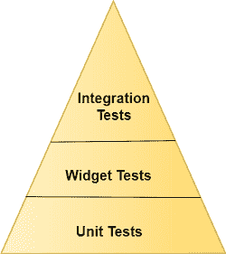
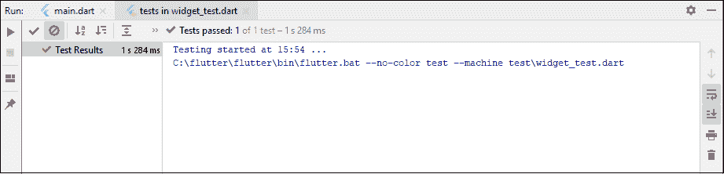

# 颤振试验

> 原文：<https://www.javatpoint.com/flutter-testing>

测试是一项活动，用于验证和确认软件或应用程序是否没有错误并满足用户需求。它确保实际结果与预期结果相匹配。它还有助于提高软件或应用程序的效率、可用性和准确性。

测试是应用程序开发生命周期中最重要的阶段之一，以确保应用程序的高质量。这是应用程序或软件开发中最耗时的阶段。

Flutter 框架为应用程序的**自动化测试**提供了出色的支持。通常，自动化测试分为三种类型来全面测试应用程序。它们如下:

1.  单元测试
2.  小部件测试
3.  集成测试



### 单元测试

这是测试应用程序或软件最简单的方法。它测试单个函数、方法或类。单元测试的目标是在各种条件下保证代码的正确性。通常，单元测试不与用户输入交互，不在屏幕上呈现，不从磁盘读取或写入数据，默认情况下不使用外部依赖关系。当你使用外部依赖时，它们会被像 Mockito 这样的包模仿出来。

### 小部件测试

小部件测试用于测试单个小部件。这个测试的目标是确保小部件的用户界面看起来像预期的那样，并与其他小部件交互。小部件测试的过程类似于单元测试，但比单元测试更全面。这个测试涉及多个类，需要一个测试环境来发现更多的错误。正在测试的小部件可以接收和响应用户动作和事件，并且能够实例化子小部件。

### 集成测试

集成测试包括上述测试以及应用程序的外部组件。它验证一个完整的应用程序或应用程序的大部分。集成测试的目的是确保所有的小部件和服务按照预期一起工作。它还可以用来验证应用程序的性能。通常，集成测试运行在真实设备上，如安卓模拟器或 iOS 模拟器。

不同类型测试之间的权衡如下:

|  | 单元测试 | 小部件测试 | 集成测试 |
| **信心** | 低的 | 高级证书。比较 ＯＲＤIＮＡＲＹ　ＧＲＡＤＥ | 最高的 |
| **维护** | 费用 | 低更高 | 最高的 |
| **依赖关系** | 很少的 | 更大的 | 最 |
| **执行速度** | 快的 | 快的 | 慢的 |

我们知道，在 Flutter 中，一切都是一个小部件。因此，在这里，我们将详细讨论小部件测试。

### 小部件测试简介

在小部件测试中，您需要一些由 **flutter_test** 包提供的附加工具。这个包提供了以下工具来测试这个小部件。

*   **WidgetTester:** 它允许在测试环境中构建小部件并与之交互。
*   **testWidgets():** 这个方法自动为每个测试用例创建一个 WidgetTester。它用作正常测试()函数。它接受两个参数:测试描述和测试代码。
*   **Finder 类:**用于在测试环境中搜索小部件。
*   **Matcher 类:**它有助于验证 Finder 类是在测试环境中定位单个小部件还是多个小部件。

让我们通过以下步骤来了解上述所有内容是如何结合在一起的:

**步骤 1:** 添加 flutter_test 依赖项。

第一步，我们需要在 **pubspec.yaml** 文件中添加 flutter_test 依赖项。默认情况下，它已经添加到依赖项部分。

**步骤 2:** 创建一个小部件进行测试。

接下来，我们必须创建一个小部件来执行测试。下面的代码片段创建了一个小部件，其中包含要在屏幕上显示的标题和消息。

```

class MyAppWidget extends StatelessWidget {
  final String title;
  final String message;

  const MyWidget({
    Key key,
    @required this.title,
    @required this.message,
  }) : super(key: key);

  @override
  Widget build(BuildContext context) {
    return MaterialApp(
      title: 'Flutter Testing Demo',
      home: Scaffold(
        appBar: AppBar(
          title: Text(title),
        ),
        body: Center(
          child: Text(message),
        ),
      ),
    );
  }
}

```

**步骤 3:** 创建一个 testWidgets 测试。

要测试小部件，请使用 **testWidget()** 方法。这个方法允许我们定义一个测试并接受两个参数:测试描述和测试代码。它还创建了一个 **WidgetTester** 来处理这个小部件。下面的代码验证 MyAppWidget 是否显示标题和消息。

```

void main() {
  testWidgets(' The widget contains a title and message', (WidgetTester tester) async {
    // Write test code here.
  });
}

```

**步骤 4:** 使用 WidgetTester 构建小部件。

WidgetTester 提供了一个 **pumpWidget()** 方法来构建和渲染所提供的 Widget。它创建了 MyAppWidget 的实例，该实例将“Ti”和“Msg”分别显示为标题和消息。下面的代码解释得更清楚。

```

void main() {
    testWidgets(The widget contains a title and message', (WidgetTester tester) async {
        await tester.pumpWidget(MyWidget(title: 'Ti', message: 'Msg'));

  });
}

```

**第 5 步:**使用 Finder 搜索小部件。

在这一步中，我们将使用 Finder 类在小部件树中搜索标题和消息。它允许我们验证小部件是否正确显示。为此，我们需要使用 **find.text()** 方法。

```

void main() {
    testWidgets(The widget contains a title and message', (WidgetTester tester) async {
    await tester.pumpWidget(MyWidget(title: 'Ti', message: 'Msg'));

    final titleFinder = find.text('Ti');
    final messageFinder = find.text('Msg');

  });
}

```

**步骤 6:** 使用匹配器验证小部件。

最后，我们需要使用 Matcher 类来验证文本消息是否出现在屏幕上。它确保小部件在屏幕上只出现一次。我们可以看到下面的代码来理解它。

```

void main() {
    testWidgets(The widget contains a title and message', (WidgetTester tester) async {
    await tester.pumpWidget(MyWidget(title: 'Ti', message: 'Msg'));

    final titleFinder = find.text('Ti');
    final messageFinder = find.text('Msg');

    expect(titleFinder, findsOneWidget);
    expect(messageFinder, findsOneWidget);
  });
}

```

现在，我们将看到工作示例来理解小部件测试的概念。首先，在 Android Studio 中创建一个项目，并导航到项目目录的测试文件夹。现在，打开 **widget_test.dart** 文件，替换如下代码:

```

import 'package:flutter/material.dart';
import 'package:flutter_test/flutter_test.dart';

void main() {
    testWidgets(The widget contains a title and message', (WidgetTester tester) async {
    // Create the widget by telling the tester to build it.
    await tester.pumpWidget(MyWidget(title: 'Ti', message: 'Msg'));

    // Create the Finders.
    final titleFinder = find.text('Ti');
    final messageFinder = find.text('Msg');

    expect(titleFinder, findsOneWidget);
    expect(messageFinder, findsOneWidget);
  });
}

class MyAppWidget extends StatelessWidget {
  final String title;
  final String message;

  const MyAppWidget({
    Key key,
    @required this.title,
    @required this.message,
  }) : super(key: key);

  @override
  Widget build(BuildContext context) {
    return MaterialApp(
      title: 'Flutter Testing Demo',
      home: Scaffold(
        appBar: AppBar(
          title: Text(title),
        ),
        body: Center(
          child: Text(message),
        ),
      ),
    );
  }
}

```

要执行测试，请转到**运行**菜单，并选择“在 widget_test.dart 中测试”选项。它将运行测试并给出如下屏幕所示的结果:



* * *