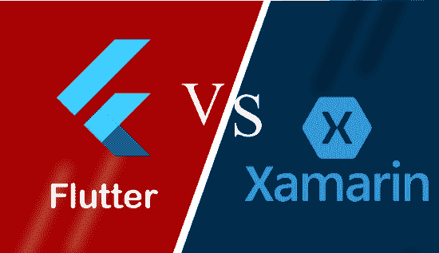

# Flutter 和 Xamarin 的区别

> 原文：<https://www.javatpoint.com/flutter-vs-xamarin>

对移动应用的需求日益增长，达到相当大的程度。正因为如此，开发人员已经搜索了一个快速的框架来构建应用程序。许多开发人员已经开始使用跨平台功能来制作一个快速应用程序，该应用程序为设计电子商务应用程序、交互式应用程序和社交应用程序提供了许多功能。

在这一节中，我们将比较 Flutter 和 Xamarin 之间的差异，这有助于我们确定哪种框架最适合我们的应用想法。在进行比较之前，我们将简要讨论这些技术。

## Xamarin 是什么？

[Xamarin](https://www.javatpoint.com/xamarin) 是一款面向 iOS、[安卓](https://www.javatpoint.com/android-tutorial)、[Windows](https://www.javatpoint.com/windows)[**的开源跨平台移动开发应用。净**](https://www.javatpoint.com/net-framework) 。它是一个抽象层，管理共享代码和平台代码之间的通信。它允许开发人员编写一次代码，并且可以在任何地方重用它，并实现本机性能、外观等。在每个平台上。

Xamarin 是一家软件公司**起源于 2011 年**，现在**于 2016 年**被微软收购。这是一个使用 [**C#语言**](https://www.javatpoint.com/c-sharp-tutorial) 开发移动应用的框架。它还使用 [HTML](https://www.javatpoint.com/html-tutorial) 和 [JavaScript](https://www.javatpoint.com/javascript-tutorial) 来开发应用程序，就像使用 JS 库开发移动应用程序的网站一样。Xamarin 工具可通过 **Visual Studio** 轻松下载。我们可以通过下载和安装 Visual Studio，使用 Xamarin 工具在 Windows 上开发一个应用程序，可以是免费版本，也可以是高级许可证。

### Xamarin 的优势或优点

Xamarin 技术的优势如下:

**性能:** Xamarin 应用程序以拥有类似原生的性能而闻名。

**完整的开发生态系统:** Xamarin 应用程序是使用 C#构建的。Net，以及微软 Visual Studio，这使得它成为一个完整的跨平台移动应用开发框架。

**共享 App 逻辑:**它是 Xamarin 的强大功能，使其成为最有用的跨平台开发工具。输入验证、web 服务调用、数据库交互和后端企业集成等应用程序逻辑在 C#中编码一次，可以在各种操作系统中共享 75%的代码。它节省了开发人员的时间和精力。

**Xamarin 组件商店:** Xamarin 信奉协作和组件共享。它允许开发人员选择主机免费或付费组件，包括用户界面控件、跨平台库和第三方网络服务，用几行代码构建应用程序逻辑。

**无缝用户体验:** Xamarin 提供了原生 UI 的优势、对特定设备功能的访问，以及最重要的原生性能。这些功能让用户体验惊艳。

### Xamarin 的缺点或缺点

以下是 Xamarin 技术的缺点:

**更新延迟:**如果新特性或更新在这项技术中推出，这些更改通常会被延迟，直到它们反映在 Xamarin 工具中。这可能会导致我们的应用程序出现问题。

**重图形:** Xamarin 不适合构建复杂的应用或重图形的手机游戏。

**平台特定代码:**有时候，我们可能需要用原生代码重新编写 app 中 UI 的某些部分，比如安卓的 Kotlin 或 Java，iOS 的 Swift 或 Objective-C。

## 什么是 Flutter？

[Flutter](https://www.javatpoint.com/flutter) 是一个跨平台的 UI 工具包，允许我们使用 **Flutter 编程语言**为移动、网络和桌面创建快速、美观、本机编译的应用程序。它用一种编程语言和一个代码库来构建应用程序。它是免费和开源的。谷歌最初于 2017 年 5 月在 T4 开发它，现在按照 ECMA 标准管理。这是一项越来越受欢迎的技术，可以提供出色的本地体验。

谷歌将其作为软件开发工具包(SDK)推出，为 iOS 和 Android 创建现代移动应用。如果我们使用 AndroidStudio，它与内置的 [Java](https://www.javatpoint.com/java-tutorial) 和客观的 [C](https://www.javatpoint.com/c-programming-language-tutorial) 和 [Swift 在 iOS](https://www.javatpoint.com/ios-development-using-swift) 上集成在一起。

### Flutter 的优点或好处

Flutter 技术的优点如下:

*   它得到了谷歌的支持。
*   它支持 Hot-Reload 功能，使应用程序开发过程极快。更改完成后，热重新加载功能会立即反映修改后的代码。
*   由于跨平台特性，它减少了测试的时间和精力。这个特性允许测试人员不要在不同的平台上为同一个应用程序运行同一套测试。
*   它有一个出色的用户界面，因为它使用了以设计为中心的小部件、高开发工具、高级 API 和更多功能。
*   它类似于一个反应式框架，开发者不需要手动更新用户界面内容。

### Flutter 的缺点或缺点

Flutter 技术的缺点如下:

*   它主要支持用于编码的 Flutter 编程，因此开发人员需要学习新技术。
*   Flutter 是一种相对较新的语言，因此它没有很好的社区支持。
*   它提供对 SDK 库非常有限的访问。这意味着开发人员没有很多功能来创建移动应用程序。

## Flutter 与 Xamarin

下面的对比图解释了 Flutter 和 Xamarin 的主要区别:

| 因素 | 摆动 | 沙马林 |
| 定义 | Flutter 是一个开源的、跨平台的 UI 工具包，用于为移动、网络和桌面创建快速、漂亮、本机编译的应用程序。它用一种编程语言和一个代码库来构建应用程序。 | Xamarin 是一款面向 iOS、Android 和 Windows 的开源、跨平台移动开发应用。它允许开发人员一次性编写代码，并在任何地方重用它。 |
| 为...的后盾 | 它得到了谷歌公司的支持。 | 它得到了微软的支持(从 2016 年开始)。 |
| 初始版本 | 2017 年 5 月 | 2012 年 12 月 |
| 语言 | 它使用谷歌在 2011 年推出的 Flutter 编程来构建移动应用。 | 它使用 C#和 XMAL 编程语言来创建应用程序。这种语言主要用于网络开发。 |
| 装置 | 我们可以通过从 GitHub 下载特定平台的二进制文件来使用 Flutter 框架。如果我们使用 MacOS 平台，则需要下载 flutter.zip 文件并将其作为 PATH 变量添加。 | 我们可以通过使用 Visual Studio IDE 进行安装和 Xamarin SDK 来创建一个 Xamarin 应用程序。 |
| 应用程序大小 | Flutter app 更大，因为它使用的应用程序二进制文件通常更大。 | 它的二进制大小相对较小，因此该应用程序的大小也较小。 |
| 表演 | 它的性能非常惊人，因为它使用了 Flutter 引擎和热重装功能。 | 它的性能很慢，因为它有一个报告性能问题的探查器。 |
| 测试支持 | 它有各种各样的测试特性以及独特的小部件测试特性。它还支持单元和集成级别的测试。 | 它支持 Visual Studio 中各种类型的测试，如单元测试和用户界面测试。它还通过框架使用第三方测试来测试应用程序，如 Appium、XCUITest 或 Expresso。它也有自己的云测试环境。 |
| 技术架构 | Flutter 使用 Flutter 语言，这里的一切都来自 Flutter 引擎，例如 Material Design，Cupertino，它提供了开发移动应用程序所需的所有技术。它还使用 Skia C++引擎，该引擎遵循所有协议、组合和通道。 | 它使用 Mono 执行环境来开发跨平台应用程序。当我们在 iOS 上工作时，这个执行环境与 Objective-C 运行时和 Unix 内核一起运行。如果我们在安卓上工作，它会与安卓运行时一起运行。 |
| 文件 | 它有很好的组织和更丰富的文档，我们可以在一个地方得到我们想要的一切。 | 它为开发人员提供了一套丰富的文档和开发应用编程接口。与 Flutter 相比，它支持更多的平台。 |
| 社区支持 | Flutter 是一项新技术，因此没有强大的社区支持。然而，它是由谷歌广告的；因此，它将在来年非常受欢迎。 | 它拥有巨大的社区支持和广阔的市场，因为 C#有微软的支持。 |
| 热重装 | 它支持热重新加载功能。 | 它没有热重装功能的概念。但是它提供了大量的模块和依赖于 Visual Studio IDE 的惊人的开发 API。 |
| 用户界面 | 与 Ionic 相比，Flutter 拥有出色的用户界面。 | 它的用户界面并不好，因为它用 HTML 和 CSS 呈现一切。 |
| 用户界面元素 | 小工具 | 本机组件 |
| 代码可重用性 | 高达 80 % | 高达 96 % |
| 汇编 | AOT 和达特虚拟机 | IOs-8 月/Android-JIT & 8 月 |
| 集成开发环境支持 | AndroidStudio、Visual Studio 和 IntelliJ Idea。 | Visual Studio，Xcode。 |
| 平台支持 | 它可以部署在安卓、iOS 上。 | 它可以部署在安卓、iOS 和 UWP 上。 |
| 热门应用 | 汉密尔顿、谷歌广告、阿里巴巴、密码等。 | 微软、UPS、Word Bank、BBC 等。 |

* * *