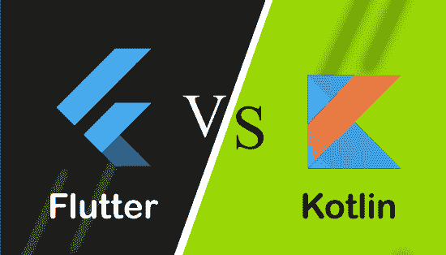

# Dart和Kotlin的区别

> 原文：<https://www.javatpoint.com/flutter-vs-kotlin>

Flutter 和 Kotlin 是用于**构建移动应用程序**的两项领先技术。Flutter 是一个**框架**，而 Kotlin 是一个**编程语言**。框架用于特定的问题。在 Flutter 中，我们可以有几个内置函数来完成一个应用，编程语言对应用开发没有任何限制。在这里，我们将基于各种参数来比较 Flutter 和 Kotlin 之间的差异。在进行比较之前，我们将简要讨论这些技术。

## 什么是 Flutter？

[Flutter](https://www.javatpoint.com/flutter) 是一个跨平台的 UI 工具包，允许我们使用 [**Dart 编程语言**](https://www.javatpoint.com/flutter-dart-programming) 为移动、网络和桌面创建快速、美观、本机编译的应用程序。它用一种编程语言和一个代码库来构建应用程序。它是免费和开源的。谷歌最初在 2017 年 5 月开发它，现在按照 ECMA 标准管理。这是一项越来越受欢迎的技术，可以提供出色的本地体验。

谷歌将其作为 SDK(软件开发工具包)推出，为 iOS 和 [Android](https://www.javatpoint.com/android-tutorial) 创建现代移动应用。如果我们使用AndroidStudio，它与内置的 [Java](https://www.javatpoint.com/java-tutorial) 和目标 C 以及 iOS 上的 [Swift 集成在一起。](https://www.javatpoint.com/ios-development-using-swift)

## Dart的特征

以下是Dart的基本特征:

**开源:** Flutter 是一个构建桌面和移动应用的开源框架。

**跨平台开发:**允许开发者一次编写代码，可以在不同平台上运行。它节省了开发人员的时间、精力和金钱。

**热重新加载:**如果我们修改了Dart代码，热重新加载可以立即看到变化。由于这个特性，开发人员可以立即修复错误。

**小部件:**小部件用于开发可定制的特定设计。Flutter 有两套小部件:材料设计和库比蒂诺小部件，它们有助于在所有平台上提供无故障体验。

**可访问的原生特性:**这个特性让我们可以轻松访问 Flutter 的原生代码、第三方集成以及应用开发的平台 API。

**最小代码:** Flutter 使用带有 JIT 和 AOT 编译方法的 [Dart 编程](https://www.javatpoint.com/dart-programming)来提高应用程序的整体启动时间、功能和性能。JIT 无需额外的努力就能刷新用户界面。

## Kotlin是什么？

[Kotlin](https://www.javatpoint.com/kotlin-tutorial) 是一种跨平台、通用、开源的编程语言。这是一种在 [JVM](https://www.javatpoint.com/jvm-java-virtual-machine) 上运行的**静态类型语言**，可以在任何使用 Java 的地方使用。我们可以用它来开发安卓应用、服务器端应用等等。它正在成为最高度采用的技术。由**捷脑**开发，2010 年发布，有一个小项目。Kotlin 第一次正式发布是在【2016 年 2 月。它是在 **Apache 2.0 许可**下开发的。Kotlin 有一个名为“ **Kotlin Multiplatform** ”的特殊功能，可以与 JVM 字节码、JavaScript 或 LLVM 代码兼容。在 Kotlin 开发的应用范围是无限的。

### Kotlin的特点

以下是Kotlin语言的特点:

**简洁:** Kotlin 语言允许开发人员减少额外代码的编写，这使得 Kotlin 更加简洁。

**空安全:** Kotlin 是空安全语言。这个特性的主要目的是消除代码中的空指针异常

**互操作性:**这个特性允许开发人员轻松调用 Java 代码，Java 也可以使用 Kotlin 代码。

**智能转换:**它显式地类型转换不可变的值，并将该值自动插入其安全转换中。

**工具友好:**我们可以使用命令行以及任何 Java IDE 来构建 Kotlin 程序。

**扩展函数:** Kotlin 支持扩展函数和扩展属性，有助于扩展类的功能，而无需接触它们的代码。

## Flutter vs. Kotlin

下面的对比图解释了 Flutter 和 Kotlin 的主要区别:

| 因素 | 摆动 | 我的锅 |
| 定义 | 它是一个跨平台的移动框架，为开发者和设计者提供移动应用软件开发工具包，为 iOS 和安卓构建现代移动应用。 | 它被详细描述为 JVM、安卓和浏览器的静态类型编程语言。它与 Java 100%互操作。 |
| 开发人 | 这是一个由谷歌首先引入的框架。 | 这是一种编程语言，最早是由喷气大脑引入的。 |
| 放 | Two thousand and seventeen | Two thousand and ten |
| 语言堆栈 | 它使用 Dart 编程来构建移动应用程序。 | 它本身是一种编程语言，使用 Java、JVM、JavaScript 和 Native 来创建应用程序。 |
| 流行 | 它在 GitHub 上的人气有 88.7k 的明星和 11.7k 的乡亲。 | 它在 GitHub 上的人气有 31.1k 的明星和 3.8k 的乡亲。 |
| 表演 | 它的性能非常惊人，因为它使用了 Dart 编程，并且不需要使用 JavaScript Bridge 来启动与应用程序的交互。 | 它的性能很慢，因为它使用 JavaScript，并且在 Java 中 100%可互操作，这降低了应用程序的速度。 |
| 学习曲线 | 在 Flutter 中，开发人员必须学习 Dart 编程才能构建应用程序。 | 它有一个简单的学习曲线，因为它非常类似于 Java。 |
| 文件 | 它有很好的组织和更丰富的文档，我们可以在一个地方得到我们想要的一切。 | 它还为开发人员提供了结构良好的文档。由于它处于开发阶段，它的库可以随时更改。 |
| 测试支持 | 它有各种各样的测试特性以及独特的小部件测试特性。 | 它的主要重点是提供后端开发服务，并使用 Firebase 作为安全的后端选项。 |
| 热重装 | 支持 | 不支持 |
| 应用程序大小 | Flutter 应用程序的大小更大。 | 与 Flutter 相比，Kotlin 应用程序的大小占用更少的空间。 |
| 第三方库和工具的集成 | 由于 Flutter 是一个用户界面工具，因此它需要第三方库和工具来桥接与本地环境的连接。 | 它不需要第三方库和工具来桥接与本机环境的连接。 |
| 定价 | 利用 Flutter 系统技术及其库是完全免费的。 | 它也是免费的，所以在这个矩阵中没有更好的选择。 |
| 部署选项 | 它可以部署在移动、桌面和网络上。 | 它可以部署在移动、桌面和网络上。 |
| 热门应用 | 汉密尔顿、谷歌广告、阿里巴巴、密码等。 | 油漆、跑步、Evernote 等。 |

* * *