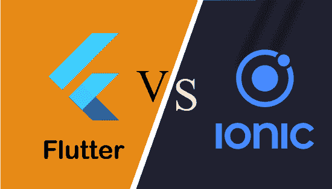

# 颤振和离子的区别

> 原文：<https://www.javatpoint.com/flutter-vs-ionic>

Flutter 和 ion 是用于为 iOS 和安卓平台构建移动应用的两项领先技术**。他们允许开发者用一种编程语言和单一的代码库快速为 T2 的移动、网络和桌面开发和发布编译后的应用程序。两种框架都有各自的好处，所以组织更好的选择取决于具体的需求和目标。在本节中，我们将基于各种参数来比较 Flutter 和 ion 框架之间的差异。在进行比较之前，我们将简要讨论这些技术。**

**

## 什么是 Flutter？

[Flutter](https://www.javatpoint.com/flutter) 是一个跨平台的 UI 工具包，允许我们使用 [**Dart 编程语言**](https://www.javatpoint.com/flutter-dart-programming) 为移动、网络和桌面创建快速、美观、本机编译的应用程序。它用一种编程语言和一个代码库来构建应用程序。它是免费和开源的。谷歌最初在 2017 年 5 月开发它，现在按照 ECMA 标准管理。这是一项越来越受欢迎的技术，可以提供出色的本地体验。

谷歌将其作为 SDK(软件开发工具包)推出，为 iOS 和 [Android](https://www.javatpoint.com/android-tutorial) 创建现代移动应用。如果我们使用安卓工作室，它与内置的 [Java](https://www.javatpoint.com/java-tutorial) 和目标 C 以及 iOS 上的 [Swift 集成在一起。](https://www.javatpoint.com/ios-development-using-swift)

### 颤振的优点或好处

颤振技术的优点如下:

*   它得到了谷歌的支持。
*   它支持 Hot-Reload 功能，使应用程序开发过程极快。更改完成后，热重新加载功能会立即反映修改后的代码。
*   由于跨平台特性，它减少了测试的时间和精力。这个特性允许测试人员不要在不同的平台上为同一个应用程序运行同一套测试。
*   它有一个出色的用户界面，因为它使用了以设计为中心的小部件、高开发工具、高级 API 和更多功能。
*   它类似于一个反应式框架，开发者不需要手动更新用户界面内容。

### 颤振的缺点或缺点

颤振技术的缺点如下:

*   它主要支持用于编码的 Dart 编程，因此开发人员需要学习新技术。
*   Flutter 是一种相对较新的语言，因此它没有很好的社区支持。
*   它提供对 SDK 库非常有限的访问。这意味着开发人员没有很多功能来创建移动应用程序。

## 什么是离子键？

[ional framework](https://www.javatpoint.com/ionic)是一个开源 UI 工具包，用于使用**[HTML](https://www.javatpoint.com/html-tutorial)[CSS](https://www.javatpoint.com/css-tutorial)和 [JavaScript](https://www.javatpoint.com/javascript-tutorial)** 等 web 技术构建高质量的移动、桌面和渐进式 web 应用。它有一个功能，可以一次构建，随处运行。它是由**漂移公司的马克斯·林奇、本·斯佩里和亚当·布拉德利在 2013 年**创作的。爱奥尼亚框架的第一个测试版于 2014 年 3 月发布。

它主要关注前端用户体验或 UI 交互，处理我们应用的所有外观和感觉。易学，可与其他库或框架如 [Angular](https://www.javatpoint.com/angularjs-tutorial) 、 [Cordova](https://www.javatpoint.com/apache-cordova) 等集成。它也可以作为一个独立的没有前端框架使用一个简单的脚本包括。

### 离子液体的优点或优点

离子框架的优点如下:

*   它很容易学习，因为它需要 CSS、HTML 或 JavaScript 技术的基本知识来构建应用程序。
*   它为开发人员提供了结构良好的文档。
*   它支持跨平台功能，可以用单个代码库在多个平台上部署应用程序。
*   它建立在 Angular 之上，为开发人员构建应用程序提供了许多功能。

### 离子液体的缺点或缺点

离子框架的缺点如下:

*   它还处于开发阶段，所以它的库可以随时重写。
*   与其他本机应用程序相比，它没有提供良好的安全性。
*   它的表现并不好；然而，对于普通用户来说，性能差距并不明显。
*   它不适合高端图形相关应用。

## 颤振与离子

下面的对比图解释了颤振和离子的主要区别:

| 因素 | 摆动 | 离子的 |
| 开发人 | 最早是谷歌推出的。 | 它是由马克斯·林奇、本·斯佩里和亚当·布拉德利创作的。 |
| 释放；排放；发布 | 2017 年 5 月 | 2014 年 3 月 |
| 语言 | 它使用 Dart 编程来构建移动应用程序。 | 它使用诸如 CSS、HTML 和 JavaScript 等网络技术来创建应用程序。 |
| 运行时间 | 它将由自定义图形引擎运行。 | 它在网络浏览器中运行。 |
| 表演 | 它的性能非常惊人，因为它使用了 Dart 编程，并且不需要使用 JavaScript Bridge 来启动与应用程序的交互。 | 它的性能很慢，因为它使用 web 技术来呈现应用程序。这种方法降低了我们应用程序的速度。 |
| 学习曲线 | 在 Flutter 中，开发人员必须学习 Dart 编程才能构建应用程序。 | 由于网络技术，它有一个简单的学习曲线。 |
| 文件 | 它有很好的组织和更丰富的文档，我们可以在一个地方得到我们想要的一切。 | 它还为开发人员提供了结构良好的文档。由于它处于开发阶段，它的库可以随时更改。 |
| 社区支持 | Flutter 是一项新技术，因此没有强大的社区支持。然而，它是由谷歌广告的；因此，它将在来年非常受欢迎。 | 它拥有巨大的社区支持和巨大的市场。 |
| 热重装 | 支持 | 支持 |
| 用户界面 | 与爱奥尼亚相比，Flutter 拥有出色的用户界面。 | 它的用户界面并不好，因为它用 HTML 和 CSS 呈现一切。 |
| 用户界面元素 | 小工具 | 网络组件 |
| 本机应用编程接口访问 | 使用 Flutter 原生包的原生插件库 | 使用科尔多瓦和电容的本地插件库 |
| 移动性能 | 优秀的 | 好的 |
| 网络性能 | 穷人 | 优秀的 |
| 定价 | 利用 Flutter 系统技术及其库是完全免费的。 | 它是免费的，但提供了一个付费的专业开发环境，加快了开发过程。 |
| 部署选项 | 它可以部署在移动、桌面和网络上。 | 它可以部署在移动，桌面，网络以及 PWA。 |
| 热门应用 | 汉密尔顿、谷歌广告、阿里巴巴、密码等。 | JustWatch、Pacifica、Nationwide 等。 |

* * ***