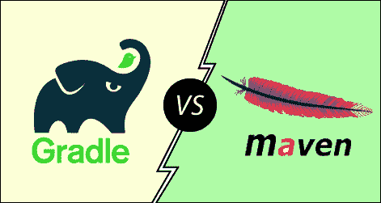

# 度与。我的胃

> 原文：<https://www.javatpoint.com/gradle-vs-maven>

Gradle 是 Java 可用的几个构建工具之一，但它不是唯一需要考虑的构建自动化工具。Maven 是一种较老的、通常使用的替代方法，但是哪种构建系统最适合我们使用其他 Java 框架的项目，例如 Spring、Hibernate。当两种工具都与越来越多的集成相结合时，很难决定使用哪种工具更好。让我们讨论这两种工具，以了解根据我们的需求哪种工具更好。

**Gradle** 是一个**构建自动化**工具，它是一个开源工具，基于 Apache Maven 和 Apache Ant 的概念构建。它能够构建几乎任何类型的软件。它是为多项目构建而设计的，可能相当大。它引入了一个基于 **Java 和 Groovy****DSL****(领域特定语言)**来代替 XML(可扩展标记语言)来声明项目配置。它使用 DAG(有向无环图)来定义任务的执行顺序。Gradle 提供了一个弹性模型，可以帮助开发生命周期从编译和打包 web 和移动应用程序的代码。

Gradle 支持**构建**、**测试**、**在不同平台部署软件**。它已经被开发用于许多语言和平台上的建筑自动化，包括 Java、Scala、Android、C / C ++和 Groovy。它是安卓的官方构建工具。Gradle 提供了与多个开发工具和服务器的集成，包括 **Eclipse** 、 **IntelliJ** 、 **Jenkins** 、 **Android Studio** 。

Gradle 的一些显著优势如下:

*   Gradle 允许我们用 Java 编程语言编写构建脚本。
*   它易于使用和维护。
*   它支持依赖性管理
*   它提供高性能和可扩展的构建。
*   梯度集成过程相当容易。
*   它支持多项目结构。
*   很容易从 Maven 或其他构建工具迁移到 Gradle。

**Maven** 是一个**开源软件项目管理**工具，主要用于 Java 项目。它也可以用于其他编程项目，如 C#、Ruby、Scala 等。Apache 软件基金会管理 maven 项目。Maven 解决了软件开发的两个主要方面；**依赖**，以及软件是如何构建的。在 maven 中，一个 **XML 文件描述了一个项目**的构建过程、它的依赖项、组件和其他外部模块。打包和编译等任务有预定义的目标。

#### 注意:Gradle 是为了克服 Maven 的缺点而构建的。

项目的结构可以在短时间内自动创建，因为 Maven 使用标准的目录布局和默认的构建生命周期，这有助于在简洁的时间内构建项目。当有多个开发团队时，Maven 可以在短时间内以标准格式运行。

Maven 的一些显著优势如下:

*   Maven 增强了依赖性管理。
*   在 Maven 中，不需要在源代码控制中存储二进制库(第三方)。
*   它有效地管理分层依赖树。
*   它使调试过程更加简单。
*   它在源代码、插件、库和集成开发环境之间提供了更好的合作。
*   它减少了项目中的重复。

## 度与。我的胃

让我们讨论一下 Gradle 和 Maven 之间的一些主要区别:

| 格拉德尔 | 专家 |
| 这是一个使用基于 Groovy 的 DSL(特定领域语言)的构建自动化系统 | 它是一个软件项目管理系统，主要用于 java 项目。 |
| 它不使用 XML 文件来声明项目配置。 | 它使用一个 XML 文件来声明项目、它的依赖项、构建顺序和它所需的插件。 |
| 它基于完成工作的任务依赖关系图。 | 它基于固定和线性模型的阶段。 |
| 在 Gradle 中，主要目标是为项目添加功能。 | 在 maven 中，主要目标与项目阶段相关。 |
| 它通过跟踪输入和输出任务来避免工作，并且只运行已经更改的任务。因此，它提供了更快的性能。 | 它不使用生成缓存；因此，它的构建时间比 Gradle 慢。 |
| Gradle 是高度可定制的；它提供了广泛的 ide 支持自定义构建。 | Maven 的参数和需求数量有限，所以定制有点复杂。 |
| Gradle 避免了 Java 的编译。 | 在 Maven 中，编译是强制性的。 |

* * *