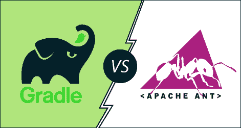

# 度数 vs ant

> 哎哎哎:# t0]https://www . javatppoint . com/gradle-vs-ant

**Gradle** 是一个基于 **Groovy 的构建自动化**工具，它是一个开源工具，基于 Apache Maven 和 Apache Ant 的概念构建。它能够构建几乎任何类型的软件。它是为多项目构建而设计的，可能相当大。它使用 **DSL(领域特定语言)**而不是 **XML(可扩展标记语言)**来定义构建脚本。它使用 **DAG(有向无环图)**来定义任务的执行顺序。协助**搭建**、**测试**、**在不同平台部署软件**中的各种开发操作。它已经被开发用于许多语言和平台上的建筑自动化，包括 Java、Scala、Android、C / C ++和 Groovy。它是安卓的官方构建工具。Gradle 提供了与多个开发工具和服务器的集成，包括 **Eclipse** 、 **IntelliJ** 、 **Jenkins** 、 **Android Studio** 。

Gradle 的一些独特功能如下:

*   它支持声明性构建和按约定构建。
*   它支持基于依赖的编程语言。
*   它为项目提供了结构化的构建。

Apache **Ant 是一个基于 Java 的构建自动化工具**，用于项目的构建过程自动化。它是为了克服 UNIX 的【T2 制造】构建工具的缺点而开发的。它被认为是 Make 工具的替代品。它类似于 Make，但它是使用 Java 语言实现的。它需要 Java 平台，适合 Java 项目。它使用 Xml 文件来定义构建脚本。它于 2000 年发布，成为当时最流行的 java 构建工具。这很容易学。最初发布后，它被更新为支持插件的能力。它基于过程编程方法。

Apache Ant 的一些独特功能如下:

*   它促进了完整的 Java 构建和部署工具。
*   它是平台中立的，可以处理特定于平台的属性，如文件分隔符。
*   它可用于执行特定于平台的任务，例如使用“触摸”命令修改文件的修改时间。
*   ant 的重要特点是它的灵活性，不强加任何编码约定或项目结构。

Gradle 是为了克服 Apache Ant 的缺点而开发的。让我们了解一下 Gradle 和 ant 之间的一些显著差异。

| 格拉德尔 | 蚂蚁 |
| Gradle 是一个基于 Groovy 的构建自动化工具。 | Ant 是一个基于 Java 的构建自动化工具。 |
| 它使用 DSL(领域特定语言)而不是 XML(可扩展标记语言)来定义构建脚本 | 它使用 XML 文件来确定构建脚本。 |
| Gradle 是为了克服 Maven 和 Ant 的缺点而开发的。 | 它是为了克服 Unix 的 Make 构建工具的缺点而开发的。 |
| Gradle 插件是用 Java 或 Groovy 编程语言编写的。 | 它没有强加任何编码约定。 |
| Gradle 提供了一个结构化的构建。 | 它不强加项目结构化。 |
| Gradle 为 IDE 集成提供了舒适的支持。 | 在 Ant 中，IDE 集成比 maven 稍微复杂一些。 |
| 在灵活性方面，Gradle 比 Ant 更标准化。 | 它不如 Gradle 灵活。 |
| Gradle 支持多项目构建。 | 它不支持多项目构建。 |

* * *