# Eclipse 插件级别

> 吴奇珍:t0]https://www . javatppoint . com/gradle-eclipse 插件

Gradle eclipse 插件生成 eclipse 集成开发环境使用的所需文件。因此，它有助于在 Eclipse 中创建和导入项目。最新版本的 Eclipse IDE 为 Gradle 提供了内置支持。如果旧版本的 Eclipse 没有提供 Gradle 选项，那么我们可以从 Eclipse 市场下载并集成它。导航至**帮助- > Eclipse 市场**并搜索 Gradle 插件。Eclipse 可用的最新 Gradle 插件是 **Gradle IDE 包 3.8** 。

要在 Eclipse 中集成 Gradle 插件，请执行以下步骤:

**步骤 1:** 打开 Eclipse 并导航至**帮助- > Eclipse 市场**。

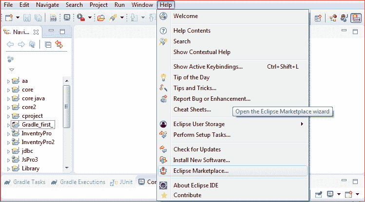

**步骤 2:** 搜索 Gradle IDE 包，点击**安装**继续集成过程。

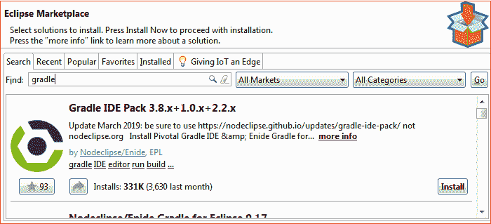

**第三步:选择并确认**要安装的渐变功能。

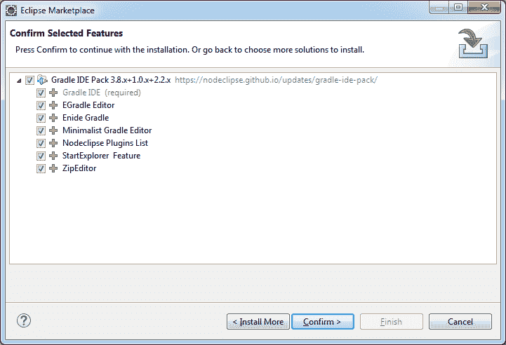

**步骤 4:** 查看并接受使用条款和条件，点击**完成**选项，完成 Gradle IDE 包的集成。

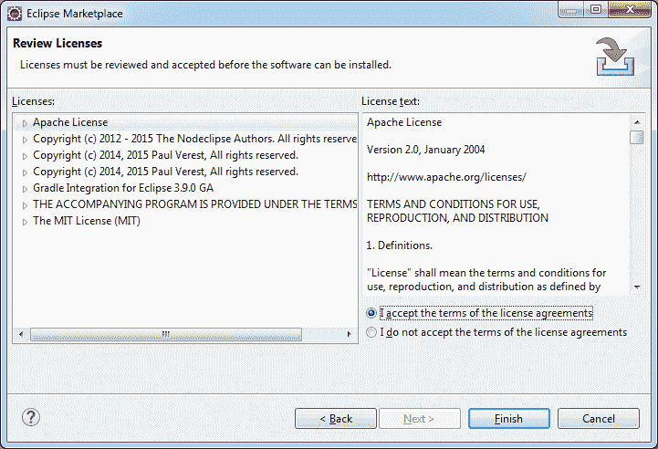

我们已经成功地将 Gradle IDE 包与我们的 Eclipse IDE 集成在一起。现在，我们准备用 Eclipse 创建我们的第一个 Gradle 项目。

## Eclipse 的第一个梯度项目

用 Eclipse 创建一个 Gradle 项目就像创建一个 Maven 项目一样是一个简单的过程。按照以下步骤创建一个 Gradle 项目。

**步骤 1:** 点击**文件**菜单，导航至**新建- >其他**。

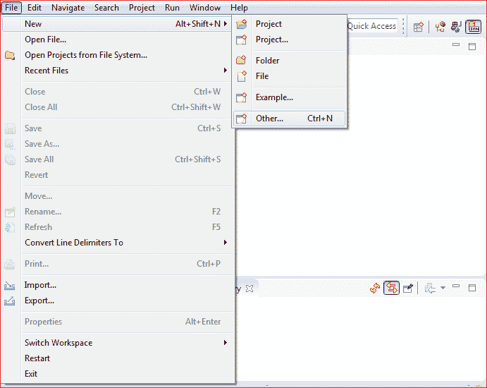

**步骤 2:** 在搜索栏中键入梯度。

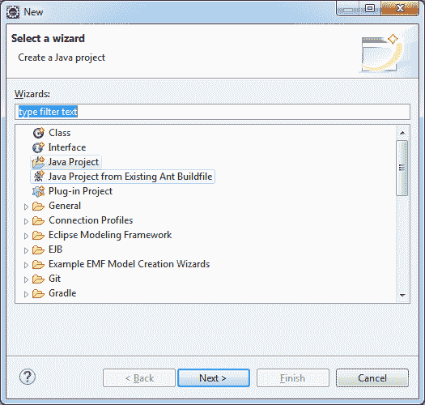

它将显示渐变选项，选择它，点击**下一步**继续。

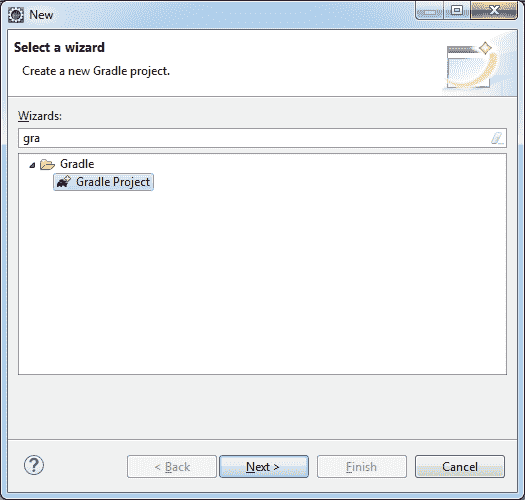

**步骤 3:** 它将显示 Gradle 欢迎屏幕，并显示一些最佳使用 Gradle 创建向导的提示。点击**下一步**继续。

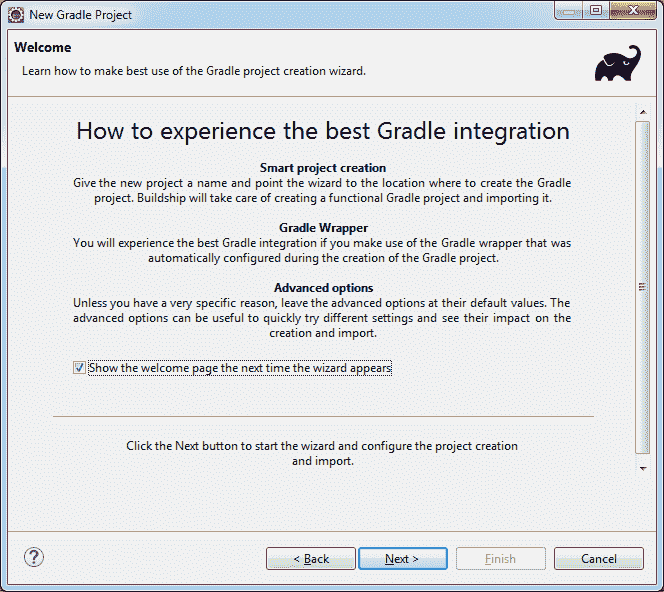

**步骤 4:** 下一步是输入项目名称。在我们的例子中，我给它命名为 Gradle_first。点击**下一步**继续。

**步骤 5:** 在这里，我们可以看到梯度分布的不同选项。指定用于创建、导入和与渐变项目交互的任意一个选项。

点击**覆盖工作空间设置**。选择**本地安装目录**，浏览选择 Gradle 的主目录。点击**下一步**继续。

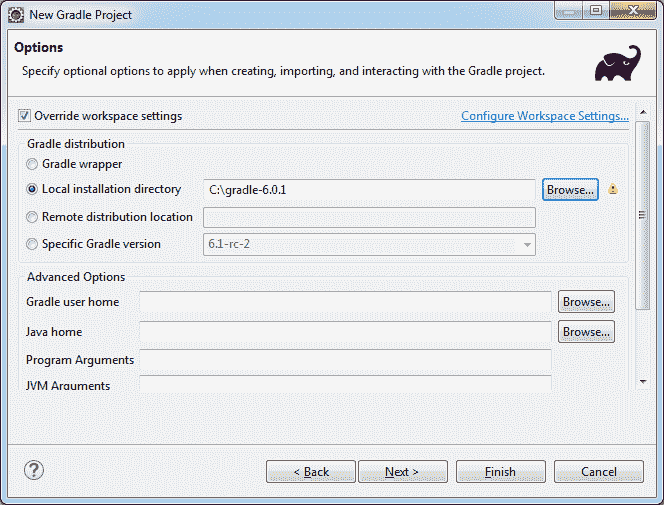

**第六步:**点击**完成**创建第一个渐变项目。这将需要一段时间，并创建我们的第一个 Gradle 项目。

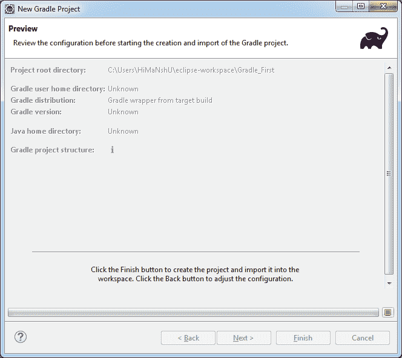

我们已经成功地创建了我们的第一个 Gradle 项目。项目结构如下所示:

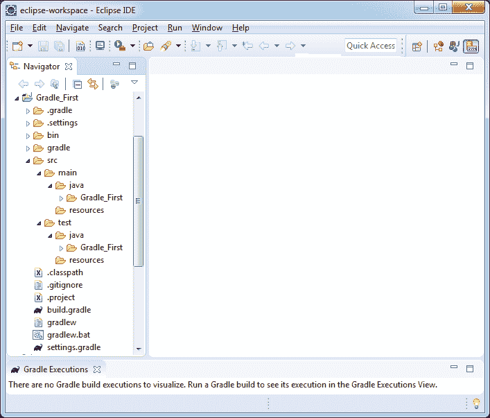

Gradle 项目包含许多自动生成的文件。这些文件对于项目声明是必不可少的。

**build.gradle** 文件是项目的构建脚本，就像 Ant 的构建脚本名为 **build.xml** 和 Maven 的构建脚本名为 **pom.xml** 一样，gradle 的默认构建脚本是 build.gradle，当 **gradle** 命令运行时，它会从工作目录中搜索 **build.gradle** 文件。如果找到，则执行特定的任务。 **build.gradle** 的默认格式如下:

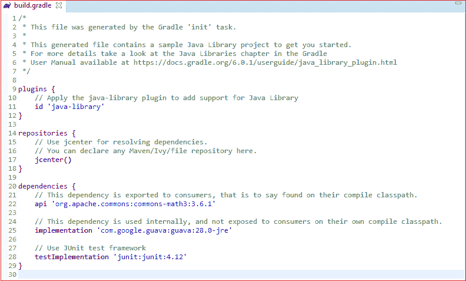

* * *