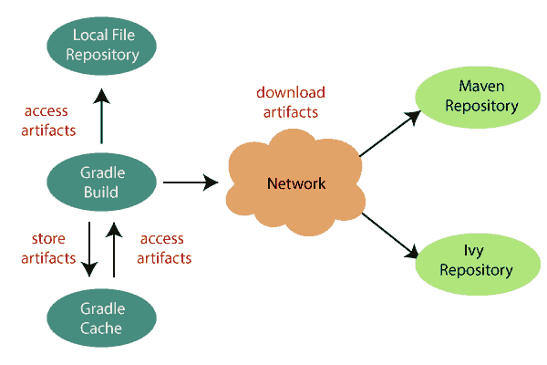

# 渐变依赖关系

> 原文：<https://www.javatpoint.com/gradle-dependencies>

Gradle 构建脚本描述了构建项目的过程。大多数项目不是独立的。他们需要一些文件来编译和测试源文件。例如，要使用 Hibernate，我们必须在类路径中包含一些 Hibernate JARs。Gradle 使用一些独特的脚本来管理依赖关系，这需要下载。

依赖项用于辅助任务，例如项目所需的 JAR 文件和外部 JAR。每个依赖项都应用于指定的范围。例如，依赖项用于编译源代码，有些依赖项将在运行时可用。Gradle 借助配置来表示依赖关系的范围，一个唯一的名称可以识别每个配置。大多数 Gradle 插件支持项目的预定义配置。

Gradle 考虑构建和发布项目的结果。出版是基于我们定义的任务。它可以将文件复制到本地目录，或者将它们上传到远程 Maven 或 lvy 存储库。我们可以在同一个多项目构建中使用来自另一个项目的这些文件。发布任务的过程称为发布。

## 依赖关系配置

依赖配置是一组依赖和工件。以下是配置的三个主要任务:

*   声明依赖项
*   解决依赖关系
*   暴露工件以供消费

### 声明依赖关系

依赖性是任何项目必不可少的一部分。我们必须声明一个依赖项才能使用它。依赖性配置是定义一组依赖性的过程。这个特性用于声明外部依赖，我们想从网上下载。

考虑下面的 Hibernate 核心依赖的例子:

```

apply plugin: 'java.' 
repositories {
   mavenCentral()
}
dependencies {
compile group: 'org.hibernate', name: 'hibernate-core', version: '3.6.7.Final'
   testCompile group: 'junit', name: 'junit', version: '4.+'
}

```

依赖关系可以用于项目的不同阶段。这些阶段可以是:

**编译:**在编译时，我们将使用编译项目的生产源所需的依赖项。

**运行时:**生产类在运行时使用这些依赖关系。默认情况下，它还包含编译时依赖项。

**测试编译:**编译项目的测试源需要这些依赖。它还包含编译的生产类和编译时依赖项。

**测试运行时:**运行测试需要这些依赖关系。它还包含运行时和测试编译依赖项。

### 解决依赖关系

该插件使用该配置，并为定义的任务获取输入。例如，Gradle 项目使用 Spring Web Framework jar 文件，该文件必须从 Maven Central 下载。

### 暴露工件以供消费

该插件使用用于为其他项目消费定义工件的配置。

## 依赖性管理

软件项目是各种功能的集合。它很少单独工作。在大多数情况下，项目依赖于库的可重用性。此外，一个项目可以被分成独立的组件来形成一个模块化的系统。依赖关系管理是一个以自动化方式声明、解析和使用项目所需的依赖关系的过程。下图展示了 Gradle 项目的结构。



Gradle 为依赖关系管理提供内置支持。在 Gradle 中，依赖关系管理由两件事组成。它们如下:

*   Gradle 必须知道项目的需求，才能构建或运行项目。这些文件被称为项目的依赖项。
*   Gradle 需要构建和上传项目产生的数据。这些文件是项目的声明。

在 Gradle，大多数项目都不是独立的。项目需要由其他项目构建的文件，用于编译或测试等。例如，如果我们想在一个项目中使用 Hibernate 框架，我们在编译时需要类路径中的 **hibernate jar 文件**。这些文件被称为项目的依赖项。在 Gradle 中，我们可以指定项目的依赖关系，Gradle 的重点是找到这些依赖关系，并使其在项目中可用。我们可以从远程 Maven 或 Ivy 存储库中下载这些依赖项，或者我们可以在项目中构建我们的依赖项并包含它。这个过程被称为**依赖解析**。

依赖项解析提供了优于蚂蚁的优势。使用 Ant，我们可以指定要加载的 jar 的绝对或相对路径。相比之下，在 Gradle 中，我们必须声明依赖项的名称来定义依赖项。同样，Ant 反映了我们添加 Apache Ivy 时的类似行为，所以在这种情况下 Gradle 更好。

项目本身的依赖性表现为依赖性；例如，在 hibernate-core 中，我们需要许多必须在类路径上可用的库。因此，当 Gradle 测试运行一个项目时，它会搜索依赖项并使其可用。这些依赖关系被称为**传递依赖关系**。

* * *