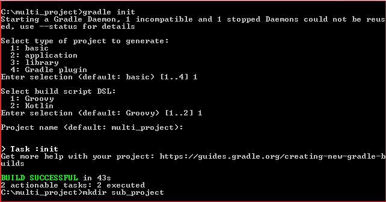
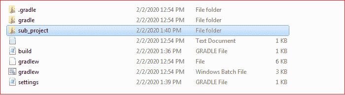
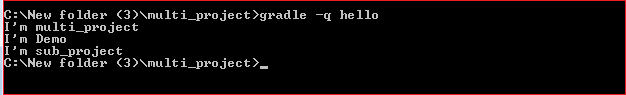
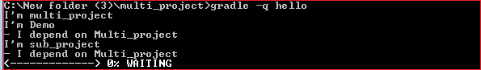

# 梯度中的多项目构建

> 原文：<https://www.javatpoint.com/multi-project-build-in-gradle>

Gradle 支持多项目构建，以实现项目的快速发展。它有助于模块化项目。它让我们能够专注于一个更大项目的一个模块。Gradle 负责项目其他部分产生的依赖关系。

多项目构建由一个根项目和一个或多个子项目组成。

### 跨项目配置

每个子项目都能够在与其他子项目完全隔离的情况下配置自己，因此子项目具有共同的特征。最好在项目之间共享配置，这样相同的配置可以影响多个子项目。

### 配置和执行

在 Gradle 中，配置意味着执行项目的“build.gradle”。默认情况下，配置是在执行任何任务之前完成的。当请求项目中的单个任务时，首先配置多项目构建。配置项目后，在访问和更新 Gradle 项目的任何模块时，它会变得更加灵活。

### 创建多项目

让我们创建一个包含其子项目的项目，并构建 Gradle 项目。

考虑下面的项目结构，其中根项目名为**多项目，**，子项目名为**子项目**。

创建一个新的根目录，我们想在其中创建一个多项目。使用以下命令创建新目录:

```

mkdir Multi_project

```

创建一个梯度建筑；多项目目录。要创建渐变构建，请运行渐变初始化命令。init 命令包含包装命令本身，因此它将在根项目中创建 **build.gradle** 和 **setting.gradle** 文件。

以下是创建 Gradle 项目的过程:

当我们执行 init 命令时，它会询问我们想要生成的项目类型。它提供四种类型的项目选项。它们如下:

1.  **基础**
2.  **应用**
3.  **库**
4.  **阶梯插件**

选择所需选项，然后按回车键继续。

接下来，它将要求我们提供所需的构建脚本 DSL。DSL 有两种选择:

1.  **常规**
2.  **锅炉**

选择所需的 DSL，然后按回车键继续。

现在它会问我们项目名称；我们可以提供任何项目名称，如果没有提供，默认情况下，它会将目录名作为项目名称。

按回车键继续。考虑以下输出:



现在按如下方式创建多项目树结构:

**多项目/**

**build.gradle**

**设置梯度**

**子项目/**

**build.gradle**

**设置梯度**

请看下图:



现在要创建一个多项目构建，在根项目构建脚本中添加下面的代码片段(即 **build.gradle** )。

```

Closure cl = { task -> println "I'm $task.project.name" }
task('hello').doLast(cl)
project(':sub_project') {
    task('hello').doLast(cl)
}

```

将子项目包含到根项目中。为此，在**设置中添加以下语句:**

```

rootProject.name = 'multi_project'
include 'sub_project.'

```

使用以下命令执行它:

```

gradle -q hello

```

**输出:**


在 Gradle 中，可以从多项目构建的构建脚本中访问任何项目。Gradle 的项目 API 提供了一种叫做 project()的方法；它将路径作为参数，并返回当前路径的项目对象。当一个项目构建从一个构建脚本进行配置时，它被称为**跨项目配置**。这是使用**配置注入**实现的。

考虑另一种情况。项目子项目下还有一个子项目叫做**演示**。Gradle 项目的树形结构如下:

**多项目/**

**build.gradle**

**设置梯度**

**子项目/**

**build.gradle**

**设置梯度**

**演示/**

**build.gradle**

**设置梯度**

我们可以执行根项目中的所有子项目。为此，请重写根项目的构建脚本。将下面的代码片段添加到根项目的 build.gradle 文件中:

```

allprojects {
    task hello {
        doLast { task ->
            println "I'm $task.project.name"
        }
    }
}

```

将子项目包含到根项目中。为此，在**设置中添加以下语句:**

```

rootProject.name = 'multi_project'
include 'sub_project', 'Demo'

```

用下面的命令执行它；

```

gradle -q hello

```

**输出:**



## 仅访问子项目

渐变项目应用编程接口还提供了一个仅用于访问子项目的属性。

**定义共同行为:**

我们可以定义项目和子项目的共同行为。为此，请按如下方式重写根项目构建脚本:

```

allprojects {
    task hello {
        doLast { task ->
            println "I'm $task.project.name"
        }
    }
}
subprojects {
    hello {
        doLast {
            println "- I depend on Multi_project"
        }
    }
}

```

使用以下命令执行它:

```

gradle -q hello

```

**输出:**



## 添加特定行为

我们可以在常见行为的基础上添加特定的行为。通常，我们将特定于项目的行为放在要添加特定特性的项目的构建脚本中。为此，我们必须更新特定项目的构建脚本。要向子项目添加特定行为，请按如下方式更新构建脚本:

```

allprojects {
    task hello {
        doLast { task ->
            println "I'm $task.project.name"
        }
    }
}
subprojects {
    hello {
        doLast {
            println "- I depend on multi_project"
        }
    }
}
project(':sub_project').hello {
    doLast {
        println "- I contain the project's submodule." 
    }
}

```

使用以下命令执行它:

```

gradle -q hello

```

**输出:**


* * *