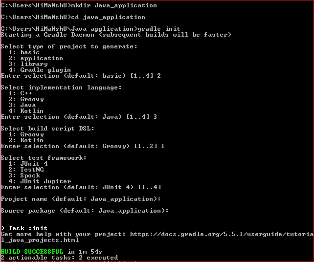
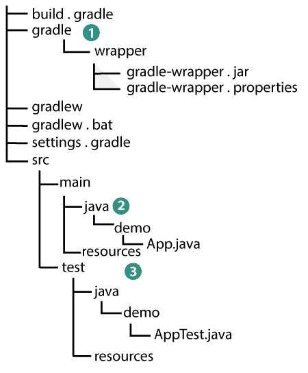
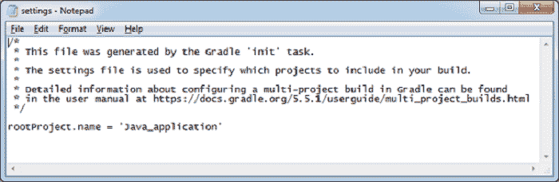
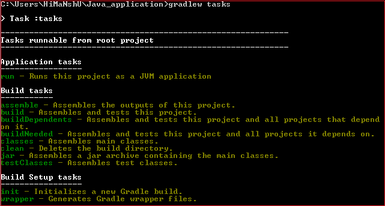
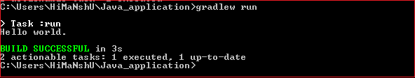

# 渐变 Java 应用程序

> 原文：<https://www.javatpoint.com/gradle-java-application>

我们可以使用 Gradle 的**构建初始化插件**来创建一个新的跟踪 Gradle 约定的 Java 应用程序。构建插件提供了一个任务，称为**初始化**，生成项目。该插件还使用包装器任务来创建一个渐变包装器脚本(**渐变**)。

要使用 Gradle 创建一个 Java 应用程序，请执行以下步骤:

**步骤 1:** 第一步是为一个新项目创建一个目录，并将目录更改为它。

按照下面的命令创建一个名为 Java_application 的目录:

```
mkdir java_application

```

按照以下命令将命令行目录更改为它:

```
cd Java_application 

```

**步骤 2:** 运行**初始化命令**创建一个新的渐变项目:

```
gradle init

```

**步骤 3:** 选择要生成的项目类型。有四个命令行选项，如下所示:

1.  **基本**
2.  **应用**
3.  **库**
4.  **阶梯插件**

键入 2 并按回车键创建一个应用程序。默认选择是基本的。

**第 4 步:**选择实现语言。有五种选择，如下所示:

1.  **C++**
2.  **常规**
3.  **Java**
4.  **锅炉**
5.  swift

键入 3，然后按回车键。默认选择是 Java。

**步骤 5:** 下一步是为项目选择默认的构建脚本语言。有两种选择，如下所示:

1.  **常规**
2.  **锅炉**

键入 1 并按下 Groovy 的回车键。默认选择是 Groovy。

**步骤 6:** 选择测试框架。测试框架有四种选择。它们如下:

1.  junit4
2.  测试
3.  斯波克
4.  朱尼特朱庇特

输入您的选择。默认选择是 JUnit 4。

**步骤 7:** 输入项目名称；默认情况下，它将使用目录名作为项目名。

**步骤 8:** 进入源包；默认情况下，它会将目录名作为源包。

现在初始化任务已经成功执行，我们已经使用 Gradle Init API 创建了一个 Java 应用程序。

考虑以下输出:



init 任务本身包含包装器任务，所以首先，它执行包装器任务，该任务在我们的存储库中生成 **gradlew** 和 **gradlew.bat** 文件(包装器脚本)。它创建了一个具有以下结构的 Gradle 项目:



上述结构描述了:

1.  包含包装文件的生成包装包。
2.  默认 Java 源文件夹
3.  默认 Java 测试文件夹

## 生成的文件

让我们看看项目生成的文件。

*   【T0 度】

评论很多，只有一行有效。它设置根项目的名称。

```
rootProject.name = 'Java_application'

```

它将使用默认行为，即以项目所在的目录命名项目。看起来像是:



*   【T0 度】

这是 Gradle 项目的构建脚本。生成的 build.gradle 文件有许多组件。在这个构建脚本中介绍了使用的依赖项及其版本。生成的构建文件的内容如下:

```
plugins {
    id 'java'
    id 'application'
}
repositories {
    jcenter() //public bintray artifactory repository
}
dependencies {
    implementation 'com.google.guava:guava:27.1-jre' //Google Guava Library
    testImplementation 'junit:junit:4.12' //JUnit testing library
}
application {
    mainClassName = 'Java_application.App' // class with the main method used by Gradle plugin 
}

```

Gradle 构建脚本添加了 Java 和应用程序插件。当我们运行 gradle 命令时，它会在 Gradle 的构建脚本中进行搜索。

*   **java:**

Gradle 支持 Java 项目，并且包含一个拥有 main 方法的类，可以从命令行执行。在 Java_Application 中，主类的名字是 **App** 。

文件 App.java 发生在目录**Java _ application \ src \ main \ Java \ Java _ application**中。生成的 App.java 代码如下:

```
package Java_application;
public class App {
    public String getGreeting() {
        return "Hello world.";
    }
    public static void main(String[] args) {
        System.out.println(new App().getGreeting());
    }
}

```

上面的 Java 源文件是由 init 任务生成的。

*   **Java:**

它是 Java 项目的测试类。测试类发生在目录**Java _ application \ src \ test \ Java \ Java _ application**中。AppTest.java 生成的代码如下:

```
package Java_application;
import org.junit.Test;
import static org.junit.Assert.*;
public class AppTest {
    @Test public void testAppHasAGreeting() {
        App classUnderTest = new App();
        assertNotNull("app should have a greeting", classUnderTest.getGreeting());
    }
}

```

初始化任务生成给定的 Java 测试文件。生成的测试文件包含一个用 JUnit 的@test 注释的测试。该测试实例化 App 类，调用**gethelling()**，并检查返回值是否为空。

## 构建的执行

要执行 gradle 生成，请运行生成任务和 gradlew 命令。但是，我们可以运行 gradle 任务，但是最好包含包装脚本。

```
gradlew build

```

**输出:**


构建任务编译类、运行测试并创建测试报告。

#### 注意:我们第一次运行 gradlew 命令时，可能需要一些时间，而指定版本的 gradle 是在本地下载和存储的。

Gradle 包装脚本检查我们是否指定了 Guava 和 JUnit 库，如果没有，它将下载并将其存储在/中。gradle 目录。

## 运行 Java 应用程序

gradle 构建使用应用程序插件，因此我们可以从命令行运行应用程序。将使用**梯度运行**命令从命令行运行应用程序。

首先，使用 task 命令显示插件添加的任务:

```
gradlew tasks

```

上面的命令将列出项目中可用的任务。考虑以下**输出的快照:**



现在，使用 run 命令运行应用程序。它将传达 Gradle 在分配给 **mainClassName** 属性的类中执行主方法。

```
gradlew run

```

**输出:**

```
Hello world.

```



* * *